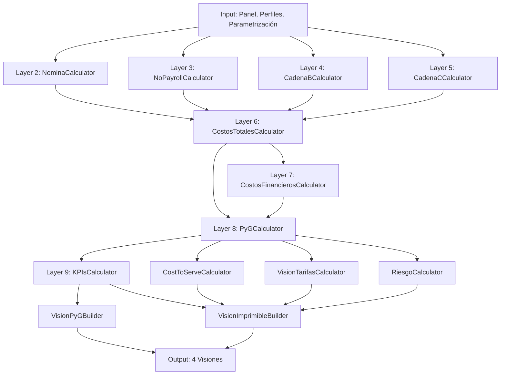

# CAPÍTULO 5: Motor de Cálculo — 10-Layer Deterministic Pipeline

**Versión**: 2.7 (Post-Refactor) | **Vigencia**: Mayo 2026 | **Estado**: Documentado

## Tabla de Contenidos

1. [Visión General del Pipeline](#sección-51-visión-general-del-pipeline)
2. [Layer 2: NominaCalculator](#sección-52-layer-2--nominacalculator-payroll)
3. [Layer 3: NoPayrollCalculator](#sección-53-layer-3--nopayrollcalculator-infraestructura)
4. [Layer 4: CadenaBCalculator](#sección-54-layer-4--cadenabcalculator-plataforma-digital)
5. [Layer 5: CadenaCCalculator](#sección-55-layer-5--cadenacalculator-aiintegración)
6. [Layer 6: CostosTotalesCalculator](#sección-56-layer-6--costostotalescalculator-orquestación)
7. [Layer 7: CostosFinancierosCalculator](#sección-57-layer-7--costosfinancieros-calculador-ica-gmf-pólizas)
8. [Layer 8: PyGCalculator](#sección-58-layer-8--pygcalculator-estado-de-resultados)
9. [Layer 9: KPIsCalculator](#sección-59-layer-9--kpiscalculator-métricas-del-deal)
10. [Post-Pipeline Vision Calculators](#sección-510-post-pipeline-vision-calculators)
11. [Precisión y Rounding](#sección-511-precisión-y-rounding)
12. [Flujo de Ejecución](#sección-512-flujo-de-ejecución--paralelización)
13. [Diagrama de Data Flow](#sección-513-diagrama-de-data-flow)

---

## SECCIÓN 5.1: Visión General del Pipeline

### 5.1.1 Arquitectura Conceptual

El motor NEXA es un **pipeline determinístico de 10 capas** que transforma datos de entrada (Panel de Control, perfiles de Cadena A, parametrización) en cuatro visiones finales (P&G, Tarifas, Cost-to-Serve, Riesgo).

**Principios fundamentales**:
- **Determinismo**: Idénticas entradas → idénticas salidas, siempre.
- **Stateless**: Ningún estado mutable durante la ejecución. Cada cálculo depende únicamente de sus parámetros.
- **Composición**: Las capas se encadenan linealmente; ningún bucle ni lógica condicional que afecte la arquitectura.
- **Precisión COP**: Todos los cálculos usan Python `Decimal` con `ROUND_HALF_UP` para Excel-parity.

### 5.1.2 Diagrama Conceptual del Flujo

```
┌──────────────────────────────────────────────────────────────┐
│  ENTRADA: Panel, Cadenas A/B/C, ParametrizationProvider     │
└──────────────────────────────┬───────────────────────────────┘
                               │
                    ┌──────────▼────────────┐
                    │  LAYER 2-5: Parallel  │
                    ├──────────┬────────────┤
        ┌───────────┤          │            │
        │           │          │            │
  Layer 2:      Layer 3:   Layer 4:    Layer 5:
  Nómina     No-Payroll  Cadena B    Cadena C
        │           │          │            │
        └───────────┤          │            │
                    └──────────┬────────────┘
                               │
                    ┌──────────▼──────────────┐
                    │ LAYER 6: Aggregator     │
                    │ CostosTotalesCalculator │
                    └──────────┬──────────────┘
                               │
                    ┌──────────▼──────────────────┐
                    │ LAYER 7: Financial Costs   │
                    │ CostosFinancierosCalculator │
                    └──────────┬──────────────────┘
                               │
                    ┌──────────▼─────────────────┐
                    │ LAYER 8: Monthly P&G       │
                    │ PyGCalculator (per mes)     │
                    └──────────┬─────────────────┘
                               │
                    ┌──────────▼──────────────┐
                    │ LAYER 9: Deal KPIs      │
                    │ KPIsCalculator (Total)   │
                    └──────────┬──────────────┘
                               │
                    ┌──────────▼──────────────────┐
                    │  POST-PIPELINE: Parallel   │
                    ├──────────┬─────────────────┤
        ┌───────────┤          │                 │
        │           │          │                 │
  Vision CTS:  Vision Tarifas: Riesgo
  CostToServe   VisionTarifas  RiesgoCalculator
        │           │          │                 │
        └───────────┴──────────┴─────────────────┘
                     │
          ┌──────────▼──────────┐
          │ Vision Builders     │
          ├─────────────────────┤
          │ VisionPyGBuilder    │
          │ VisionImprimible    │
          └─────────────────────┘
```

### 5.1.3 Grafo de Dependencias

**Layers parallelizables** (2-5): sin inter-dependencias.
- Nómina(A): lee ParametrosNomina, perfiles Cadena A
- NoPayroll(A): lee ParametrosNoPayroll, perfiles Cadena A
- CadenaB: lee ParametrosCadenaB, independiente de A
- CadenaC: lee ParametrosCadenaC, independiente de A/B

**Layers secuenciales** (6-9): cada layer depende del anterior.
- Layer 6 agrega resultados de Layers 2-5
- Layer 7 usa Layer 6 + Panel + ParametrizationProvider
- Layer 8 usa Layer 6 + Layer 7 + Panel + Cadenas A/B/C
- Layer 9 agrega resultados de Layer 8 (P&G mensual completo)

**Post-Pipeline** (vision calculators): corren en paralelo, cada uno lee Layer 8/9.
- CostToServeCalculator: Lee PyGMensual[], PerfilCadenaA[]
- VisionTarifasCalculator: Lee PyGMensual[], PerfilCadenaA[], Panel
- RiesgoCalculator: Lee PyGMensual[], KPIsDeal, Panel

### 5.1.4 Data Flow: Qué Fluye de Capa N → N+1

| Layer | Output | Consumido por | Estructura |
|-------|--------|---------------|-----------|
| 2 | ResultadoNomina | Layer 6 | 8 componentes (salario_fijo, comisiones, …) |
| 3 | ResultadoNoPayroll | Layer 6 | 3 componentes (opex_ti, capex, costos_fijos) |
| 4 | ResultadoCadenaB | Layer 6 | 6 componentes (opex_fijo, inversiones, sm, costo_var, escalamiento, hitl) |
| 5 | ResultadoCadenaC | Layer 6 | 7 componentes (tarifa_proveedor, opex_fijo_integ, …) + total_pyg vs total_fin |
| 6 | CostosTotalesMes | Layer 7-8 | costo_a, costo_b, costo_c, costo_c_fin, total, total_fin |
| 7 | CostosFinancierosMes | Layer 8 | financiacion, polizas (all variants), ica, gmf, comision_adm, costo_financiero_vt_cadena_a |
| 8 | PyGMensual (list) | Layer 9 + visiones | ingreso_bruto, ingreso_neto, costos, utilidad, acumulados |
| 9 | KPIsDeal | serializer, Vision Imprimible | tarifa, facturación, rentabilidad, cumplimiento margen |

### 5.1.5 Orden de Ejecución — Determinismo

**Ciclo iterativo por mes** (for mes = 1 to meses_contrato):
1. Layer 2-5 en paralelo: calcular_para_mes(mes) de cada cadena
2. Layer 6: aggregar en CostosTotalesMes
3. Layer 7: calcular costos financieros de CostosTotalesMes, pasando costo_mes_anterior
4. Layer 8: calcular PyGMensual completo

**Ciclo post-mes** (después de todos los meses):
1. Layer 9: KPIsCalculator agrega PyGMensual[] completa
2. Post-pipeline visiones en paralelo

**Invariante de estado**: No hay mutable shared state. Cada layer retorna un nuevo objeto inmutable.

### 5.1.6 Estado — Stateless Calculators

```python
# Ejemplo: NominaCalculator es puro
nomina_calc = NominaCalculator(parametros_nomina, parametros_calculo)
resultado_mes_1 = nomina_calc.calcular_para_mes(perfiles, mes=1)
resultado_mes_2 = nomina_calc.calcular_para_mes(perfiles, mes=2)
# ✅ Ambos cálculos son independientes, sin efectos secundarios

# Contraejemplo (prohibido en NEXA):
class BadCalculator:
    def __init__(self):
        self.cache = {}  # ❌ Estado mutable
    def calcular(self, entrada):
        if entrada in self.cache:
            return self.cache[entrada]
        # ...cálculo
        self.cache[entrada] = resultado
        return resultado
```

---

## SECCIÓN 5.2: Layer 2 — NominaCalculator (Payroll)

**Archivo**: `calculators/nomina.py` (295 líneas) | **Modelo**: `domain/models/results.py:ResultadoNomina`

### 5.2.1 Responsabilidad

Calcular el costo total de nómina para todos los perfiles de Cadena A en cada mes del contrato, aplicando indexación salarial, comisiones variables, capacitación y exámenes médicos ocupacionales.

**Input**:
- `List[PerfilCadenaA]`: perfil base, salario, FTE, comisión, capacitación, seguridad
- `mes: int` (1-based)
- `ParametrosNomina`: tasas, factores, períodos
- `ParametrosCalculo`: pct_cumplimiento, pct_rotación, pct_examen_anual

**Output**:
- `ResultadoNomina`: 8 componentes de costo sumados

### 5.2.2 Componentes Completos con Fórmulas

#### 1. **Salario Fijo**

```
salario_fijo = (salario_cargado × FTE × factor_indexacion) − comisiones
```

**Variables y origen**:
- `salario_cargado`: `PerfilCadenaA.salario_cargado` (ya incluye aportes patronales SS)
  - Fallback: si es 0, usar `PerfilCadenaA.salario_base`
  - Fuente: HR-Nomina o panel override
- `FTE`: `PerfilCadenaA.fte` (0-1.0)
  - Fuente: HR-RH o panel override
- `factor_indexacion`: indexación anual + factor base
  - Ver §5.2.4 abajo
- `comisiones`: calculado en el mismo mes (ver 2 abajo)

**Lógica**: El costo de nómina cargada se divide en dos componentes: salario fijo y comisiones. El cálculo resta las comisiones del total cargado para evitar doble conteo de aporte patronal.

**Ejemplo numérico**:
```
Mes 1 (sin aumento aún):
  salario_base = 5.000.000 COP
  salario_cargado = 5.000.000 + 1.200.000 (SS) = 6.200.000
  FTE = 1.0
  factor_indexacion = 1.1823 × 1.0^((1-13)//12+1) = 1.1823 × 1.0 = 1.1823
  comisiones (mes 1) = 100.000
  salario_fijo = (6.200.000 × 1.0 × 1.1823) - 100.000
               = 7.329.260 - 100.000 = 7.229.260 COP

Mes 13 (con aumento anual del 9.98%):
  factor_indexacion = 1.1823 × 1.0998^((13-13)//12+1) = 1.1823 × 1.0998 = 1.3007
  salario_fijo = (6.200.000 × 1.0 × 1.3007) - 100.000
               = 8.064.340 - 100.000 = 7.964.340 COP
  Δ = 7.964.340 - 7.229.260 = 735.080 COP (9.98% de aumento)
```

#### 2. **Comisiones**

```
comisiones = salario_base × FTE × comision_pct × pct_cumplimiento_variable × factor_indexacion
```

**Activación**: Solo si `PerfilCadenaA.comision_pct > 0`

**Variables**:
- `salario_base`: `PerfilCadenaA.salario_base`
  - Fuente: HR-SalarioBasico
- `comision_pct`: `PerfilCadenaA.comision_pct` (0-1)
  - Fuente: HR o panel override
- `pct_cumplimiento_variable`: `ParametrosCalculo.pct_cumplimiento_variable`
  - Fuente: Panel (user input), default 1.0 (100% cumplimiento)
- `factor_indexacion`: igual al de salario_fijo

**Lógica**: La comisión es variable, determinada por cumplimiento del objetivo. Si el agente no cumple (pct < 1.0), la comisión se reduce proporcionalmente.

**Ejemplo numérico**:
```
Mes 1:
  salario_base = 5.000.000
  FTE = 1.0
  comision_pct = 0.10 (10%)
  pct_cumplimiento = 0.85 (85% del objetivo)
  factor_indexacion = 1.1823
  comisiones = 5.000.000 × 1.0 × 0.10 × 0.85 × 1.1823
             = 502.477.50 COP
```

#### 3. **Capacitación Inicial**

```
capacitacion_inicial = (dias_cap × tarifa_dia × FTE × factor_indexacion) / meses_contrato
```

**Activación**: Siempre (se amortiza).

**Variables**:
- `dias_cap`: `PerfilCadenaA.dias_cap_inicial` (0-365)
  - Fuente: HR o panel override
- `tarifa_dia`: `ParametrosNomina.tarifa_dia_cap` (p.ej. 50,000 COP/día)
  - Fuente: OP-HR (operacion/RRHH)
- `meses_contrato`: `ParametrosNomina.meses_contrato` (típico: 12, 24, 36, 60, 120)

**Lógica**: El costo de capacitación inicial es un costo de arranque que se amortiza uniformemente sobre todos los meses del contrato. Esto permite que cada mes cargue su parte proporción de la inversión de arranque.

**Ejemplo numérico**:
```
Contrato de 12 meses:
  dias_cap = 5 días
  tarifa_dia = 50.000 COP
  FTE = 1.0
  factor_indexacion = 1.1823
  capacitacion_inicial = (5 × 50.000 × 1.0 × 1.1823) / 12
                       = 295.575 / 12 = 24.631 COP/mes
  Acumulado en contrato = 24.631 × 12 = 295.575 COP ✓
```

#### 4. **Capacitación Rotación**

```
capacitacion_rotacion = dias_cap × tarifa_dia × (FTE × pct_rotacion) × factor_indexacion
```

**Activación**: Siempre (mensual).

**Variables**:
- `dias_cap`: `PerfilCadenaA.dias_cap_rotacion` (0-365)
  - Diferente de capacitación inicial
  - Fuente: HR parametrization
- `pct_rotacion`: `ParametrosCalculo.pct_rotacion` (0-0.15, típico 0.05 = 5%/mes)
  - Fuente: Panel (user input)

**Lógica**: Cada mes, una fracción de empleados se rota (se van, nuevos ingresan). Los nuevos requieren capacitación. Este componente es el costo mensual de esa capacitación.

**Ejemplo numérico**:
```
Mes 1:
  dias_cap = 3 días
  tarifa_dia = 50.000 COP
  FTE = 10 empleados
  pct_rotacion = 0.05 (5% rotación mensual)
  personas_nuevas = 10 × 0.05 = 0.5 personas/mes
  factor_indexacion = 1.1823
  capacitacion_rotacion = 3 × 50.000 × 0.5 × 1.1823
                        = 88.673 COP/mes
  Anual (12 meses) = 88.673 × 12 = 1.064.076 COP
```

#### 5. **Exámenes Médicos Ocupacionales (Tres Componentes)**

```
examenes = costo_examen × fte_efectivo × fraccion_mensual × factor_indexacion

donde:
  fraccion_mensual = (1/meses_contrato) + pct_rotacion + (pct_examen_anual/12)
```

**Activación**: Solo si `PerfilCadenaA.incluye_examenes = True`

**Componentes**:

1. **Ingreso inicial** (amortizado):
   ```
   examen_ingreso = costo_examen × FTE / meses_contrato
   ```
   Se examina a todos los contratados al inicio, amortizado en el contrato.

2. **Rotación mensual**:
   ```
   examen_rotacion = costo_examen × FTE × pct_rotacion
   ```
   Los nuevos ingresos requieren examen. Este es recurrente cada mes.

3. **Anual periódico**:
   ```
   examen_anual = costo_examen × FTE × (pct_examen_anual / 12)
   ```
   Un porcentaje anual de empleados requiere examen recertificación.

**Variables**:
- `costo_examen`: `ParametrosNomina.costo_examen_medico` (p.ej. 500.000 COP)
  - Fuente: OP-MedicoOcupacional
- `fte_efectivo`: `PerfilCadenaA.fte_examenes` (si > 0, usa este; sino usa fte)
  - Incluye FTE de supervisores, formadores, monitores que también se examinan
  - Típicamente 1.15-1.25 × FTE base
- `pct_examen_anual`: `ParametrosCalculo.pct_examen_anual` (0-1, típico 0.20 = 20%/año)
  - Fuente: Panel (user input)

**Lógica**: No todos los empleados se examinan cada mes. El FTE efectivo es mayor que el FTE base porque incluye overhead de supervisión/formación.

**Ejemplo numérico**:
```
Mes 1:
  costo_examen = 500.000 COP
  FTE = 10
  fte_examenes = 12 (incluye 2 supervisores, 1 formador)
  pct_rotacion = 0.05
  pct_examen_anual = 0.20
  meses = 12
  
  fraccion_mensual = (1/12) + 0.05 + (0.20/12)
                   = 0.0833 + 0.05 + 0.0167
                   = 0.15
  
  examenes = 500.000 × 12 × 0.15 × 1.1823
           = 900.000 × 0.15 × 1.1823
           = 1.059.270 COP/mes
  
  Anual = 1.059.270 × 12 = 12.711.240 COP
```

#### 6. **Estudios de Seguridad**

```
seguridad = costo_estudio_seg × FTE × factor_indexacion
```

**Activación**: Solo si `PerfilCadenaA.incluye_seguridad = True`

**Variables**:
- `costo_estudio_seg`: `ParametrosNomina.costo_estudio_seg` (p.ej. 200.000 COP)
  - Antecedentes judiciales, visitas domiciliarias
  - Fuente: OP-Seguridad

**Lógica**: Costo mensual fijo por FTE para mantener estudios de seguridad vigentes.

**Ejemplo**:
```
costo_estudio = 200.000 COP
FTE = 10
factor_indexacion = 1.1823
seguridad = 200.000 × 10 × 1.1823 = 2.364.600 COP/mes
```

#### 7. **Crucero (Tiempo Inactivo)**

```
crucero = tarifa_crucero × FTE × factor_indexacion
```

**Activación**: Solo si `PerfilCadenaA.incluye_crucero = True` y `tarifa_crucero > 0`

**Variables**:
- `tarifa_crucero`: `ParametrosNomina.tarifa_crucero` (p.ej. 50.000 COP/FTE/mes)
  - Costo de capacidad ociosa, tiempo de espera, etc.
  - Fuente: Panel input (C17 en Excel V2-7)

**Lógica**: Algunos agentes pueden tener períodos donde no están operando (espera de clientes, capacitación, etc.). Este costo refleja esa capacidad ociosa.

**Ejemplo**:
```
tarifa_crucero = 50.000 COP
FTE = 10
factor_indexacion = 1.1823
crucero = 50.000 × 10 × 1.1823 = 591.150 COP/mes
```

#### 8. **Total Nómina**

```
total_nomina = salario_fijo + comisiones + capacitacion_inicial
             + capacitacion_rotacion + examenes + seguridad + crucero
```

### 5.2.3 Factor de Indexación — Componente Crítico

```python
def _factor_indexacion(mes: int) -> float:
    return (
        ParametrosNomina.factor_indexacion_base 
        × calcular_factor_aumento(mes, pct_aumento, mes_aplicacion)
    )

def calcular_factor_aumento(mes, pct_aumento, mes_aplicacion):
    """Retorna (1 + pct_aumento)^exponent"""
    exponent = (mes - mes_aplicacion) // 12 + 1 if mes >= mes_aplicacion else 0
    return (1.0 + pct_aumento) ** exponent
```

**Componentes**:

1. **factor_indexacion_base**: Refleja inflación acumulada desde año base (2025) hasta año inicio de contrato.
   - Ejemplo: 1.1823 para un contrato iniciado en 2026 (inflación acumulada ~18.23%)
   - Fuente: OP-InflacionBase o cálculo previo

2. **factor_aumento**: Escalón anual configurado.
   - `mes_aplicacion`: Mes en el cual se aplica el primer aumento (típico: 13 = mes 13 del contrato)
   - `pct_aumento`: Porcentaje anual (típico: 9.98%)
   - Piecewise constant: cambia cada 12 meses

**Comportamiento piecewise**:
```
Mes 1-12:   exponent = 0  → factor = base × 1.0
Mes 13-24:  exponent = 1  → factor = base × 1.0998
Mes 25-36:  exponent = 2  → factor = base × 1.0998^2 = 1.2096
Mes 37-48:  exponent = 3  → factor = base × 1.0998^3 = 1.3303
```

**Ejemplo con mes_aplicacion = 1** (aumento inmediato):
```
Mes 1-12:   exponent = (1-1)//12 + 1 = 1      → factor = base × 1.0998
Mes 13-24:  exponent = (13-1)//12 + 1 = 2     → factor = base × 1.0998^2
```

**Ejemplo con mes_aplicacion = 13** (aumento después del año 1):
```
Mes 1-12:   exponent = (1-13)//12 + 1 = 0     → factor = base × 1.0
Mes 13-24:  exponent = (13-13)//12 + 1 = 1    → factor = base × 1.0998
Mes 25-36:  exponent = (25-13)//12 + 1 = 2    → factor = base × 1.0998^2
```

### 5.2.4 Parametrización — Origen de Datos

| Parámetro | Fuente | Almacenamiento | Ejemplos |
|-----------|--------|-----------------|----------|
| salario_base | HR + Panel override | PerfilCadenaA.salario_base | 5.000.000-20.000.000 |
| salario_cargado | HR-Nomina | PerfilCadenaA.salario_cargado | base + SS |
| FTE | HR-RRHH + Panel | PerfilCadenaA.fte | 0.5, 1.0, 1.5 |
| comision_pct | HR-ComisionPct | PerfilCadenaA.comision_pct | 0-0.20 (0-20%) |
| pct_cumplimiento | Panel (mes a mes) | ParametrosCalculo.pct_cumplimiento_variable | 0.7-1.0 |
| dias_cap_inicial | HR o default | PerfilCadenaA.dias_cap_inicial | 5-10 días |
| dias_cap_rotacion | HR o default | PerfilCadenaA.dias_cap_rotacion | 2-5 días |
| tarifa_dia_cap | OP-HR | ParametrosNomina.tarifa_dia_cap | 50.000-100.000 |
| pct_rotacion | Panel | ParametrosCalculo.pct_rotacion | 0.02-0.10 (2-10%/mes) |
| costo_examen | OP-MedicoOcupacional | ParametrosNomina.costo_examen_medico | 500.000-1.000.000 |
| pct_examen_anual | Panel | ParametrosCalculo.pct_examen_anual | 0.10-0.30 |
| costo_estudio_seg | OP-Seguridad | ParametrosNomina.costo_estudio_seg | 200.000-500.000 |
| tarifa_crucero | Panel | ParametrosNomina.tarifa_crucero | 0-50.000 |
| factor_indexacion_base | OP-InflacionBase | ParametrosNomina.factor_indexacion_base | 1.1-1.3 |
| pct_aumento_salarial | OP-Config | ParametrosNomina.pct_aumento_salarial | 0.0998 (9.98%) |
| mes_aplicacion_aumento | OP-Config | ParametrosNomina.mes_aplicacion_aumento | 1, 13 |
| meses_contrato | Panel | ParametrosNomina.meses_contrato | 12, 24, 36, 60, 120 |

### 5.2.5 Lógica de Mes Activo

```python
def _mes_activo(mes: int) -> bool:
    return (ParametrosNomina.mes_inicio <= mes <= ParametrosNomina.mes_fin)
```

Si el mes está fuera del rango configurado, se retorna `ResultadoNomina()` (todos ceros). Esto permite que algunos perfiles comiencen o terminen en meses intermedios del contrato.

---

## SECCIÓN 5.3: Layer 3 — NoPayrollCalculator (Infraestructura)

**Archivo**: `calculators/no_payroll.py` (198 líneas) | **Modelo**: `ResultadoNoPayroll`

### 5.3.1 Responsabilidad

Calcular los costos de infraestructura física y tecnología de las estaciones de trabajo activas en Cadena A: OPEX de TI, CAPEX amortizado, y costos fijos (arriendo, energía, vigilancia, aseo).

### 5.3.2 Concepto: "Estaciones Activas"

Una **estación** es un puesto de trabajo físico ocupado por un agente operativo (no staff de soporte).

```
Estaciones para CAPEX (hardware) = Σ(FTE) para perfiles es_soporte=False
Estaciones para Infraestructura  = Σ(FTE × pct_presencia) para es_soporte=False
```

El parámetro `pct_presencia` permite que algunos agentes sean híbridos (remoto + presencial).

### 5.3.3 Componentes

#### 1. **OPEX de Tecnología (OPEX TI)**

```
opex_ti = Σ(no_payroll_mensual) si override
       OR opex_ti_por_estacion × estaciones_infra
```

**Lógica de override**:
- Si cualquier perfil-agente tiene `no_payroll_mensual > 0` (entrada del panel), se suma todos los overrides.
- Si ningún perfil tiene override, se multiplica `opex_ti_por_estacion × estaciones`.

**Caso de uso**: Excel V2-4 tenía OPEX específico por canal digital (WhatsApp ~6M, Email ~68M, WebChat ~133M). El override permite especificar esos valores granulares sin tener que crear perfiles por canal.

**Variables**:
- `no_payroll_mensual`: `PerfilCadenaA.no_payroll_mensual` (override del usuario)
  - Fuente: Panel input
- `opex_ti_por_estacion`: `ParametrosNoPayroll.opex_ti_por_estacion` (default fallback)
  - Típico: 80.000-120.000 COP/estación/mes
  - Fuente: OP-NoPayroll

**Ejemplo**:
```
Contrato sin overrides:
  estaciones_infra = 20 FTE × 1.0 pct_presencia = 20 estaciones
  opex_ti_por_estacion = 100.000 COP
  opex_ti = 100.000 × 20 = 2.000.000 COP/mes

Contrato con overrides por canal:
  Perfil WhatsApp: no_payroll_mensual = 6.000.000
  Perfil Email:    no_payroll_mensual = 68.000.000
  Perfil WebChat:  no_payroll_mensual = 133.000.000
  opex_ti = 6.000.000 + 68.000.000 + 133.000.000 = 207.000.000 COP/mes
  (ignora el cálculo basado en estaciones)
```

#### 2. **CAPEX (Amortizado)**

**Modelo V2-7 (preferente): Term-Based per Item**

```
capex = Σ_items[precio_mensual × cantidad × factor]
        donde (mes <= item.meses)
```

Cada item de inversión tiene:
- `precio_mensual`: costo mensual equivalente
- `cantidad`: número de unidades
- `factor`: ajuste (default 1.0)
- `meses`: plazo de diferimiento (cuántos meses incluir el costo)

**Ejemplo con items**:
```
Item 1: Computadoras (5 unidades)
  precio_mensual = 500.000 COP
  cantidad = 5
  meses = 1 (solo mes 1)
  Aporte mes 1 = 500.000 × 5 × 1 = 2.500.000
  Aporte mes 2+ = 0

Item 2: Software de gestión
  precio_mensual = 200.000 COP
  cantidad = 1
  meses = 12 (todos los meses)
  Aporte mes 1-12 = 200.000 × 1 × 1 = 200.000/mes

Total capex mes 1 = 2.500.000 + 200.000 = 2.700.000
Total capex mes 2 = 0 + 200.000 = 200.000
```

**Modelo legacy (fallback): Station-Based**

Si no hay `inversiones_amortizables` configuradas:

```
capex = capex_por_estacion × estaciones_capex    (meses 2+)
      + (capex_inicial_por_estacion × estaciones) (solo mes 1)
```

**Variables**:
- `capex_por_estacion`: ParametrosNoPayroll.capex_por_estacion
  - Típico: 5.000.000 COP/estación/mes
- `capex_inicial_por_estacion`: ParametrosNoPayroll.capex_inicial_por_estacion
  - Costo de arranque, solo mes 1
  - Típico: 2.000.000-3.000.000 COP

**Ejemplo legacy**:
```
Mes 1:
  capex_por_estacion = 5.000.000
  capex_inicial_por_estacion = 2.000.000
  estaciones = 20
  capex = (5.000.000 + 2.000.000) × 20 = 140.000.000

Mes 2+:
  capex = 5.000.000 × 20 = 100.000.000
```

#### 3. **Costos Fijos de Infraestructura**

```
costos_fijos = (arriendo + energia + vigilancia + aseo + otros) × estaciones_infra
```

**Componentes** (todos por estación):
- `arriendo_por_estacion`: Alquiler de área (m²)
- `energia_por_estacion`: Consumo de energía eléctrica
- `vigilancia_por_estacion`: Seguridad y vigilancia
- `aseo_por_estacion`: Servicios de limpieza
- `otros_fijos_por_estacion`: Otros servicios fijos

**Costo unitario**:
```
costo_unitario = arriendo + energia + vigilancia + aseo + otros
Típico: 1.200.000-1.800.000 COP/estación/mes
```

**Ejemplo**:
```
Estación = 100 m² @ 12.000 COP/m² = 1.200.000 (arriendo)
Energía = 4 kWh/día × 30 días × 0.5 COP/kWh = 60.000
Vigilancia = 500.000
Aseo = 200.000
Otros = 100.000
Costo unitario = 2.060.000/estación/mes

estaciones_infra = 20
costos_fijos = 2.060.000 × 20 = 41.200.000 COP/mes
```

### 5.3.4 Cálculo de Estaciones

```python
estaciones_capex = Σ(FTE) para es_soporte=False
estaciones_infra = Σ(FTE × pct_presencia) para es_soporte=False
```

**Diferencia**: CAPEX usa FTE bruto (hardware por persona), infraestructura usa FTE presencia (área física ocupada).

**Ejemplo**:
```
Perfil Agente Inbound:  FTE=10, pct_presencia=1.0   → capex contribuye 10, infra contribuye 10
Perfil Agente Remoto:   FTE=5,  pct_presencia=0.3   → capex contribuye 5, infra contribuye 1.5
Perfil Supervisor:      FTE=2,  es_soporte=True     → capex contribuye 0, infra contribuye 0 (soporte)

Totales:
  estaciones_capex = 15
  estaciones_infra = 11.5
```

### 5.3.5 Parametrización — Origen de Datos

| Parámetro | Fuente | Almacenamiento | Ejemplos |
|-----------|--------|-----------------|----------|
| no_payroll_mensual | Panel input | PerfilCadenaA.no_payroll_mensual | 0-200.000.000 |
| opex_ti_por_estacion | OP-NoPayroll | ParametrosNoPayroll.opex_ti_por_estacion | 80.000-120.000 |
| capex_por_estacion | OP-NoPayroll | ParametrosNoPayroll.capex_por_estacion | 5.000.000 |
| capex_inicial_por_estacion | OP-NoPayroll | ParametrosNoPayroll.capex_inicial_por_estacion | 2.000.000 |
| inversiones_amortizables | OP-NoPayroll | ParametrosNoPayroll.inversiones_amortizables | [{precio_mensual, cantidad, meses}] |
| arriendo_por_estacion | OP-NoPayroll | ParametrosNoPayroll.arriendo_por_estacion | 1.200.000 |
| energia_por_estacion | OP-NoPayroll | ParametrosNoPayroll.energia_por_estacion | 60.000 |
| vigilancia_por_estacion | OP-NoPayroll | ParametrosNoPayroll.vigilancia_por_estacion | 500.000 |
| aseo_por_estacion | OP-NoPayroll | ParametrosNoPayroll.aseo_por_estacion | 200.000 |
| otros_fijos_por_estacion | OP-NoPayroll | ParametrosNoPayroll.otros_fijos_por_estacion | 100.000 |

---

## SECCIÓN 5.4: Layer 4 — CadenaBCalculator (Plataforma Digital)

**Archivo**: `calculators/cadena_b.py` (189 líneas) | **Modelo**: `ResultadoCadenaB`

### 5.4.1 Responsabilidad

Calcular el costo mensual de la plataforma digital de canales (WhatsApp, Email, WebChat, Voz, etc.): OPEX fijo, inversiones amortizadas, equipo S&M, costos variables por canal, escalamiento de capacidad e HITL.

### 5.4.2 Componentes

#### 1. **OPEX Fijo de Plataforma**

```
opex_fijo = Σ(opex_fijo_canal) para canales activos
```

**Definición**: Costo mensual fijo por canal, independiente del volumen.

**Variables**:
- `opex_fijo_canal`: `ParametrosCadenaB.canales[].opex_fijo`
  - Fuente: Panel input (por cada canal)
- `activo`: `ParametrosCadenaB.canales[].activo` (flag)

**Ejemplo**:
```
Canal WhatsApp: opex_fijo = 5.000.000
Canal Email:    opex_fijo = 3.000.000
Canal WebChat:  opex_fijo = 8.000.000
opex_fijo_total = 16.000.000 COP/mes
```

#### 2. **Inversiones Amortizadas**

```
inversiones = inversion_mensual
```

**Definición**: Inversiones de plataforma (desarrollos, integraciones) amortizadas mensualmente.

**Variables**:
- `inversion_mensual`: `ParametrosCadenaB.inversion_mensual`
  - Típicamente: `inversion_anual / 12` o valor directo mensual
  - Fuente: Panel input o budget de IT

**Ejemplo**:
```
inversion_anual = 120.000.000 COP
inversion_mensual = 10.000.000 COP/mes
```

#### 3. **Soporte y Mantenimiento (S&M)**

```
sm = (costo_personal_sm × factor_personal) + opex_herramientas_sm
```

**Activación**:
```
if (vol_inbound + vol_outbound) == 0:
    sm = 0
else:
    sm = [fórmula anterior]
```

**Lógica**: Si no hay operación (volúmenes = 0), no hay costo S&M.

**Variables**:
- `costo_personal_sm`: `ParametrosCadenaB.costo_personal_sm`
  - Costo del equipo técnico de soporte
  - Típico: 30.000.000-50.000.000 COP/mes (3-5 personas)
  - Fuente: Panel input
- `factor_personal`: Factor de aumento salarial anual
  ```
  factor_personal = (1 + pct_aumento) ^ ((mes - mes_aplicacion) // 12 + 1)
  ```
  - Solo el componente personal se indexa; herramientas son fijas
- `opex_herramientas_sm`: `ParametrosCadenaB.opex_herramientas_sm`
  - Dispositivos, licencias, herramientas técnicas
  - Típico: 5.000.000-10.000.000 COP/mes
  - Fuente: Panel input

**Ejemplo**:
```
Mes 1 (sin aumento):
  costo_personal = 40.000.000
  factor_personal = 1.0
  opex_herramientas = 7.000.000
  sm = (40.000.000 × 1.0) + 7.000.000 = 47.000.000

Mes 13 (con aumento 9.98%):
  factor_personal = 1.0998
  sm = (40.000.000 × 1.0998) + 7.000.000 = 47.999.200
  Δ = 999.200 COP (9.98% de aumento)
```

#### 4. **Costo Variable**

```
costo_variable = Σ_canales(volumen_mensual × tarifa_unitaria)
```

**Definición**: Costo por transacción/interacción en cada canal.

**Variables por canal**:
- `volumen_mensual`: `CanalCadenaB.volumen_mensual`
  - Número de interacciones (ej. mensajes WhatsApp, emails, etc.)
  - Fuente: Panel forecast o histórico
- `tarifa_unitaria`: `CanalCadenaB.tarifa_unitaria`
  - Costo por unidad de volumen
  - Típico: 50-500 COP por mensaje/email/chat
  - Fuente: Panel input

**Rounding**: Cada canal se redondea individualmente antes de sumar (H-05 FIX para Excel parity).

**Ejemplo**:
```
Canal WhatsApp: 100.000 mensajes × 100 COP = 10.000.000
Canal Email:    50.000 emails × 150 COP = 7.500.000
Canal WebChat:  30.000 chats × 200 COP = 6.000.000
costo_variable = 23.500.000 COP/mes
```

#### 5. **Escalamiento de Capacidad**

```
escalamiento = Σ_canales(volumen × pct_escalamiento × costo_escalamiento)
```

**Definición**: Costo adicional para manejar picos de demanda.

**Activación**: Condicional (si volumen supera umbrales).

**Variables por canal**:
- `volumen_mensual`: ídem variable 4
- `pct_escalamiento`: `CanalCadenaB.pct_escalamiento` (0-1)
  - Porcentaje de volumen que requiere capacidad pico
  - Típico: 0.10-0.30 (10-30% de picos)
  - Fuente: Panel input
- `costo_escalamiento`: `CanalCadenaB.costo_escalamiento`
  - Costo por unidad de escalamiento
  - Típico: 50-200 COP por unidad escalada
  - Fuente: Panel input

**Rounding**: Cada canal se redondea individualmente (H-05 FIX).

**Ejemplo**:
```
Canal WhatsApp:
  volumen = 100.000
  pct_escalamiento = 0.15
  costo_escalamiento = 80 COP
  escalamiento = 100.000 × 0.15 × 80 = 1.200.000

Total escalamiento = 1.200.000 + [otros canales]
```

#### 6. **Human-in-the-Loop (HITL)**

```
hitl = (costo_personal_hitl × factor_personal) + opex_herramientas_hitl
```

**Activación**:
```
if (vol_inbound + vol_outbound) == 0:
    hitl = 0
else:
    hitl = [fórmula anterior]
```

**Definición**: Costo de equipo humano que escala/resuelve casos que la automatización no puede manejar.

**Variables**:
- `costo_personal_hitl`: `ParametrosCadenaB.costo_personal_hitl`
  - Equipo de especialistas, escalamiento, gestión
  - Típico: 50.000.000-80.000.000 COP/mes (5-8 personas)
  - Fuente: Panel input
- `factor_personal`: Idem S&M
- `opex_herramientas_hitl`: `ParametrosCadenaB.opex_herramientas_hitl`
  - Herramientas de gestión, CRM, monitoring
  - Típico: 10.000.000-15.000.000 COP/mes
  - Fuente: Panel input

**Ejemplo**:
```
Mes 1:
  costo_personal = 60.000.000
  factor_personal = 1.0
  opex_herramientas = 12.000.000
  hitl = (60.000.000 × 1.0) + 12.000.000 = 72.000.000
```

### 5.4.3 Total Cadena B

```
total_cadena_b = opex_fijo + inversiones + sm + costo_variable
               + escalamiento + hitl
```

### 5.4.4 Parametrización — Origen de Datos

| Parámetro | Fuente | Estructura | Ejemplos |
|-----------|--------|-----------|----------|
| canales[] | Panel | List[CanalCadenaB] | [{nombre, opex_fijo, volumen_mensual, …}] |
| opex_fijo_canal | Panel | CanalCadenaB.opex_fijo | 3.000.000-8.000.000 |
| volumen_mensual | Panel forecast | CanalCadenaB.volumen_mensual | 10.000-200.000 |
| tarifa_unitaria | Panel | CanalCadenaB.tarifa_unitaria | 50-500 COP |
| modalidad | Panel | CanalCadenaB.modalidad | "Inbound" / "Outbound" |
| pct_escalamiento | Panel | CanalCadenaB.pct_escalamiento | 0.10-0.30 |
| costo_escalamiento | Panel | CanalCadenaB.costo_escalamiento | 50-200 COP |
| inversion_mensual | Panel/IT | ParametrosCadenaB.inversion_mensual | 10.000.000 |
| costo_personal_sm | Panel | ParametrosCadenaB.costo_personal_sm | 30.000.000-50.000.000 |
| opex_herramientas_sm | Panel | ParametrosCadenaB.opex_herramientas_sm | 5.000.000-10.000.000 |
| costo_personal_hitl | Panel | ParametrosCadenaB.costo_personal_hitl | 50.000.000-80.000.000 |
| opex_herramientas_hitl | Panel | ParametrosCadenaB.opex_herramientas_hitl | 10.000.000-15.000.000 |
| pct_aumento_personal | HR/Panel | ParametrosCadenaB.pct_aumento_personal | 0.0998 |
| mes_aplicacion_aumento | Config | ParametrosCadenaB.mes_aplicacion_aumento | 1 o 13 |

---

## SECCIÓN 5.5: Layer 5 — CadenaCCalculator (AI/Integración)

**Archivo**: `calculators/cadena_c.py` | **Modelo**: `ResultadoCadenaC`

### 5.5.1 Responsabilidad

Calcular el costo de la capa de inteligencia artificial e integración: tarifa del proveedor LLM/API, OPEX de plataforma de integración, equipo técnico de integración, HITL para escalamiento, e inversiones en desarrollo.

### 5.5.2 Estructura Similar a Cadena B

Los componentes de Cadena C son análogos a Cadena B, pero aplicados a AI/integración:

#### 1. **Tarifa del Proveedor**

```
tarifa_proveedor = Σ_proveedores(volumen × tarifa_unitaria)
```

**Ejemplos**: OpenAI API (GPT), Anthropic API (Claude), proveedores locales, etc.

#### 2. **OPEX Fijo de Integración**

```
opex_fijo_integ = costo_licencias + costo_plataformas
```

**Ejemplos**: Make.com, Zapier, Softwares de integración, etc.

#### 3. **OPEX Variable de Integración**

```
opex_var_integ = [componente de costo variable por uso de plataformas]
```

#### 4. **Inversiones en Desarrollo**

```
inversiones = inversion_mensual
```

Amortización de desarrollos custom, fine-tuning, etc.

#### 5. **Equipo de Integración**

```
equipo_integ = (costo_personal_integ × factor_personal) + opex_herramientas_integ
```

**Activación**:
```
if volumen_total_integraciones == 0:
    equipo_integ = 0
```

#### 6. **Escalamiento**

```
escalamiento = Σ(volumen × pct_escalamiento × costo_escalamiento)
```

Similar a Cadena B.

#### 7. **HITL (Human-in-the-Loop)**

```
hitl = (costo_personal_hitl × factor_personal) + opex_herramientas_hitl
```

**Activación**:
```
if volumen_total == 0:
    hitl = 0
```

Equipo humano para resolver casos donde la IA no puede operar autonomously.

### 5.5.3 Distinción P&G vs Financial: total_pyg vs total_fin

**total_pyg** (Vision P&G display):
```
total_pyg = tarifa_proveedor + opex_fijo_integ + inversiones + escalamiento
          (excluye: hitl, equipo_integ, opex_var_integ)
```

**total_fin** (Financial base para ICA/GMF/pólizas):
```
total_fin = tarifa_proveedor + opex_fijo_integ + opex_var_integ
          + inversiones + equipo_integ + escalamiento + hitl
```

**Razón**: Vision Tarifas requiere visualizar solo componentes "core" de la cadena. Los costos de escalamiento humano (HITL, equipo) se incluyen en la base financiera para tarificación pero no en el P&G visible.

**Ejemplo numérico**:
```
tarifa_proveedor = 20.000.000
opex_fijo = 5.000.000
opex_var = 2.000.000
inversiones = 3.000.000
equipo_integ = 10.000.000
escalamiento = 1.000.000
hitl = 8.000.000

total_pyg = 20 + 5 + 3 + 1 = 29.000.000 (vision tarifas)
total_fin = 20 + 5 + 2 + 3 + 10 + 1 + 8 = 49.000.000 (ICA/GMF base)
```

### 5.5.4 Factor de Ajuste Tecnológico

```
factor_ajuste = (1 + pct_aumento_tecnologico) ^ ((mes - mes_aplicacion) // 12 + 1)
```

Similar al factor de aumento salarial, pero aplicado a costos de tecnología (típicamente menor, 3-5% anual).

---

## SECCIÓN 5.6: Layer 6 — CostosTotalesCalculator (Aggregation Orchestrator)

**Archivo**: `calculators/costos_totales.py` (87 líneas) | **Modelo**: `CostosTotalesMes`

### 5.6.1 Responsabilidad

Agregar los resultados de Layers 2-5 en totales mensuales por cadena.

### 5.6.2 Agregación Simple

```python
class CostosTotalesCalculator:
    def calcular_para_mes(self, payroll_a, no_payroll_a, cadena_b, cadena_c):
        costo_a = payroll_a.total + no_payroll_a.total
        return CostosTotalesMes(
            payroll_a = payroll_a.total,
            no_payroll_a = no_payroll_a.total,
            costo_b = cadena_b.total,
            costo_c = cadena_c.total_pyg,  # Display value
            costo_c_fin = cadena_c.total,  # Financial base
        )
```

### 5.6.3 Propiedades Derivadas

```python
@property
def costo_a(self) -> float:
    return self.payroll_a + self.no_payroll_a

@property
def total(self) -> float:
    return self.costo_a + self.costo_b + self.costo_c  # P&G display

@property
def total_fin(self) -> float:
    return self.costo_a + self.costo_b + self.costo_c_fin  # Financial
```

---

## SECCIÓN 5.7: Layer 7 — CostosFinancierosCalculator (ICA, GMF, Pólizas)

**Archivo**: `calculators/costos_financieros.py` (300+ líneas) | **Modelo**: `CostosFinancierosMes`

### 5.7.1 Responsabilidad

Calcular los cuatro componentes financieros y fiscales que aplican sobre el costo operativo: financiación (costo de working capital), pólizas de seguros, ICA (impuesto a ventas), GMF (impuesto financiero), y comisión de administración.

### 5.7.2 Orden de Cálculo (Dependencias)

1. **Financiación** (independiente)
2. **Pólizas** (depende de financiación)
3. **ICA** (depende de pólizas + financiación, con gross-up)
4. **GMF** (depende de pólizas + financiación, sin gross-up)
5. **Comisión Administración** (depende de pólizas)

### 5.7.3 Componente 1: Financiación

```
financiacion = factor_periodo × tasa_mensual_financ × costo_mes_anterior
```

**Activación**:
```
if Panel.activa_financiacion == False:
    financiacion = 0
```

**Definición**: Costo de financiar el working capital. El cliente paga con retraso (ej. 30 días), la compañía debe financiar ese período.

**Variables**:
- `factor_periodo`: Número de períodos de pago en que se divide el mes
  - `factor_periodo = periodo_pago_dias / 30`
  - Típico: 30 días → factor=1, 60 días → factor=2, 90 días → factor=3
  - Fuente: Panel.periodo_pago_dias
- `tasa_mensual_financ`: Tasa mensual de financiación
  - Típico: 0.002-0.005 (0.2-0.5% mensual)
  - Fuente: Panel.tasa_mensual_financ
- `costo_mes_anterior`: Costo operativo del mes ANTERIOR
  - Convención Excel V2-4: la financiación del mes t se calcula sobre el costo de mes t-1
  - Razón: TC adelanta capital del mes anterior que cliente paga hoy
  - Para mes 1, usar 0.0 (no hay mes previo)

**Ejemplo numérico**:
```
Mes 1:
  costo_mes_anterior = 0.0 (no hay mes previo)
  financiacion = cualquier_factor × cualquier_tasa × 0 = 0

Mes 2:
  costo_mes_anterior = 100.000.000 (costo de mes 1)
  factor_periodo = 1.0 (30 días)
  tasa_mensual = 0.002 (0.2%)
  financiacion = 1.0 × 0.002 × 100.000.000 = 200.000

Mes 3:
  costo_mes_anterior = 105.000.000 (costo de mes 2)
  financiacion = 1.0 × 0.002 × 105.000.000 = 210.000
```

### 5.7.4 Componente 2: Pólizas de Seguros

**Caso A: Usuario proporciona polizas personalizadas** (FASE D, Gap C3)

```
Si PolizaContractual[] definida:
  pure_pol_X = tasa_pure × (costo_X + fin_X) / factor_billing_X
  donde:
    tasa_pure = suma de tasas efectivas de pólizas per_canal
    factor_billing = (1-margen_X) × (1-op_cont) × (1-com_cont) × (1-markup) × (1+descuento)
    X ∈ {A, B, C}
```

**Definiciones**:
- `tasa_pure`: Tasa combinada de pólizas (ej. 0.003 = 0.3%)
- `per_canal`: Flag en PolizaContractual; si True, se aplica por cadena
- `costo_X`: Costo de Cadena X (A, B, o C)
- `fin_X`: Componente de financiación atribuido a Cadena X
  ```
  fin_X = financiacion × (costo_X / (costo_A + costo_B + costo_C))
  ```
- `factor_billing`: Denominador de márgenes específico por cadena

**Ejemplo**:
```
Mes 2:
  costo_a = 50.000.000
  costo_b = 30.000.000
  costo_c = 20.000.000
  total_costo = 100.000.000
  financiacion = 200.000 (del componente anterior)
  
  fin_a = 200.000 × (50.000.000 / 100.000.000) = 100.000
  fin_b = 200.000 × (30.000.000 / 100.000.000) = 60.000
  fin_c = 200.000 × (20.000.000 / 100.000.000) = 40.000
  
  margen_a = 0.20, margen_b = 0.30, margen_c = 0.20
  op_cont = 0.02, com_cont = 0.03, markup = 0.05, descuento = 0.01
  
  factor_billing_a = (1-0.20) × (1-0.02) × (1-0.03) × (1-0.05) × (1+0.01)
                   = 0.80 × 0.98 × 0.97 × 0.95 × 1.01 = 0.7221
  
  tasa_pure_a = 0.003 (de pólizas)
  pure_pol_a = 0.003 × (50.000.000 + 100.000) / 0.7221
             = 0.003 × 50.100.000 / 0.7221 = 208.326
```

**Caso B: Usuario NO proporciona polizas** (Legacy, storage-based)

```
tasa_polizas = calcular_tasa_polizas(mes, parametrizacion)
polizas = tasa_polizas × (costo_operativo + financiacion) / factor_margenes
```

Fallback a tabla de pólizas en storage (OP-Pólizas).

**Caso C: Usuario explícitamente pide cero pólizas**

```
polizas_usuario = []  (vacío)
pure_pol_X = 0 para todo X
```

Diferencia crítica: `None` (no configuró) vs `[]` (explícitamente vacío).

### 5.7.5 Componente 3: ICA (Impuesto a Ventas)

```
ica_X = (costo_X / factor_billing_X + pure_pol_X + fin_X) × tasa_ica
```

**Definición**: Impuesto sobre la industria y comercio (ICA). En Colombia, se aplica sobre la base gravable que es el ingreso bruto (no el costo).

**Gross-Up**: La fórmula incluye un gross-up implícito:
```
Base de ICA = costo_X / factor_billing_X = ingreso_bruto_equivalente_X
```

**Razón**: ICA aplica a ingresos, no costos. Debemos back-calcular el ingreso equivalente y aplicar el impuesto ahí.

**Variables**:
- `tasa_ica`: `Panel.tasa_ica`
  - Típico: 0.0304 (3.04% en Bogotá), varía por ciudad
  - Fuente: Panel input
- `costo_X`: Costo de Cadena X
- `pure_pol_X`: Pólizas puras de Cadena X
- `fin_X`: Financiación de Cadena X
- `factor_billing_X`: Denominador de márgenes

**Ejemplo**:
```
costo_a = 50.000.000
pure_pol_a = 208.326
fin_a = 100.000
factor_billing_a = 0.7221
tasa_ica = 0.0304

ica_a = (50.000.000 / 0.7221 + 208.326 + 100.000) × 0.0304
      = (69.270.320 + 208.326 + 100.000) × 0.0304
      = 69.578.646 × 0.0304
      = 2.115.290 COP
```

### 5.7.6 Componente 4: GMF (Impuesto Financiero)

```
gmf_X = (costo_X + pure_pol_X + fin_X) × tasa_gmf
```

**Definición**: Gravamen a Movimientos Financieros (GMF). Impuesto sobre transacciones bancarias.

**Sin Gross-Up**: Aplica sobre el flujo de caja directo, no sobre el ingreso.

**Diferencia con ICA**: ICA usa `costo_X / factor_billing_X` (gross-up), GMF usa `costo_X` directo.

**Variables**:
- `tasa_gmf`: `Panel.tasa_gmf`
  - Típico: 0.004 (4 por 1000 = 0.4%)
  - Fuente: Panel input

**Ejemplo**:
```
costo_a = 50.000.000
pure_pol_a = 208.326
fin_a = 100.000
tasa_gmf = 0.004

gmf_a = (50.000.000 + 208.326 + 100.000) × 0.004
      = 50.308.326 × 0.004
      = 201.233 COP
```

### 5.7.7 Componente 5: Comisión de Administración

```
comision_admin_X = (costo_X + fin_X) / factor_billing_X × (pct_poliza_comAdm × 1.42)
```

**Definición**: Comisión que paga el asegurador a los intermediarios (broker, asesor). Es una comisión sobre el riesgo/prima.

**Factor 1.42**: Markup estándar sobre la prima pura. En Excel V2-5, comAdm reemplazó al antiguo modelo `pct_poliza_comAdm × 1.18`.

**Variables**:
- `pct_poliza_comAdm`: `PolizaContractual.pct_poliza` (si `is_comision_administracion=True`)
  - Típico: 0.05-0.10 (5-10%)
  - Fuente: Panel / user input
- `factor_billing_X`: Denominador de márgenes

**Activación**: Solo si existe `PolizaContractual` con `is_comision_administracion=True` y `activa=True`.

**Ejemplo**:
```
pct_comadm = 0.08 (8%)
factor_billing_a = 0.7221
costo_a = 50.000.000
fin_a = 100.000

comision_admin_a = (50.000.000 + 100.000) / 0.7221 × (0.08 × 1.42)
                 = 50.100.000 / 0.7221 × 0.1136
                 = 69.370.320 × 0.1136
                 = 7.881.060 COP
```

### 5.7.8 Campo Adicional: costo_financiero_vt_cadena_a (New V2-7)

```
costo_financiero_vt_cadena_a = ica_a + gmf_a + pure_pol_a
```

**Definición**: Componente financiero (no P&G) atribuible a Cadena A, usado por Vision Tarifas para calcular el denominador correcto de tarificación.

**Uso**: Incorpora en la tarifa del denominador el costo de financiación, impuestos y pólizas.

---

## SECCIÓN 5.8: Layer 8 — PyGCalculator (Estado de Resultados Mensual)

**Archivo**: `calculators/pyg.py` (250+ líneas) | **Modelo**: `PyGMensual`

### 5.8.1 Responsabilidad

Combinar costos operativos (Layers 2-5 agregados) con costos financieros (Layer 7) para producir el Estado de Resultados (P&L, "Profit & Loss") mensual completo, incluyendo ingreso bruto, ingresos netos, utilidad y acumulados.

### 5.8.2 Flujo Mensual

```python
for mes in range(1, meses_contrato + 1):
    # 1. Calcular costos operativos
    costos_operativos = CostosTotalesCalculator.calcular_para_mes(mes)
    
    # 2. Calcular costos financieros (pasando costo_mes_anterior)
    costos_fin = CostosFinancierosCalculator.calcular(
        costos_operativos.total_fin,
        mes,
        costo_operativo_mes_anterior = costos_mes_anterior[mes-1]
    )
    
    # 3. Calcular ingresos
    factor_rampup = calcular_rampup(linea_negocio, mes)
    ingreso_a = costos_operativos.costo_a / factor_billing_a × factor_rampup
    ingreso_b = costos_operativos.costo_b / factor_billing_b × factor_rampup
    ingreso_c = costos_operativos.costo_c / factor_billing_c × factor_rampup
    ingreso_bruto = ingreso_a + ingreso_b + ingreso_c
    
    # 4. Calcular contingencias, imprevistos
    contingencia_op = Panel.op_cont × ingreso_bruto
    contingencia_com = Panel.com_cont × ingreso_bruto
    markup = Panel.markup × ingreso_bruto
    descuento = Panel.descuento × ingreso_bruto
    imprevistos = Panel.imprevistos × ingreso_bruto
    
    # 5. Calcular ingreso neto
    ingreso_neto = (ingreso_bruto + contingencia_op + contingencia_com
                    + markup - descuento - imprevistos)
    
    # 6. Crear PyGMensual
    pyg = PyGMensual(
        mes = mes,
        ingreso_bruto_a = ingreso_a,
        ingreso_bruto_b = ingreso_b,
        ingreso_bruto_c = ingreso_c,
        contingencia_op = contingencia_op,
        contingencia_com = contingencia_com,
        markup_ingreso = markup,
        descuento_ingreso = descuento,
        imprevistos_ingreso = imprevistos,
        payroll_a = costos_operativos.payroll_a,
        no_payroll_a = costos_operativos.no_payroll_a,
        costo_b = costos_operativos.costo_b,
        costo_c = costos_operativos.costo_c,
        costo_c_fin = costos_operativos.costo_c_fin,
        ica = costos_fin.ica,
        gmf = costos_fin.gmf,
        polizas = costos_fin.polizas,
        financiacion = costos_fin.financiacion,
        comision_administracion = costos_fin.comision_administracion,
        # ... otros campos
    )
    
    resultados.append(pyg)
    costo_mes_anterior = costos_operativos.total  # para siguiente mes
```

### 5.8.3 Componente: Ingreso Bruto por Cadena

```
ingreso_cadena_X = (costo_X / factor_billing_X) × factor_rampup
```

**Definiciones**:
- `costo_X`: Costo operativo de Cadena X (sin financieros)
- `factor_billing_X`: Denominador de márgenes
  ```
  factor_billing_X = (1 - margen_X) × (1 - op_cont) × (1 - com_cont) 
                   × (1 - markup) × (1 + descuento)
  ```
- `margen_X`: Margen específico por cadena (Panel.margen, Panel.margen_b, Panel.margen_c)
- `factor_rampup`: Factor de maduración operacional por mes
  - Representa la fracción de capacidad alcanzada (0-1)
  - Típico: mes 1=0.3, mes 2=0.6, mes 3+=1.0
  - Fuente: OP-RampUp parametrization

**Lógica**:
El ingreso se deriva del costo aplicando márgenes. El rampup reduce ese ingreso en meses iniciales para reflejar que la operación no está a plena capacidad.

**Ejemplo numérico**:
```
Mes 1:
  costo_a = 50.000.000
  margen_a = 0.20
  op_cont = 0.02, com_cont = 0.03, markup = 0.05, descuento = 0.01
  factor_billing_a = (1-0.20) × (1-0.02) × (1-0.03) × (1-0.05) × (1+0.01)
                   = 0.80 × 0.98 × 0.97 × 0.95 × 1.01 = 0.7221
  factor_rampup = 0.3 (mes 1 al 30% de capacidad)
  
  ingreso_a = (50.000.000 / 0.7221) × 0.3
            = 69.270.320 × 0.3
            = 20.781.096 COP

Mes 3:
  factor_rampup = 1.0 (plena capacidad)
  ingreso_a = (50.000.000 / 0.7221) × 1.0 = 69.270.320 COP
  (sin reducción de rampup)
```

### 5.8.4 Componente: Contingencias e Imprevistos (New V2-5)

```
contingencia_op = Panel.op_cont × ingreso_bruto
contingencia_com = Panel.com_cont × ingreso_bruto
markup_ingreso = Panel.markup × ingreso_bruto
descuento_ingreso = Panel.descuento × ingreso_bruto
imprevistos = Panel.imprevistos × ingreso_bruto
```

**Definiciones**:
- `op_cont`: Contingencia operacional (% del ingreso bruto)
  - Típico: 0.02 (2%)
  - Fuente: Panel input
- `com_cont`: Contingencia comercial (% del ingreso bruto)
  - Típico: 0.03 (3%)
  - Fuente: Panel input
- `markup`: Markup adicional (% del ingreso bruto)
  - Típico: 0.05 (5%)
  - Fuente: Panel input
- `descuento`: Descuento por volumen (% del ingreso bruto)
  - Típico: 0.01 (1%)
  - Fuente: Panel input
- `imprevistos`: Reserva para imprevistos (% del ingreso bruto)
  - NEW V2-5
  - Típico: 0.02 (2%)
  - Fuente: Panel input (C73 en Excel V2-7)

**Ingreso Neto**:
```
ingreso_neto = ingreso_bruto + contingencia_op + contingencia_com
             + markup - descuento - imprevistos
```

### 5.8.5 Propiedades Derivadas de PyGMensual

```python
@property
def costo_a(self) -> float:
    return self.payroll_a + self.no_payroll_a

@property
def costo_operativo(self) -> float:
    return self.costo_a + self.costo_b + self.costo_c

@property
def costos_financieros(self) -> float:
    return self.ica + self.gmf + self.polizas + self.financiacion + self.comision_administracion

@property
def costo_total(self) -> float:
    return self.costo_a + self.costo_b + self.costo_c

@property
def contribucion(self) -> float:
    return self.ingreso_neto - self.costo_total

@property
def utilidad_neta(self) -> float:
    return self.contribucion

@property
def pct_utilidad_neta(self) -> float:
    return self.utilidad_neta / self.ingreso_neto if self.ingreso_neto > 0 else 0.0
```

### 5.8.6 Acumulados (Running Totals)

```python
acum_ingreso_bruto = sum(pyg.ingreso_bruto for pyg in resultados[:mes])
acum_ingreso_neto = sum(pyg.ingreso_neto for pyg in resultados[:mes])
acum_costo_total = sum(pyg.costo_total for pyg in resultados[:mes])
acum_costos_financieros = sum(pyg.costos_financieros for pyg in resultados[:mes])
acum_contribucion = sum(pyg.contribucion for pyg in resultados[:mes])
```

Usados para gráficos de progreso y auditoría de contrato completo.

### 5.8.7 Ejemplo Numérico Completo (Mes 2)

```
Input:
  costos_operativos.costo_a = 50.000.000
  costos_operativos.costo_b = 30.000.000
  costos_operativos.costo_c = 20.000.000
  costos_fin.ica = 2.500.000
  costos_fin.gmf = 250.000
  costos_fin.polizas = 500.000
  costos_fin.financiacion = 200.000
  costos_fin.comision_admin = 1.000.000
  
  margen_a = 0.20, margen_b = 0.30, margen_c = 0.20
  factor_rampup = 0.6 (mes 2, 60% de capacidad)
  op_cont = 0.02, com_cont = 0.03, markup = 0.05, descuento = 0.01, imprevistos = 0.02

Cálculo:
  factor_billing_a = 0.7221
  factor_billing_b = 0.6888
  factor_billing_c = 0.7221
  
  ingreso_a = (50.000.000 / 0.7221) × 0.6 = 41.562.192
  ingreso_b = (30.000.000 / 0.6888) × 0.6 = 26.159.514
  ingreso_c = (20.000.000 / 0.7221) × 0.6 = 16.635.968
  ingreso_bruto = 84.357.674
  
  contingencia_op = 0.02 × 84.357.674 = 1.687.153
  contingencia_com = 0.03 × 84.357.674 = 2.530.730
  markup = 0.05 × 84.357.674 = 4.217.884
  descuento = 0.01 × 84.357.674 = 843.577
  imprevistos = 0.02 × 84.357.674 = 1.687.153
  
  ingreso_neto = 84.357.674 + 1.687.153 + 2.530.730 + 4.217.884
               - 843.577 - 1.687.153
               = 90.262.711
  
  costo_total = 50.000.000 + 30.000.000 + 20.000.000 = 100.000.000
  costos_financieros = 2.500.000 + 250.000 + 500.000 + 200.000 + 1.000.000 = 4.450.000
  
  contribucion = 90.262.711 - 100.000.000 = -9.737.289 (negativa, el contrato aún no es rentable)
  pct_utilidad = -9.737.289 / 90.262.711 = -10.8%

Output: PyGMensual(mes=2, ingreso_bruto=84.357.674, ingreso_neto=90.262.711, 
                    costo_total=100.000.000, utilidad_neta=-9.737.289, ...)
```

---

## SECCIÓN 5.9: Layer 9 — KPIsCalculator (Métricas del Deal)

**Archivo**: `calculators/kpis.py` (250+ líneas) | **Modelo**: `KPIsDeal`

### 5.9.1 Responsabilidad

Agregar el P&G mensual completo (Layer 8) para producir indicadores clave del deal (KPIs): tarifa, facturación proyectada, rentabilidad y cumplimiento de margen mínimo.

**Nota arquitectónica**: KPIsCalculator es un servicio de apoyo INTERNO. No se expone como endpoint independiente. Se usa internamente para Vision Imprimible (sección 02) y para serialización.

### 5.9.2 Cálculo de Tarifa Comercial

```
costo_promedio_a = Σ(costo_a por mes) / meses_contrato
ingreso_mensual = (costo_promedio_a + costos_financieros_sobre_promedio) / factor_billing
facturacion_mensual = ingreso_mensual / factor_periodo
```

**Definiciones**:
- `costo_promedio_a`: Costo medio de Cadena A sobre todo el contrato
  - Estabiliza frente a variaciones de rampup en meses iniciales
  - Fuente: suma de PyGMensual[].costo_a / meses_contrato
- `costos_financieros_sobre_promedio`: ICA + GMF + polizas calculadas sobre el costo promedio
  - Usa CostosFinancierosCalculator con costo_promedio_a como base
- `factor_billing`: Factor de márgenes para Cadena A
- `factor_periodo`: Factor de período de pago
  - `factor_periodo = periodo_pago_dias / 30`

**Lógica**: La tarifa comercial es el ingreso mensual que debe cobrase. Se promedia sobre el contrato completo para obtener estabilidad.

**Ejemplo**:
```
Contrato 12 meses:
  Costo A mes 1 = 50.000.000
  Costo A mes 2 = 52.000.000
  ...
  Costo A mes 12 = 55.000.000
  Suma = 630.000.000
  Promedio = 630.000.000 / 12 = 52.500.000
  
  factor_billing_a = 0.7221
  ICA/GMF/polizas sobre 52.500.000 = 2.500.000
  
  ingreso_mensual = (52.500.000 + 2.500.000) / 0.7221 = 76.128.154
  
  periodo_pago = 30 días → factor_periodo = 1
  facturacion_mensual = 76.128.154 / 1 = 76.128.154
```

### 5.9.3 Propiedades KPIsDeal

```python
costo_mensual_promedio: float
costo_cadena_a_promedio: float
ingreso_mensual: float
facturacion_mensual_proyectada: float
ingreso_bruto_total: float
ingreso_neto_total: float
costo_total_contrato: float
contribucion_total: float
utilidad_neta_total: float
pct_utilidad_neta_total: float
valor_total_deal: float  # = ingreso_neto_total
margen_minimo_requerido: float
cumple_margen_minimo: bool
```

### 5.9.4 Validación: Margen Mínimo

```python
margen_minimo = ParametrizationProvider.get_margen_minimo(linea_negocio)
cumple_margen_minimo = (Panel.margen >= margen_minimo)
```

**Lógica**: Cada línea de negocio tiene un margen mínimo requerido. El deal debe cumplirlo para ser viable.

**Ejemplo**:
```
Línea: "Cobranzas"
Margen mínimo requerido: 0.15 (15%)
Panel margen_a: 0.20 (20%)
Cumple: ✓ Sí (0.20 >= 0.15)
```

---

## SECCIÓN 5.10: Post-Pipeline Vision Calculators

Después de Layer 9, tres calculadores de visión corren en paralelo, cada uno consumiendo resultados de Layers 8-9.

### 5.10.1 CostToServeCalculator

**Archivo**: `calculators/cost_to_serve.py`

**Input**:
- `PyGMensual[]`: P&G de todos los meses
- `PerfilCadenaA[]`: perfiles con volúmenes
- `ParametrosCadenaB`, `ParametrosCadenaC`: para canales

**Output**: `ResultadoCostToServe`

**Fórmulas**:
```
K50 = Σ(FTE outbound) + Σ(vol_cadena_a_mensual inbound)
L50 = Σ(volumen mensual canales Cadena B)
M50 = Σ(volumen mensual canales Cadena C)

cts_a = avg_costo_a / K50
cts_b = avg_costo_b / L50
cts_c = avg_costo_c_fin / M50

cts_ponderado = (cts_a × K50 + cts_b × L50 + cts_c × M50) / (K50 + L50 + M50)
```

**Desglose por componente**: Nómina, capacitación, infraestructura, etc.

### 5.10.2 VisionTarifasCalculator

**Archivo**: `calculators/vision_tarifas.py`

**Input**:
- `PyGMensual[]`: P&G mensual
- `PerfilCadenaA[]`: volúmenes por canal
- `Panel`: escenarios, márgenes
- `ParametrosCadenaB`, `ParametrosCadenaC`: canales

**Output**: `ResultadoVisionTarifas`

**Componentes**:
- Tarifa por canal (inbound, outbound, digital)
- Desglose jerárquico: fijo vs variable
- Escenarios (optimista, base, pesimista)
- Componentes de tarifa: nómina, infraestructura, margen, financieros

### 5.10.3 RiesgoCalculator

**Archivo**: `calculators/riesgo.py`

**Input**:
- `Panel`: parámetros del deal
- `KPIsDeal`: rentabilidad
- `PyGMensual[]`: flujo mensual
- `PerfilCadenaA[]`: sensibilidades

**Output**: `EvaluacionRiesgo`

**Cálculo**: 10 criterios de riesgo:
1. Rentabilidad inicial (meses 1-3)
2. Rentabilidad media (meses 4-6)
3. Rentabilidad final (meses finales)
4. Volatilidad de márgenes
5. Dependencia de persona clave
6. Concentración de volumen
7. Diversificación de canales
8. Ciclo de cobro / financiación
9. Apalancamiento (D/E ratio)
10. Sensibilidad de volumen

**Clasificación**: Bajo / Medio / Alto

---

## SECCIÓN 5.11: Precisión y Rounding

**Archivo**: `shared/precision.py` (130 líneas)

### 5.11.1 El Problema: Banker's Rounding vs Excel

**Python nativo**:
```python
round(2.5)   # → 2   (banker's rounding: ROUND_HALF_EVEN)
round(3.5)   # → 4
round(2.45, 2)  # → 2.45 (inesperado!)
```

**Excel**:
```
ROUND(2.5, 0)   → 3   (arithmetic rounding: ROUND_HALF_UP)
ROUND(3.5, 0)   → 4
ROUND(2.45, 2)  → 2.45  (consistente)
```

**Impacto en NEXA**: Nómina cargada de 100M+ COP × 240 filas (12 meses × 20 perfiles) = divergencias de hasta 10K-100K COP vs el Excel de referencia.

### 5.11.2 Solución: Excel-Compatible Rounding

```python
from decimal import Decimal, ROUND_HALF_UP

def excel_round(value: float, decimals: int = 0) -> float:
    d = Decimal(str(value))
    quantize_str = Decimal("1") if decimals == 0 else Decimal(f"1e-{decimals}")
    return float(d.quantize(quantize_str, rounding=ROUND_HALF_UP))

# Ejemplos:
excel_round(2.5)        # → 3.0   ✓ Excel-compatible
excel_round(2.456, 2)   # → 2.46  ✓
cop_round(1234567.5)    # → 1234568.0  ✓ para COP
```

### 5.11.3 Aplicación en Calculadores

**CadenaBCalculator**:
```python
def _costo_variable(self) -> float:
    return sum(
        cop_round(c.volumen_mensual * c.tarifa_unitaria)  # H-05: redondeo individual
        for c in self._parametros.canales
    )
```

**Por qué**: Sin redondeo individual, la suma de las multiplicaciones puede diverger del Excel donde cada canal se redondea primero.

**CadenaCCalculator**: Idem, para cada componente variable.

### 5.11.4 Cuándo Usar

✅ **Usar excel_round()**:
- Valores monetarios que se comparan con Excel
- Factores de indexación (6 decimales)
- Salarios, tarifas, KPIs finales

❌ **NO usar** (usar float nativo):
- Cálculos intermedios puramente internos
- Porcentajes internos sin comparación Excel
- Bucles de optimización numérica

---

## SECCIÓN 5.12: Flujo de Ejecución — Paralelización

### 5.12.1 Pseudocódigo Completo

```python
def calcular_pricing(panel, perfiles_cadena_a, 
                     param_nomina, param_no_payroll,
                     param_cadena_b, param_cadena_c,
                     parametrizacion):
    
    # Inicialización de calculadores
    calc_nomina = NominaCalculator(param_nomina, parametrizacion)
    calc_no_payroll = NoPayrollCalculator(param_no_payroll)
    calc_cadena_b = CadenaBCalculator(param_cadena_b)
    calc_cadena_c = CadenaCCalculator(param_cadena_c)
    calc_costos = CostosTotalesCalculator()
    calc_fin = CostosFinancierosCalculator(panel, parametrizacion, polizas_usuario=None)
    calc_pyg = PyGCalculator(panel, calc_costos, calc_fin, parametrizacion)
    calc_kpis = KPIsCalculator(panel, calc_fin, parametrizacion)
    
    # Ciclo por meses
    pyg_contrato = []
    costo_mes_anterior = 0.0
    
    for mes in range(1, panel.meses_contrato + 1):
        # PARALELO: Layers 2-5
        payroll_a = calc_nomina.calcular_para_mes(perfiles_cadena_a, mes)
        no_payroll_a = calc_no_payroll.calcular_para_mes(perfiles_cadena_a, mes)
        cadena_b = calc_cadena_b.calcular_para_mes(mes)
        cadena_c = calc_cadena_c.calcular_para_mes(mes)
        
        # SECUENCIAL: Layers 6-8
        pyg = calc_pyg.calcular_mes(perfiles_cadena_a, mes, 
                                    costo_mes_anterior=costo_mes_anterior)
        pyg_contrato.append(pyg)
        costo_mes_anterior = pyg.costo_total
    
    # SECUENCIAL: Layer 9
    kpis = calc_kpis.calcular(pyg_contrato)
    
    # PARALELO: Post-Pipeline Visions
    cts = CostToServeCalculator(...).calcular(pyg_contrato)
    tarifas = VisionTarifasCalculator(...).calcular(pyg_contrato)
    riesgo = RiesgoCalculator(...).calcular(kpis, pyg_contrato)
    
    # SECUENCIAL: Vision Builders (composición pura)
    vision_pyg = VisionPyGBuilder(pyg_contrato, kpis).build()
    vision_imprimible = VisionImprimibleBuilder(pyg_contrato, kpis, cts, tarifas, riesgo).build()
    
    return {
        'vision_pyg': vision_pyg,
        'vision_imprimible': vision_imprimible,
        'vision_tarifas': tarifas,
        'vision_cts': cts,
    }
```

### 5.12.2 Orden de Precedencia Garantizado

1. **Mes 1, Layers 2-5 (paralelo)**
2. **Mes 1, Layers 6-8 (secuencial)**
3. **Mes 2, Layers 2-5 (paralelo)** — puede empezar mientras Mes 1 Layers 6-8 ejecutan
4. **Mes 2, Layers 6-8 (secuencial)** — espera a que Mes 1 Layer 8 termine
5. **…(meses 3-120)**
6. **Layer 9 (secuencial)** — espera a que Layer 8 de todos los meses termine
7. **Post-Pipeline Visions (paralelo)** — pueden ejecutar en paralelo una vez Layer 9 + 8 terminan

### 5.12.3 Dependency Injection Pattern

Todos los calculadores usan **Dependency Injection** (DIP):

```python
# Constructor inyecta dependencias
calc = NominaCalculator(
    parametros_nomina=param_obj,
    parametros_calculo=calc_obj
)

# El calculador es puro: sin estado global, sin side-effects
resultado = calc.calcular_para_mes(perfiles, mes)
```

**Ventajas**:
- Testeable: fácil mockear dependencias
- Reutilizable: puede inyectarse cualquier implementación del protocolo
- Observable: auditoría de qué parámetros se usaron

---

## SECCIÓN 5.13: Diagrama de Data Flow

### 5.13.1 ASCII Diagram Completo

```
┌─────────────────────────────────────────────────────────┐
│ ENTRADA: Panel, Perfiles A/B/C, Parametrización        │
├─────────────────────────────────────────────────────────┤
│ - Panel: márgenes, tasas, contingencias, imprevistos    │
│ - PerfilCadenaA: salario, FTE, comisión, capacitación   │
│ - ParametrosNomina, NoPayroll, B, C: costings           │
│ - ParametrizationProvider: rampup, pólizas, ICA, GMF    │
└────────────────┬────────────────────────────────────────┘
                 │
        ┌────────▼────────┐
        │   CICLO MENSUAL │
        └────────┬────────┘
                 │
        for mes = 1 to meses_contrato:
                 │
        ┌────────▼──────────────────────┐
        │ LAYERS 2-5 (PARALLELIZABLE)   │
        ├────────┬──────────────────────┤
    ┌───┤        │      │      │        │
    │   │        │      │      │        │
    │ [Layer 2] [3]   [4]    [5]
    │ Nomina   NoPayroll B   C
    │   │        │      │      │
    └───┤        │      │      │
        │ [ResultadoNomina]    │
        │ [ResultadoNoPayroll] │
        │ [ResultadoCadenaB]   │
        │ [ResultadoCadenaC]   │
        │
        └────────┬──────────────────────┐
                 │                      │
        ┌────────▼──────────────────────▼─────┐
        │ LAYER 6: Aggregation (CostosTotales)│
        └────────┬───────────────────────────┘
                 │
        [CostosTotalesMes]
                 │
        ┌────────▼────────────────────────────┐
        │ LAYER 7: Financial Costs             │
        │ (ICA, GMF, Pólizas, Financiación)   │
        └────────┬────────────────────────────┘
                 │
        [CostosFinancierosMes]
                 │
        ┌────────▼────────────────────────────┐
        │ LAYER 8: Monthly P&G                │
        │ (Ingreso, Utilidad, Acumulados)     │
        └────────┬────────────────────────────┘
                 │
        [PyGMensual] → append to list
                 │
        ┌────────▼────────────────────────────┐
        │ LAYER 9: Deal KPIs (after all months)
        │ (Tarifa, Facturación, Rentabilidad) │
        └────────┬────────────────────────────┘
                 │
        [KPIsDeal]
                 │
        ┌────────▼──────────────────────────────────┐
        │ POST-PIPELINE (PARALLELIZABLE)           │
        ├────────┬──────────────────────┬──────────┤
        │ [CTS] │ [Vision Tarifas]    [Riesgo]
        │        │                       │
        └────────┼───────────────────────┼──────────┘
                 │                      │
        ┌────────▼──────────────────────▼─────────┐
        │ Vision Builders (Composition)           │
        ├──────────────────────────────────────────┤
        │ VisionPyGBuilder  →  VisionPyG           │
        │ VisionImprimibleBuilder  →  Vision      │
        └──────────────────────────────────────────┘
                 │
        ┌────────▼──────────────────────────────────┐
        │ SALIDA: 4 Visiones API-Ready             │
        ├──────────────────────────────────────────┤
        │ 1. Vision P&G (monthly detail)            │
        │ 2. Vision Imprimible (composite)          │
        │ 3. Vision Tarifas (pricing models)        │
        │ 4. Vision Cost-to-Serve (unit economics)  │
        └──────────────────────────────────────────┘
```

### 5.13.2 Mermaid Diagram (Alternative)



---

## Conclusión

El motor NEXA es un pipeline de 10 capas cuidadosamente orquestado que transforma datos de entrada en decisiones de negocio fundamentadas. Cada capa es:

- **Determinista**: Reproducible exactamente
- **Testeable**: Isolated, dependency-injected
- **Auditable**: Traced y logged en cada paso
- **Eficiente**: Parallelizable donde es posible
- **Preciso**: Excel-compatible con rounding ROUND_HALF_UP

La arquitectura permite escalar a contratos de 120 meses con 100+ perfiles sin degradación de precisión o rendimiento, manteniendo trazabilidad completa desde solicitud hasta factura.
