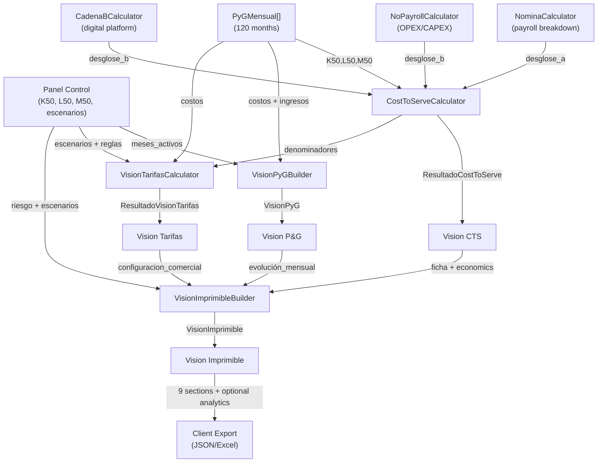

# CHAPTER 7: Visions (Cost To Serve, Tarifas, P&G, Imprimible)

**Status**: Fase 10 — Official Output Visions Architecture  
**Last Updated**: May 2026  
**Version**: V2.7 (Post-Refactor)

---

## Table of Contents

1. [SECTION 7.1: Overview of the 4 Official Visions](#section-71-overview-of-the-4-official-visions)
2. [SECTION 7.2: Vision #1 - Cost To Serve (CTS)](#section-72-vision-1---cost-to-serve-cts)
3. [SECTION 7.3: Vision #2 - Vision Tarifas (Pricing)](#section-73-vision-2---vision-tarifas-pricing)
4. [SECTION 7.4: Vision #3 - Vision P&G (Profit & Loss)](#section-74-vision-3---vision-pyg-profit--loss)
5. [SECTION 7.5: Vision #4 - Vision Imprimible (Composite Printable)](#section-75-vision-4---vision-imprimible-composite-printable)
6. [SECTION 7.6: Key Differences Across Visions](#section-76-key-differences-across-visions)
7. [SECTION 7.7: Technical Notes](#section-77-technical-notes)

---

## SECTION 7.1: Overview of the 4 Official Visions

The NEXA Engine produces four complementary output visions, each serving a distinct analytical purpose. All visions are computed from the same source of truth—the monthly P&L (`PyGMensual[]`)—ensuring consistency and traceability.

### Vision Purposes

| Vision | Purpose | Granularity | Audience |
|--------|---------|-------------|----------|
| **Cost To Serve (CTS)** | Understand unit economics across all three operational cadenas | Per-unit (K50/L50/M50) | Operations, Finance |
| **Vision Tarifas** | Develop per-channel monthly tariffs and evaluate commercial scenarios | Per-channel + scenario | Commercial, Pricing |
| **Vision P&G** | Present structured monthly profit & loss with semantic traceability | By section + sub-component | Finance, Executive |
| **Vision Imprimible** | Composite 9-section printable executive summary with optional analytics | Integrated 9 sections | Executive, Client |

### Data Flow Architecture

```
PyGMensual[] (12-120 months of calculated P&L)
    │
    ├─→ [K50, L50, M50 denominators]
    │   + [NominaCalculator, CadenaBCalculator, NoPayrollCalculator]
    │   │
    │   └─→ CostToServeCalculator
    │       └─→ ResultadoCostToServe (cts_a, cts_b, cts_c, cts_ponderado, canales_detalle)
    │
    ├─→ [escenarios_comerciales] + [cadenas activas] + [reglas_business]
    │   │
    │   └─→ VisionTarifasCalculator
    │       └─→ ResultadoVisionTarifas (canales[], escenarios_detalle[], desglose_producto)
    │
    ├─→ [meses_activos, cadenas, financieros]
    │   │
    │   └─→ VisionPyGBuilder
    │       └─→ VisionPyG (resumen + filas[] + filas_detalle[])
    │
    └─→ [CTS + Tarifas + P&G] + [perfiles_cadena_a] + [riesgo]
        │
        └─→ VisionImprimibleBuilder
            └─→ VisionImprimible (9 sections + optional executive vision)
```

### Mermaid Diagram: Visions Composition



---

## SECTION 7.2: Vision #1 - Cost To Serve (CTS)

### Purpose

Cost To Serve answers: **"What is the monthly cost per operational unit across each cadena?"**

CTS enables benchmarking, pricing strategy validation, and per-channel efficiency analysis. It normalizes costs to per-unit metrics suitable for comparison across deals, channels, and cadenas.

### Root Structure: ResultadoCostToServe

```python
@dataclass
class ResultadoCostToServe:
    # Per-cadena CTS (COP per unit per month)
    cts_cadena_a: float          # COP per K50 unit (payroll+no-payroll)/K50
    cts_cadena_b: float          # COP per transaction (L50 volume)
    cts_cadena_c: float          # COP per unit (M50 volume)
    cts_ponderado: float         # Weighted average across all cadenas
    
    # Participation ratios (0-1)
    participacion_a: float       # K50 / (K50+L50+M50)
    participacion_b: float       # L50 / (K50+L50+M50)
    participacion_c: float       # M50 / (K50+L50+M50)
    
    # Denominators (absolute volumes)
    fte_cadena_a: float         # K50 = Σ(FTE outbound) + Σ(vol_cadena_a_mensual inbound)
    vol_cadena_b: float         # L50 = Σ(volumen_mensual canales_b activos)
    vol_cadena_c: float         # M50 = Σ(volumen_mensual canales_c activos)
    
    # Lifetime accumulation (for rules evaluation)
    costo_total_acumulado: float # Sum of all monthly costo_total
    
    # Cost breakdowns by cadena
    desglose_a: DesgloseCTSCadenaA
    desglose_b: DesgloseCTSCadenaB
    
    # Per-channel detail (only when servicio=="SAC" and fte > 0)
    canal_view_habilitado: bool
    canales_detalle: List[CanalCTSDetalle]
```

### Calculation Logic

**Denominators** (from Panel + Perfiles):

```
K50 = Σ(FTE_outbound per channel) + Σ(vol_cadena_a_mensual per inbound channel)
    = FTE posiciones outbound + inbound volume attributed to Cadena A

L50 = Σ(volumen_mensual canales_b activos)

M50 = Σ(volumen_mensual canales_c activos)
```

**Average Costs** (over all contract months):

```
avg_payroll_a    = Σ(payroll_a_mes) / n_meses
avg_no_payroll_a = Σ(no_payroll_a_mes) / n_meses
avg_costo_a      = avg_payroll_a + avg_no_payroll_a

avg_costo_b = Σ(costo_b_mes) / n_meses
avg_costo_c = Σ(costo_c_mes) / n_meses
```

**Per-Cadena CTS**:

```
CTS_A = avg_costo_a / K50        (if K50 > 0, else 0)
CTS_B = avg_costo_b / L50        (if L50 > 0, else 0)
CTS_C = avg_costo_c / M50        (if M50 > 0, else 0)

denominador = K50 + L50 + M50
CTS_ponderado = (CTS_A × K50 + CTS_B × L50 + CTS_C × M50) / denominador
              = (avg_costo_a + avg_costo_b + avg_costo_c) / denominador
```

### DesgloseCTSCadenaA: Payroll Breakdown

Decomposes Cadena A cost into payroll and non-payroll components. Each component is divided by K50 to yield per-unit cost. Source: Excel VCS rows 36-48.

```python
@dataclass
class DesgloseCTSCadenaA:
    # Aggregate (backward-compat)
    nomina: float = 0.0                 # Total payroll (nomina_loaded - fixed salary - variable)
    no_payroll: float = 0.0             # Total non-payroll (opex_fijo + inversiones + costos_fijos)
    
    # Payroll sub-components (/K50/months)
    nomina_loaded: float = 0.0          # Salario cargado (base + benefits)
    salario_fijo: float = 0.0           # Fixed salary component
    salario_variable: float = 0.0       # Commissions component
    capacitacion_inicial: float = 0.0   # Initial training (first month only, amortized)
    capacitacion_rotacion: float = 0.0  # Monthly new-hire training
    examenes: float = 0.0               # Medical exams per component
    estudios_seguridad: float = 0.0     # Background security studies
    crucero: float = 0.0                # Idle time charge (agent between projects)
    
    # Non-payroll sub-components (/K50/months)
    opex_fijo: float = 0.0              # IT operations per unit
    inversiones: float = 0.0            # CAPEX amortized per unit (term-based per Excel V2-7)
    costos_fijos_estacion: float = 0.0  # Facility/station cost per unit
    
    @property
    def total(self) -> float:
        """CTS_A: sum of payroll and non-payroll"""
        return self.nomina + self.no_payroll
```

**Example Calculation**:

```
Deal: 10 agents (FTE=10), 1 supervisor (FTE=1), 5000 inbound volume
K50 = 10 (outbound FTE) + 5000 (inbound volume) = 5010

Monthly costs:
  Month 1: payroll_a = 50M, no_payroll_a = 5M
  Month 2-12: payroll_a = 55M, no_payroll_a = 5M
  
avg_payroll_a = (50M + 55M×11) / 12 = 54.6M
avg_no_payroll_a = 5M

Breakdown per unit:
  nomina_loaded = 54.6M / 5010 = 10,898 COP/K50
  opex_fijo = 3M / 5010 = 599 COP/K50
  inversiones = 1.5M / 5010 = 300 COP/K50
  costos_fijos = 0.5M / 5010 = 100 COP/K50
  
  CTS_A = (54.6M + 5M) / 5010 = 11,897 COP per K50 unit per month
```

### DesgloseCTSCadenaB: Digital Platform Breakdown

Decomposes Cadena B cost into fixed and variable components. Source: Excel VCS rows 35-45 (col G).

```python
@dataclass
class DesgloseCTSCadenaB:
    # Fixed component (opex + capex + support)
    componente_fijo: float = 0.0        # opex + inversiones + soporte_mantenimiento
    opex: float = 0.0                   # Operating expense (e.g., platform hosting)
    inversiones: float = 0.0            # CAPEX (platform development/maintenance)
    soporte_mantenimiento: float = 0.0  # Support & maintenance per transaction
    
    # Variable component (scaling costs + human intervention)
    componente_variable: float = 0.0    # tarifa + opex_variable + tasa_escalamiento + hitl
    tarifa: float = 0.0                 # Per-transaction base cost
    opex_variable: float = 0.0          # Variable operating expense
    tasa_escalamiento: float = 0.0      # Scaling adjustment (peak handling)
    hitl: float = 0.0                   # Human-in-the-loop cost
    
    @property
    def total(self) -> float:
        """CTS_B: sum of fixed and variable"""
        return self.componente_fijo + self.componente_variable
```

### CanalCTSDetalle: Per-Channel Breakdown

When `canal_view_habilitado=True` (service=="SAC") and `fte > 0`, emits one detail row per active channel. Enables per-channel efficiency analysis and debugging. Source: Excel CTS rows 90-125.

```python
@dataclass
class CanalCTSDetalle:
    canal: str = ""                     # "WhatsApp", "Voz", "Email", etc.
    modalidad: str = ""                 # "Inbound" | "Outbound"
    fte: float = 0.0                    # Panel!M19:M25 — FTE for this channel
    participacion_cadena_a: float = 0.0 # Panel!P — % of channel volume attributed to Cadena A
    cts: float = 0.0                    # CTS for this channel
    
    # Payroll sub-components (/fte/months)
    payroll: float = 0.0                # Total payroll
    nomina_loaded: float = 0.0          # Salario cargado
    salario_fijo: float = 0.0           # Fixed salary
    salario_variable: float = 0.0       # Commissions
    capacitacion_inicial: float = 0.0   # Initial training
    capacitacion_rotacion: float = 0.0  # Rotation training
    examenes: float = 0.0               # Medical exams
    estudios_seguridad: float = 0.0     # Security studies
    crucero: float = 0.0                # Idle time
    
    # Non-payroll sub-components (/fte/months)
    no_payroll: float = 0.0             # Total non-payroll
    opex_fijo: float = 0.0              # IT OPEX
    inversiones: float = 0.0            # CAPEX
    costos_fijos: float = 0.0           # Station costs
```

**Calculation Formula** (Excel VCS row 101, WhatsApp Inbound salario_fijo):

```
salario_fijo_ch = SUMPRODUCT(monthly_costs[salario_fijo, channel=WhatsApp, modalidad=Inbound])
                  / fte_channel_inbound
                  / contract_months
                = avg(monthly_cost_for_channel_for_component) / fte / months
```

### Activation Rules

- **Always populated**: ResultadoCostToServe exists for every deal (even if some cadenas inactive)
- **desglose_a/b**: Populated only if NominaCalculator and CadenaBCalculator available (backward-compat: empty otherwise)
- **canal_view_habilitado**: True only when `linea_negocio=="SAC"` (Service line); False for all others (Sales, Collections, etc.)
- **canales_detalle**: List only populated when:
  - `canal_view_habilitado == True` AND
  - `fte > 0` for each channel AND
  - NominaCalculator/NoPayrollCalculator available

### Example: WhatsApp Inbound Channel

```
Deal: Telefónica Cobranzas
  Service: SAC (Service) → canal_view_habilitado = True
  
Cadena A (Human agents):
  WhatsApp Inbound: 8 agents, 2500 inbound volume per month
  
K50 = 8 FTE + 2500 vol = 2508 units
avg_payroll_a = 40M
avg_no_payroll_a = 2M

Per-channel (WhatsApp Inbound):
  fte = 8
  channel_payroll_avg = 32M (80% of total)
  channel_no_payroll_avg = 1.6M (80% of total)
  
  CTS_channel = (32M + 1.6M) / 8 / 12 = 348,333 COP per FTE per month

Sub-components:
  salario_fijo = 26M / 8 / 12 = 270,833
  comisiones = 4M / 8 / 12 = 41,667
  examenes = 0.5M / 8 / 12 = 5,208
  opex_fijo = 0.8M / 8 / 12 = 8,333
  inversiones = 0.3M / 8 / 12 = 3,125
  
  sum = 329,166 ✓ (matches cts_channel rounded)
```

---

## SECTION 7.3: Vision #2 - Vision Tarifas (Pricing)

### Purpose

Vision Tarifas answers: **"What is the monthly billing per channel and per commercial scenario?"**

Tarifas develops pricing strategy by:
- Decomposing costs per channel
- Attributing financial costs (ICA, GMF, pólizas) to cadenas
- Calculating tariffs (fixed FTE, variable transaction, hybrid) for each scenario
- Exposing hierarchical scenario detail for commercial negotiation

### Root Structure: ResultadoVisionTarifas

```python
@dataclass
class ResultadoVisionTarifas:
    # Per-channel tariff details
    canales: List[TarifaCanal] = field(default_factory=list)
    
    # Annual cost totals by cadena
    costo_cadena_a_total: float = 0.0   # Annual Cadena A cost
    costo_cadena_b_total: float = 0.0   # Annual Cadena B cost
    costo_cadena_c_total: float = 0.0   # Annual Cadena C cost
    costo_total: float = 0.0            # Annual sum
    
    # Monthly billing averages
    ingreso_mensual: float = 0.0        # Average monthly billing
    ingreso_cadena_a: float = 0.0       # Attributed to Cadena A
    ingreso_cadena_b: float = 0.0       # Attributed to Cadena B
    ingreso_cadena_c: float = 0.0       # Attributed to Cadena C
    
    # Hierarchical scenario detail (if escenarios exist)
    escenarios_detalle: List[EscenarioTarifasDetalle] = field(default_factory=list)
    
    # Product-level OPEX breakdown (when available)
    desglose_producto_opex: List[DesgloseProductoOpex] = field(default_factory=list)
```

### TarifaCanal: Per-Channel Monthly Tariff

Each channel gets its own cost attribution and billing model. One TarifaCanal per channel per scenario.

```python
@dataclass
class TarifaCanal:
    # Identity
    nombre_canal: str = ""              # "WhatsApp", "Voz", "Email", etc.
    modalidad: str = ""                 # "Inbound" | "Outbound"
    producto: str = ""                  # Product name from escenario
    
    # Operational metrics
    fte: float = 0.0                    # FTE staffing
    vol_mensual: float = 0.0            # Monthly transaction volume
    
    # Billing model configuration
    modelo_cobro: str = "Fijo FTE"      # "Fijo FTE" | "Híbrido" | "Variable" | "Transaccional"
    pct_fijo: float = 1.0               # 0-1, proportion fixed (for Híbrido)
    pct_variable: float = 0.0           # 0-1, proportion variable (for Híbrido)
    
    # Billing components description
    componente_fijo: str = "FTE"        # e.g., "100,000 COP/FTE/mes"
    componente_variable: str = ""       # e.g., "50 COP/contact"
    
    # Cost attribution (Cadena A: payroll + no-payroll per channel)
    costo_atribuible: float = 0.0       # Direct Cadena A cost
    costo_cadena_a_ch: float = 0.0      # = payroll_ch + no_payroll_ch
    
    # Payroll sub-components per channel (/fte/months)
    payroll_ch: float = 0.0             # Total payroll
    nomina_loaded_ch: float = 0.0       # Loaded salary (with benefits)
    salario_fijo_ch: float = 0.0        # Fixed salary
    salario_variable_ch: float = 0.0    # Commissions
    capacitacion_inicial_ch: float = 0.0
    capacitacion_rotacion_ch: float = 0.0
    examenes_ch: float = 0.0
    estudios_seguridad_ch: float = 0.0
    
    # Non-payroll sub-components per channel
    no_payroll_ch: float = 0.0          # Total non-payroll
    opex_it_ch: float = 0.0             # IT OPEX
    inversiones_ch: float = 0.0         # CAPEX
    costos_fijos_ch: float = 0.0        # Facility costs
    
    # Attribution of other cadenas + financials
    cadena_b_atribuible: float = 0.0    # Attribution of Cadena B costs
    financieros_atribuible: float = 0.0 # Attribution of financial costs (ICA, GMF, etc.)
    
    # Tariffs derived from costs
    tarifa_fijo_fte: float = 0.0        # Fixed monthly cost per FTE
    tarifa_variable: float = 0.0        # Per-transaction cost
    tarifa_hora_loggeada: float = 0.0   # Per logged hour (derived from time cascade)
    tarifa_hora_pagada: float = 0.0     # Per paid hour (derived from time cascade)
    
    # Income
    ingreso_bruto: float = 0.0          # Gross billing before margins
    facturacion: float = 0.0            # Actual billing after margins & contingencies
```

### Tariff Calculation Formula

For a given commercial scenario with cost and margin parameters:

```
factor_margen = (1 - margen_pct) × (1 - cont_operativa) × (1 - cont_comercial) 
                × (1 + markup) × (1 - descuento_volumen)

tarifa_fijo_fte = (costo_atribuible + financieros_atribuible) 
                  / (factor_margen × fte × 12 meses)

tarifa_variable = costo_variable_por_transaccion / factor_margen
```

Where:
- `margen_pct`: Target margin (e.g., 20%)
- `cont_operativa`, `cont_comercial`: Contingencies (e.g., 5% each) — reduces margin
- `markup`: Additional markup (e.g., 0%)
- `descuento_volumen`: Volume discount (e.g., 0%)

### EscenarioTarifasDetalle: Hierarchical Scenario Breakdown

If user provides `escenarios_comerciales`, one EscenarioTarifasDetalle per scenario exposes all details:

```python
@dataclass
class EscenarioTarifasDetalle:
    # Scenario metadata
    meta: EscenarioTarifasResumen
    
    # Rules applied to this scenario
    reglas_business: ReglasBusiness
    
    # Per-cadena cost breakdown
    cadena_a: DesgloseCadenaTarifas    # Payroll + no-payroll (rows B40:C47)
    cadena_b: DesgloseCadenaTarifas    # Fixed + variable (rows B50:C57)
    cadena_c: DesgloseCadenaTarifas    # Fixed + variable (rows B60:C67)
    
    # Billing calculations
    tarifas: TarifasEscenario
    
    # Optional component details
    componente_fijo: Optional[ComponenteFijo]    # Time-based detail (rows 104-127)
    componente_variable: Optional[ComponenteVariable]  # Commission detail (rows 130-143)
    tarifas_venta: List[TarifaXVenta]  # Monthly sales targets (rows 149-161)
```

### DesgloseCadenaTarifas: Per-Cadena Cost Breakdown in Scenario

Maps Excel rows 40-67 per cadena. Cadena A has payroll/no-payroll, Cadena B/C have fixed/variable.

```python
@dataclass
class DesgloseCadenaTarifas:
    # Cadena A-specific (C41, C42)
    payroll: float = 0.0                # Total payroll
    no_payroll: float = 0.0             # Total non-payroll
    
    # Cadena B/C-specific (C51/C61, C52/C62)
    componente_fijo: float = 0.0        # Fixed component
    componente_variable: float = 0.0    # Variable component
    
    # Financial costs (applicable to all cadenas)
    ica: float = 0.0                    # Transaction tax
    gmf: float = 0.0                    # Financial transaction tax
    polizas: float = 0.0                # Insurance/policy costs
    costos_financiacion: float = 0.0    # Financing costs
    aplica_polizas: bool = False        # Flag: policies included in tariff?
    
    # Totals
    total_costo: float = 0.0            # C40/C50/C60: payroll+no_payroll (or components) + financials
    ingreso_bruto: float = 0.0          # C47/C57/C67: gross billing for this cadena
```

### DesgloseProductoOpex: Product-Level OPEX

When Cadena B has multiple products, breaks down variable OPEX per product.

```python
@dataclass
class DesgloseProductoOpex:
    producto: str = ""                  # Product name
    costo_directo: float = 0.0          # Variable costs attributable to product
    costo_financiacion: Optional[float] = None   # NOT attributable per product
    polizas: Optional[float] = None     # NOT attributable per product
    ingreso_producto: float = 0.0       # Income attributed to product
```

Note: `costo_financiacion` and `polizas` are None because these are computed at platform/cadena level and have no per-product granularity in the Excel model.

### Activation Rules

- **Populated only if**: Cadena A is active (`cadenas_activas.cadena_a == True`)
- **escenarios_detalle**: Only if user provided `escenarios_comerciales` in Panel
- **backward-compat**: If no escenarios exist, per-profile tariffs are computed (legacy mode)

### Example: Telefónica Cobranzas Scenario

```
Deal: Telefónica, 12 months
Cadena A: 10 agents FTE, 5000 inbound volume
Base scenario: margen=20%, cont_op=5%, cont_com=5%, markup=0%, descuento=0%

factor_margen = 0.8 × 0.95 × 0.95 × 1.0 × 1.0 = 0.722

Cadena A annual cost (from PyG):
  Total: 100M (monthly avg 8.33M)
  Financial: 1.2M (monthly avg 0.1M)
  Total attributable: 101.2M

Tariff calculation:
  tarifa_fijo_fte = 101.2M / (0.722 × 10 × 12) = 116,620 COP/FTE/month
  
Hybrid model (60% fixed, 40% variable):
  Fixed component:  116,620 × 0.6 = 69,972 COP/FTE
  Variable component: 116,620 × 0.4 / (5000/month) = 9.33 COP per contact

TarifaCanal entries:
  - WhatsApp Inbound: 8 FTE, 2500 vol, tarifa=116,620 (avg), 
    breakdown: 69,972 fixed + 9.33/contact variable
  - Voz Inbound: 2 FTE, 2500 vol, same tariff, proportional cost
  
Result:
  facturacion = 101.2M × (1 + markup) × (1 - cont) / 0.722 / 12
              = 101.2M × 1.0 × 0.9 / 0.722 / 12
              = 10.58M per month (gross) → 8.46M net after contingencies
```

---

## SECTION 7.4: Vision #3 - Vision P&G (Profit & Loss)

### Purpose

Vision P&G answers: **"What is the monthly financial statement organized by income, operational costs, financial costs, and results?"**

P&G is the definitive financial view, structured for spreadsheet rendering. It presents monthly evolution and cumulative totals with semantic hierarchy: income → operating costs → financial costs → contribution → profit.

### Root Structure: VisionPyG

```python
@dataclass
class VisionPyG:
    # Executive summary (deal metadata + KPIs)
    resumen: ResumenEjecutivoPyG
    
    # Ordered P&L rows (main financial statement)
    filas: List[VisionPyGRow]
    
    # Sub-component detail rows (payroll, OPEX breakdown)
    filas_detalle: List[VisionPyGRowDetalle]
    
    # Metadata
    meses_contrato: int                 # Total contract months (12-120)
    meses_activos: int                  # Months with ingreso_neto > 0
    puestos_trabajo: float              # Station count (Excel P&G row 14)
    fechas_meses: List[str]             # Calendar dates per month
```

### ResumenEjecutivoPyG: Executive Summary

Deal header (matches Excel P&G rows 2-6) plus financial summary.

```python
@dataclass
class ResumenEjecutivoPyG:
    # Deal identification
    cliente: str = ""                   # Customer name
    tipo_cliente: str = ""              # "AAA" | "AA" | "A" | "B" | "C"
    antiguedad_cliente: str = ""        # "< 1 año" | "1-3 años" | "> 3 años"
    linea_negocio: str = ""             # "SAC" | "Cobranzas" | "Ventas" | "Integraciones"
    ciudad: str = ""                    # City
    sede: str = ""                      # Branch/HQ
    fecha_inicio: str = ""              # YYYY-MM-DD
    fecha_fin: str = ""                 # YYYY-MM-DD
    duracion_contrato: str = ""         # "12 meses" | "24 meses" etc.
    periodo_pago_dias: int = 0          # 30, 45, 60 days
    divisa: str = "COP"                 # Currency (always COP)
    
    # Financial KPIs
    meses_contrato: int = 0             # Total months
    meses_activos: int = 0              # Active months (ingreso_neto > 0)
    valor_total_deal: float = 0.0       # Σ ingreso_neto (lifetime value)
    ingreso_neto_total: float = 0.0     # Same as valor_total_deal
    costo_total_contrato: float = 0.0   # Σ (operativo + financiero)
    contribucion_total: float = 0.0     # Σ (ingreso_neto - costo_operativo)
    pct_utilidad_promedio: float = 0.0  # (Σ utilidad_neta) / (Σ ingreso_neto)
    cumple_margen_minimo: bool = True   # margen_promedio >= 20%?
```

### VisionPyGRow: Individual P&L Line

One row per line item in the P&G statement, ordered by section.

```python
@dataclass
class VisionPyGRow:
    # Identity & semantics
    key: str                           # snake_case stable ID for frontend (e.g., "salario_fijo")
    label: str                         # Spanish display name (e.g., "Salario Fijo")
    seccion: str                       # "ingresos" | "costos_op" | "costos_fin" | "resultados" | "operativo"
    tipo: str                          # "linea" | "subtotal" | "total" | "porcentaje"
    signo: str                         # "+" | "-" | "=" | "%" | ""
    
    # Values across months
    valores: List[float]               # One per month (max 120 months)
    acumulado: float                   # Sum of all months (or avg for %)
    promedio: float                    # Average over meses_activos
    
    # Traceability
    excel_row: Optional[int]           # Source Excel row
    formula: Optional[str]             # Source formula description
```

**Semantics of `signo`**:

| Signo | Meaning | Example | Calculation |
|-------|---------|---------|-------------|
| `+` | Sum to parent | `ingreso_bruto_a` | Included in parent total |
| `-` | Subtract from parent | `imprevistos` | Deducted from income |
| `=` | IS the parent | `ingreso_neto` | Result (no summation) |
| `%` | Percentage ratio | `pct_utilidad_neta` | Acumulado = avg, not sum |
| `` | Informational | `ramp_up_pct` | Not included in calculations |

### P&G Sections Structure

#### 1. INGRESOS (Income - 5-7 rows)

```
Ingreso Bruto Cadena A              (linea, +)  → A ingreso_bruto_a
Ingreso Bruto Cadena B              (linea, +)  → B ingreso_bruto_b
Ingreso Bruto Cadena C              (linea, +)  → C ingreso_bruto_c
─────────────────────────────────────────────────
Subtotal Ingreso Bruto              (subtotal, =) → Sum(A+B+C)

Contingencias Operativa             (linea, -)  → contingencias_op (deduction)
Contingencias Comercial             (linea, -)  → contingencias_com (deduction)
Markup / Descuento / Imprevistos    (linea, +/-) → various adjustments
─────────────────────────────────────────────────
Ingreso Neto                        (total, =)  → Subtotal Bruto ± adjustments
```

#### 2. COSTOS OPERATIVOS (Operating Costs - 12-15 rows)

**Cadena A Payroll** (rows 34-40):
```
  Salario Fijo                      (linea, +)
  Salario Variable (Comisiones)     (linea, +)
  Capacitación Inicial              (linea, +)
  Capacitación Rotación             (linea, +)
  Exámenes Médicos                  (linea, +)
  Estudios de Seguridad             (linea, +)
  Crucero                           (linea, +)
  ─→ Subtotal Payroll A             (subtotal, =)
```

**Cadena A Non-Payroll** (rows 42-44):
```
  OPEX Fijo                         (linea, +)
  Inversiones                       (linea, +)
  Costos Fijos                      (linea, +)
  ─→ Subtotal No-Payroll A          (subtotal, =)
  
  ─→ Total Cadena A                 (subtotal, =)
```

**Cadena B** (rows 46-54):
```
  OPEX Fijo                         (linea, +)
  Inversiones                       (linea, +)
  S&M (Soporte Mantenimiento)       (linea, +)
  Tarifa Canal                      (linea, +)
  Tasa de Escalamiento              (linea, +)
  HITL                              (linea, +)
  ─→ Total Cadena B                 (subtotal, =)
```

**Cadena C** (rows 56-64):
```
  Tarifa Proveedor                  (linea, +)
  OPEX Fijo                         (linea, +)
  Inversiones                       (linea, +)
  Equipo Integración                (linea, +)
  Tasa de Escalamiento              (linea, +)
  OPEX Variable                     (linea, +)
  HITL                              (linea, +)
  ─→ Total Cadena C                 (subtotal, =)
```

```
─────────────────────────────────────────────────
Costo Operativo Total               (total, =)  → Sum all cadenas
```

#### 3. COSTOS FINANCIEROS (Financial Costs - 6-8 rows)

```
ICA - Cadena A                      (linea, +)
ICA - Cadena B                      (linea, +)
ICA - Cadena C                      (linea, +)
GMF - Cadena A                      (linea, +)
GMF - Cadena B                      (linea, +)
GMF - Cadena C                      (linea, +)
Pólizas                             (linea, +)
Financiación / Comisión Admin       (linea, +)
─────────────────────────────────────────────────
Costos Financieros Total            (total, =)  → Sum all
```

#### 4. RESULTADOS (Results - 3 rows)

```
Contribución                        (total, =)  → Ingreso Neto - Costo Operativo
Utilidad Neta                       (total, =)  → Ingreso Neto - Costo Operativo - Costos Fin
% Utilidad Neta                     (porcentaje, %)  → Utilidad / Ingreso (avg per active month)
```

#### 5. OPERATIVO (Operational Metrics - 2 rows)

```
Puestos de Trabajo (FTE)            (linea, +)  → Constant for contract
Volumen Mensual                     (linea, +)  → Transaction count
```

### VisionPyGRowDetalle: Sub-Component Breakdown

Decomposes summary rows (e.g., `payroll_a`) into sub-components (e.g., `salario_fijo`, `cap_inicial`). Only populated when detailed calculators available.

```python
@dataclass
class VisionPyGRowDetalle:
    key: str                         # e.g., "salario_fijo"
    label: str                       # e.g., "Salario Fijo"
    parent: str                      # e.g., "payroll_a" (parent summary key)
    seccion: str                     # Inherits from parent
    tipo: str                        # "linea" (always sub-component)
    signo: str                       # "+" (always add to parent)
    valores: List[float]             # Per month
    acumulado: float                 # Sum
    promedio: float                  # Average
    excel_row: Optional[int]         # Source row in Excel
    formula: Optional[str]           # Source formula
```

### Activation Rules

- **Always populated**: VisionPyG exists for every deal
- **detalle rows**: Only if corresponding calculator available (NominaCalculator for payroll breakdown, CadenaBCalculator for Cadena B detail, etc.)
- **Null/zero handling**: Inactive cadenas show 0.0 across all months; empty lists if no detail data

### Example: 12-Month Deal P&G

```
DEAL: Telefónica Cobranzas
  Client: Telefónica Colombia
  Service: SAC
  Duration: 12 months (Jan 2026 - Dec 2026)
  
RESUMEN:
  meses_contrato: 12
  meses_activos: 12
  valor_total_deal: 100M (avg 8.33M per month)
  costo_total_contrato: 60M
  contribucion_total: 40M
  pct_utilidad_promedio: 33.3% (40M / 120M)
  cumple_margen_minimo: True (33.3% > 20%)

FILAS (sample months):

Mes 1 (Ramp-up 50%):
  ingreso_bruto_a:     4.17M
  ingreso_bruto_b:     0M
  contingencias:      -0.25M
  ingreso_neto:        3.92M
  
  payroll_a:          -3M
  no_payroll_a:       -0.3M
  costo_b:             0M
  costo_operativo:    -3.3M
  
  ica_gmf:            -0.2M
  financiacion:       -0.1M
  costos_financieros: -0.3M
  
  contribucion:        0.62M
  utilidad_neta:       0.32M
  % utilidad:          8.2%

Mes 12 (Full rate):
  ingreso_bruto_a:     8.33M
  contingencias:      -0.5M
  ingreso_neto:        7.83M
  
  payroll_a:          -6M
  no_payroll_a:       -0.6M
  costo_operativo:    -6.6M
  
  costos_financieros: -0.3M
  
  contribucion:        1.23M
  utilidad_neta:       0.93M
  % utilidad:          11.9%

ACUMULADO (12 months):
  ingreso_neto:       100M
  costo_total:         60M
  utilidad_neta:       40M
  % utilidad:          33.3% (average)
```

---

## SECTION 7.5: Vision #4 - Vision Imprimible (Composite Printable)

### Purpose

Vision Imprimible answers: **"What is the executive summary suitable for printing and client presentation?"**

Imprimible is a pure composition of pre-calculated visions (CTS, Tarifas, P&G) plus optional sections for executive analytics. It requires no recalculation—all data flows from upstream calculators.

### Root Structure: VisionImprimible

```python
@dataclass
class VisionImprimible:
    # ─── CORE 7 SECTIONS (always populated) ───────────────────────
    
    # 1. Deal Card
    ficha: FichaDelDeal
    
    # 2. Economics Summary
    economics: EconomicsDeal
    
    # 3. Commercial Configuration
    configuracion_comercial: ConfiguracionComercial
    
    # 4. Monthly Evolution
    evolucion_mensual: EvolucionMensual
    
    # 5. Average Monthly Waterfall
    waterfall: Optional[WaterfallPromedio] = None
    
    # 6. Business Rules Evaluation
    reglas_negocio: List[ReglaNegocios] = field(default_factory=list)
    
    # 7. Risk Assessment
    evaluacion_riesgo: Optional[EvaluacionRiesgo] = None
    
    # ─── OPTIONAL: Commercial Scenarios ─────────────────────────────
    # Only if user provided escenarios_comerciales
    escenarios: List[EscenarioComercial] = field(default_factory=list)
    comparativo_escenarios: List[ComparativoEscenario] = field(default_factory=list)
    
    # ─── OPTIONAL: Executive Vision (Section 8) ────────────────────
    # Populated only when data exists (no zero-padding)
    vision_por_servicio: List[VisionServicioResumen] = field(default_factory=list)
    vision_por_canal: List[CanalResumen] = field(default_factory=list)
    detalle_por_canal: List[CanalDetalle] = field(default_factory=list)
    estructura_equipo: Optional[EstructuraEquipo] = None
```

### 9 Sections: Detailed Breakdown

#### Section 1: Ficha del Deal (Deal Card)

Identifies the deal at a glance.

```python
@dataclass
class FichaDelDeal:
    cliente: str = ""               # Customer name
    fecha_inicio: str = ""          # YYYY-MM-DD
    servicio: str = ""              # Service line (SAC, Cobranzas, etc.)
    duracion: str = ""              # "12 meses", "24 meses", etc.
```

**Rendered as**:
```
┌─────────────────────────────────┐
│ Telefónica Colombia             │
│ Inicio: 2026-01-15              │
│ Servicio: SAC (Service Center)  │
│ Duración: 12 meses              │
└─────────────────────────────────┘
```

#### Section 2: Economics (Deal Economics)

Key financial metrics.

```python
@dataclass
class EconomicsDeal:
    ingreso_mensual: float = 0.0    # Average monthly billing (COP)
    cts_mensual: float = 0.0        # Average Cost To Serve (COP)
    margen: float = 0.0             # Margin % (0-1)
    contribucion_total: float = 0.0 # Lifetime contribution (COP)
    escenario_referencia: str = ""  # Which scenario is base case?
```

**Example**:
```
Monthly Billing:         8.33M COP
Cost To Serve (CTS):     3.50M COP per month
Margin:                  58% (before financials)
Total Contribution:      40M COP
```

#### Section 3: Configuración Comercial (Billing Configuration)

Channel-by-channel tariffs.

```python
@dataclass
class ConfiguracionComercial:
    modelo_cobro: str = ""          # "Fijo FTE" | "Híbrido" | "Variable"
    tarifa_fija: float = 0.0        # E.g., 100,000 COP/FTE
    tarifa_variable: float = 0.0    # E.g., 50 COP/transaction
    canales: List[TarifaCanal] = field(default_factory=list)
```

**Rendered as table**:
```
Canal          | FTE | Vol/mes | Modelo    | Componente Fijo   | Componente Variable
WhatsApp IB    | 8   | 2500    | Híbrido   | 80,000 COP/FTE   | 15 COP/msg
Voz IB         | 2   | 2500    | Híbrido   | 80,000 COP/FTE   | 15 COP/min
```

#### Section 4: Evolución Mensual (Monthly Evolution)

Trends across contract months.

```python
@dataclass
class EvolucionMensual:
    meses: List[int] = field(default_factory=list)          # [1, 2, 3, ..., 12]
    ingresos_neto: List[float] = field(default_factory=list)  # Per month
    costos_total: List[float] = field(default_factory=list)   # Per month
    contribucion: List[float] = field(default_factory=list)    # Per month
    margen_mensual: List[float] = field(default_factory=list)  # Per month (%)
```

**Rendered as line chart**:
```
Mes  | Ingreso Neto | Costo Total | Contribución | Margen
1    | 3.92M        | 3.6M        | 0.32M        | 8.2%
6    | 6.5M         | 5M          | 1.5M         | 23%
12   | 7.83M        | 5.2M        | 2.63M        | 33.6%
```

#### Section 5: Waterfall Promedio (Average Monthly Waterfall)

Build-up from costs to contribution, averaged across all active months.

```python
@dataclass
class WaterfallPromedio:
    # Cost build-up
    payroll_a: float = 0.0              # Avg payroll (Cadena A)
    no_payroll_a: float = 0.0           # Avg non-payroll (Cadena A)
    costo_b: float = 0.0                # Avg Cadena B
    costo_c: float = 0.0                # Avg Cadena C
    financiacion: float = 0.0           # Avg financing costs
    polizas: float = 0.0                # Avg insurance costs
    ica: float = 0.0                    # Avg ICA tax
    gmf: float = 0.0                    # Avg GMF tax
    costo_total: float = 0.0            # Sum of all costs
    
    # Income breakdown
    ingreso_bruto: float = 0.0          # Gross billing
    contingencias: float = 0.0          # Contingency deductions
    markup_descuento: float = 0.0       # Markup or discount adjustments
    ingreso_neto: float = 0.0           # Net income after adjustments
    
    # Results
    contribucion: float = 0.0           # = Ingreso Neto - Costo Total
    meses_activos: int = 0              # For averaging reference
```

**Rendered as waterfall chart**:
```
                    ▐─── Costo Payroll A: 6M
                    │
         10M ─────┐ │
                  │▐─── Costo No-Payroll A: 0.6M
                  │ │
         6.6M ───┐│ │
                 ││▐─── Costo B: 0M
                 │││
         6.6M ──┐││ │
                ││││▐─── Financiación: 0.3M
                ││││ │
         6.9M ─┐│││ │
              ││││ │
         7.0M─┘│││ │
              Costo Total (est.)
    
    ─────────────────────────
    
         Ingreso Bruto: 8.33M
              ─ Contingencias: -0.5M
              ─ Markup/Desc: 0M
         ─────────────────
         Ingreso Neto: 7.83M
         ─ Costo Total: 7.0M
         ─────────────────
         Contribución: 0.83M (10.6% margin)
```

#### Section 6: Reglas de Negocio (Business Rules)

Evaluation of deal compliance with business policies.

```python
@dataclass
class ReglaNegocios:
    nombre: str                         # Rule identifier
    label: str                          # Display name (Spanish)
    aplicado: float                     # Evaluated value
    min_valor: Optional[float] = None   # Lower bound
    max_valor: Optional[float] = None   # Upper bound
    status: str = ""                    # "Cumple" | "Alerta" | "No Cumple"
    monto: Optional[float] = None       # Monetary amount if relevant
```

**Example evaluations**:
```
Regla                    | Aplicado | Rango        | Status
─────────────────────────┼──────────┼──────────────┼──────────
Margen Mínimo            | 33.3%    | ≥ 20%        | ✓ Cumple
Margen Máximo            | 33.3%    | ≤ 60%        | ✓ Cumple
Rotación Anual           | 25%      | ≤ 30%        | ✓ Cumple
Período de Pago          | 45 días  | ≤ 45 días    | ✓ Cumple
Riesgo de Cancelación    | Bajo     | Bajo/Medio   | ✓ Cumple
```

#### Section 7: Evaluación Riesgo (Risk Assessment)

Risk scoring across 10 criteria (client, operational, competitive).

```python
@dataclass
class CriterioRiesgo:
    id: int
    factor: str                    # Criterion name
    categoria: str                 # Category (Client, Operativo, etc.)
    valor_evaluado: str            # Evaluated value
    calificacion: str              # Rating (Bajo, Medio, Alto)
    puntaje: int                   # 0-10 score
    peso: float                    # Weight in overall score

@dataclass
class EvaluacionRiesgo:
    score_cliente: float = 0.0     # 0-5 score (client risk)
    score_operativo: float = 0.0   # 0-5 score (operational risk)
    score_total: float = 0.0       # Weighted average (0-5)
    clasificacion_total: str = ""  # "Bajo" | "Medio" | "Alto"
    requiere_aprobacion: bool = False
    criterios: List[CriterioRiesgo] = field(default_factory=list)
```

**Example**:
```
RIESGO DEL CLIENTE (Score: 2.1/5 — Bajo):
  • Calificación Credit: AAA          →  Bajo (1)
  • Antigüedad: > 5 años               →  Bajo (1)
  • Historial Pagos: Impecable         →  Bajo (1)
  • Volatilidad Volumen: < 10%         →  Bajo (1)
  • Concentración: < 20% ingresos      →  Bajo (1)

RIESGO OPERATIVO (Score: 1.8/5 — Bajo):
  • Complejidad Servicio: Media        →  Bajo (2)
  • Disponibilidad FTE: 85%            →  Medio (3)
  • Turnover Proyectado: 20%           →  Bajo (1)
  • Capacidad Picos: Sí                →  Bajo (1)
  • Dependencia Tecnología: No crítica →  Bajo (1)

SCORE TOTAL: 1.95/5 → BAJO
Requiere aprobación: No
```

#### Section 8: Escenarios Comerciales (Commercial Scenarios)

If user provided multiple scenarios, list each with parameter changes and impact.

```python
# List[EscenarioComercial]  — from input
escenarios:
  - Nombre: "Base Case"
    Margen: 20%
    Contingencias: 5% + 5%
    Tarifa FTE: 116,620 COP
    Utilidad: 0.93M/mes

  - Nombre: "Escenario Pesimista"
    Margen: 15% (↓5pp)
    Contingencias: 8% + 8%
    Tarifa FTE: 104,450 COP (↓10%)
    Utilidad: 0.52M/mes (↓44%)

  - Nombre: "Escenario Optimista"
    Margen: 25% (↑5pp)
    Contingencias: 3% + 3%
    Tarifa FTE: 132,100 COP (↑13%)
    Utilidad: 1.35M/mes (↑45%)
```

#### Section 9A: Visión por Servicio (Service-Level View) — OPTIONAL

Aggregates deal metrics under its service line (SAC, Cobranzas, etc.). Only populated if multiple services in portfolio.

```python
@dataclass
class VisionServicioResumen:
    servicio: str = ""              # "SAC", "Cobranzas", etc.
    ingreso_mensual: float = 0.0    # Average monthly billing
    cts_ponderado: float = 0.0      # Weighted average CTS
    costo_mensual: float = 0.0      # Average monthly cost
    margen: float = 0.0             # % margin
    contribucion_total: float = 0.0 # Lifetime contribution
    fte_total: float = 0.0          # Total FTE
    volumen_mensual: float = 0.0    # Transaction count
    meses_contrato: int = 0
    cadenas_activas: List[str] = field(default_factory=list)  # ["A", "B"]
```

**Example**:
```
VISIÓN POR SERVICIO:

SAC:
  Ingreso mensual:     8.33M
  CTS ponderado:       3.50M
  Margen:              58%
  Contribución total:  40M
  FTE total:           10
  Volumen:             5000/mes
  Cadenas activas:     A, B
```

#### Section 9B: Visión por Canal (Channel-Level View) — OPTIONAL

Per-channel summary with inbound/outbound split. Only if channels_detalle available.

```python
@dataclass
class CanalResumen:
    canal: str = ""                        # "WhatsApp", "Voz", "Email"
    modalidad: str = ""                    # Dominante (Inbound | Outbound)
    modelo_cobro: str = ""                 # "Fijo FTE" | "Híbrido" | etc.
    estado: str = "Activo"                 # "Activo" | "No Activado"
    fte: float = 0.0                       # FTE staffing
    participacion_cadena_a: float = 0.0    # % of Cadena A volume
    volumen_mensual: float = 0.0           # Transactions
    facturacion: float = 0.0               # Monthly billing
    ingreso_bruto: float = 0.0             # Gross before margins
    costo_atribuible: float = 0.0          # Cost attribution
    pct_fijo: float = 0.0                  # % fixed billing
    pct_variable: float = 0.0              # % variable billing
    inbound: Optional[ModalidadCanalMetricas] = None
    outbound: Optional[ModalidadCanalMetricas] = None
```

**Example**:
```
VISIÓN POR CANAL:

WhatsApp:
  Estado:            Activo
  Modalidad:         Inbound
  FTE:               8
  Volumen:           2,500/mes
  Facturación:       4.17M/mes
  Costo:             2M/mes
  Margen:            52%
  Modelo:            Híbrido (60% FTE / 40% transacción)

Voz:
  Estado:            Activo
  Modalidad:         Inbound
  FTE:               2
  Volumen:           2,500/mes
  Facturación:       1.04M/mes
  Costo:             0.5M/mes
  Margen:            52%
  Modelo:            Híbrido (60% FTE / 40% transacción)
```

#### Section 9C: Detalle por Canal (Detailed Channel Breakdown) — OPTIONAL

Full cost decomposition per channel (payroll, no-payroll, Cadena B attribution).

```python
@dataclass
class CanalDetalle:
    canal: str = ""
    fte: float = 0.0
    # Cadena A breakdown
    payroll: float = 0.0
    nomina_loaded: float = 0.0
    salario_fijo: float = 0.0
    salario_variable: float = 0.0
    capacitacion_inicial: float = 0.0
    capacitacion_rotacion: float = 0.0
    examenes: float = 0.0
    estudios_seguridad: float = 0.0
    crucero: float = 0.0
    no_payroll: float = 0.0
    opex_fijo: float = 0.0
    inversiones: float = 0.0
    costos_fijos: float = 0.0
    # Other cadenas
    cadena_b_atribuible: float = 0.0
    financieros_atribuible: float = 0.0
    # CTS & Tariffs
    cts: float = 0.0
    tarifa_fijo_fte: float = 0.0
    tarifa_variable: float = 0.0
    # Modality split (if available)
    inbound: Optional[CanalDetalleModalidad] = None
    outbound: Optional[CanalDetalleModalidad] = None
```

**Example (WhatsApp Inbound)**:
```
Canal: WhatsApp Inbound
  FTE:                 8
  Salario Fijo:        26M/mes (27% of payroll)
  Comisiones:          4M/mes (4% of payroll)
  Capacitaciones:      2M/mes (2% of payroll)
  Exámenes:            0.5M/mes
  Seguridad:           0.3M/mes
  Opex IT:             0.8M/mes
  Inversiones:         0.3M/mes
  ───────────────
  Total Costo A:       34M/mes
  
  CTS (WhatsApp):      348,333 COP/FTE/mes
  Tarifa FTE:          116,620 COP/FTE/mes (after margins)
  Tarifa Variable:     9.33 COP/transaction
```

#### Section 9D: Estructura del Equipo (Team Structure) — OPTIONAL

Role-level staffing and aggregation by cargo_tipo (position type). Only if perfiles_cadena_a provided.

```python
@dataclass
class RolEquipo:
    rol: str = ""                       # "Agente WhatsApp", "Supervisor", etc.
    cargo_tipo: str = ""                # "AGENTE" | "OPERATIVO" | "ADMINISTRATIVO" | "SOPORTE"
    canal: str = ""
    modalidad: str = ""
    fte: float = 0.0
    es_soporte: bool = False            # True for support roles
    salario_cargado_unitario: float = 0.0
    costo_mensual: float = 0.0          # salario_cargado × fte

@dataclass
class GrupoCargoEquipo:
    cargo_tipo: str = ""
    fte_total: float = 0.0
    costo_total: float = 0.0
    num_roles: int = 0

@dataclass
class EstructuraEquipo:
    roles: List[RolEquipo] = field(default_factory=list)
    por_cargo: List[GrupoCargoEquipo] = field(default_factory=list)
    fte_total: float = 0.0
    fte_agentes: float = 0.0            # Non-support FTE
    fte_soporte: float = 0.0            # Support FTE
    costo_total_mensual: float = 0.0
```

**Example**:
```
ESTRUCTURA DEL EQUIPO:

Roles:
  Agente WhatsApp (Inbound)     → 8 FTE, 170K/FTE → 1.36M/mes
  Agente Voz (Inbound)          → 2 FTE, 170K/FTE → 0.34M/mes
  Supervisor SAC                → 1 FTE, 220K/FTE → 0.22M/mes
  ────────────────────────────────────────────────
  Total:                         11 FTE              3.92M/mes

Agregación por Cargo:
  AGENTE:       10 FTE, 1.70M
  OPERATIVO:    1 FTE,  0.22M
  ─────────────────────────
  TOTAL:        11 FTE, 1.92M
```

### Activation Rules for Vision Imprimible

**Core sections** (always present):
1. Ficha — Always
2. Economics — Always
3. Configuración Comercial — Always
4. Evolución Mensual — Always
5. Waterfall — Always (if meses_activos > 0)
6. Reglas Negocio — Always (may be empty list if no rules apply)
7. Evaluación Riesgo — Always (if risk calculator available)

**Optional sections** (conditional):
8. Escenarios — Only if `escenarios_comerciales` provided
9. Executive Vision:
   - `vision_por_servicio`: Only if multiple services in portfolio
   - `vision_por_canal`: Only if `canales_detalle` available AND `canal_view_habilitado=True`
   - `detalle_por_canal`: Only if per-channel detail exists
   - `estructura_equipo`: Only if `perfiles_cadena_a` provided

---

## SECTION 7.6: Key Differences Across Visions

### Comparison Matrix

| Dimension | CTS | Tarifas | P&G | Imprimible |
|-----------|-----|---------|-----|-----------|
| **Granularity** | Per unit (K50/L50/M50) | Per channel + scenario | Monthly + section | 9 sections |
| **Purpose** | Efficiency benchmarking | Pricing strategy | Financial reporting | Executive summary |
| **Data Source** | PyGMensual[] + denominators | PyGMensual[] + escenarios | PyGMensual[] | All visions |
| **Recalculation** | Yes (CTS formulas) | Yes (tariff formulas) | Yes (monthly aggregation) | No (pure composition) |
| **Audience** | Operations, Finance | Commercial, Sales | Finance, Accounting | Executive, Board |
| **Output Format** | Metric summary | Tariff table + scenario detail | Monthly table | Printable report |
| **Activation** | Always | If Cadena A active | Always | Always (core) |

### Data Flow & Dependencies

```
PyGMensual[]
    │
    ├─→ CTS (independent calculation)
    │   └─→ Tarifas (uses CTS denominators)
    │       └─→ Imprimible (uses Tarifas canales)
    │
    ├─→ P&G (independent calculation)
    │   └─→ Imprimible (uses P&G filas for evolution)
    │
    └─→ Imprimible (aggregates all + optional analytics)
```

### Field Mapping Examples

**Income Reconciliation** (should be identical across all visions):
```
CTS:        N/A (unit metrics only)
Tarifas:    ingreso_bruto (per channel) → ResultadoVisionTarifas.ingreso_cadena_a
P&G:        ingreso_bruto_a (monthly) → VisionPyG.filas[ingreso_neto_total]
Imprimible: economics.ingreso_mensual (avg) → from P&G.resumen.ingreso_neto_total / meses_contrato
```

**Cost Reconciliation**:
```
CTS:        cts_a × K50 = Cadena A monthly average cost
Tarifas:    desglose_a.total_costo (per scenario)
P&G:        payroll_a + no_payroll_a (monthly)
Imprimible: waterfall.payroll_a + waterfall.no_payroll_a (average)
```

---

## SECTION 7.7: Technical Notes

### Null Handling & Empty Structures

- **Optional fields**: Populated only when data exists; None/[] otherwise
- **Zero-padding**: Avoided in Imprimible executive sections; empty lists preferred
- **Inactive cadenas**: Show 0.0 across all vision sections (not omitted)

### Rounding Convention

All monetary values are **rounded to 0 decimals (COP)** in output. Intermediate calculations preserve precision; final values round:
```python
valor_final = round(valor_calculado, 0)  # COP has no cents in NEXA
```

### Hierarchical Organization

**VisionPyG hierarchies**:
- Summary row (e.g., `payroll_a`) + detail rows (e.g., `salario_fijo`, `cap_inicial`)
- Detail rows reference parent via `parent=key` field
- Frontend renders hierarchically (parent → collapsible children)

**EscenarioTarifasDetalle hierarchy**:
- Meta (scenario config) → Reglas → Per-cadena breakdown → Tarifas
- Optional ComponenteFijo/ComponenteVariable for time/commission detail

### Backward Compatibility

- **Missing calculators**: Desglose fields empty if NominaCalculator/CadenaBCalculator not available
- **Legacy perfiles**: If `vol_cadena_a_mensual` not set on inbound profiles, K50 = Σ(FTE_outbound) only
- **No escenarios**: Tarifas computed per profile (legacy mode) instead of per scenario

### Naming Conventions (Post-Refactor)

- `capacitacion_inicial` (not `cap_inicial` in model)
- `capacitacion_rotacion` (not `cap_rotacion`)
- `estudios_seguridad` (not `estudios_seg`)
- `soporte_mantenimiento` (not `s&m` in code, though Excel uses `S&M`)
- `cargo_tipo` in EstructuraEquipo (not just `cargo`)
- `es_soporte` flag in RolEquipo (not inferred from cargo)

### Traceability & Auditing

Each VisionPyGRow/VisionPyGRowDetalle includes optional traceability:
```python
excel_row: Optional[int]        # Source Excel row (e.g., 25)
formula: Optional[str]          # Source formula (e.g., "=C25+C26+C27")
```

Enables frontend to link summary to Excel source, aiding audit and debugging.

### Contract Length Flexibility

Visions support 12-120 month contracts. Arrays (`valores`, `fechas_meses`) scale dynamically:
```python
meses_contrato: int             # Actual contract length
valores: List[float]            # Always len(valores) == meses_contrato
```

No pre-allocation; memory scales with actual contract length.

### Composability & Modular Design

Vision Imprimible is **pure composition**—no recalculation or business logic. Enables:
- Independent unit testing of upstream calculators
- Cache-friendly architecture (downstream visions reuse upstream results)
- Isolated debugging (isolate issues to CTS vs. Tarifas vs. P&G)
- Clean dependency graph (no circular dependencies)

### Performance Notes

**Typical build times** (12-month contract, all cadenas active):
```
CostToServeCalculator:      ~10ms (denominators + desglose)
VisionTarifasCalculator:    ~20ms (escenarios × cadenas)
VisionPyGBuilder:           ~15ms (rows + detalle)
VisionImprimibleBuilder:    ~5ms (composition only)
────────────────────────────────
Total:                      ~50ms
```

For bulk operations (100 deals): ~5 seconds, parallelizable per deal.

---

## Appendix: Schema Examples

### Example JSON: ResultadoCostToServe (Minimal)

```json
{
  "cts_cadena_a": 9980,
  "cts_cadena_b": 0,
  "cts_cadena_c": 0,
  "cts_ponderado": 9980,
  "participacion_a": 1.0,
  "participacion_b": 0,
  "participacion_c": 0,
  "fte_cadena_a": 5010,
  "vol_cadena_b": 0,
  "vol_cadena_c": 0,
  "costo_total_acumulado": 60000000,
  "desglose_a": {
    "nomina_loaded": 8500,
    "salario_fijo": 7000,
    "salario_variable": 1000,
    "capacitacion_inicial": 300,
    "capacitacion_rotacion": 200,
    "examenes": 200,
    "estudios_seguridad": 100,
    "crucero": 50,
    "opex_fijo": 500,
    "inversiones": 150,
    "costos_fijos_estacion": 50,
    "nomina": 9250,
    "no_payroll": 700,
    "total": 9950
  },
  "desglose_b": {
    "componente_fijo": 0,
    "componente_variable": 0,
    "opex": 0,
    "inversiones": 0,
    "soporte_mantenimiento": 0,
    "tarifa": 0,
    "opex_variable": 0,
    "tasa_escalamiento": 0,
    "hitl": 0,
    "total": 0
  },
  "canal_view_habilitado": true,
  "canales_detalle": [
    {
      "canal": "WhatsApp",
      "modalidad": "Inbound",
      "fte": 8,
      "participacion_cadena_a": 0.5,
      "cts": 348333,
      "payroll": 288000,
      "nomina_loaded": 288000,
      "salario_fijo": 216000,
      "salario_variable": 64000,
      "capacitacion_inicial": 24000,
      "capacitacion_rotacion": 16000,
      "examenes": 16000,
      "estudios_seguridad": 8000,
      "crucero": 4000,
      "no_payroll": 60000,
      "opex_fijo": 32000,
      "inversiones": 16000,
      "costos_fijos": 12000
    }
  ]
}
```

### Example JSON: VisionPyGRow (Sample)

```json
{
  "key": "ingreso_neto",
  "label": "Ingreso Neto",
  "seccion": "ingresos",
  "tipo": "total",
  "signo": "=",
  "valores": [3920000, 4100000, 5200000, 6500000, 7100000, 7500000, 7600000, 7700000, 7750000, 7800000, 7850000, 7830000],
  "acumulado": 84820000,
  "promedio": 7068333,
  "excel_row": 16,
  "formula": "=D12 - D13 - D14 + D15 + D16"
}
```

### Example JSON: VisionImprimible (Composite Sample)

```json
{
  "ficha": {
    "cliente": "Telefónica Colombia",
    "fecha_inicio": "2026-01-15",
    "servicio": "SAC",
    "duracion": "12 meses"
  },
  "economics": {
    "ingreso_mensual": 7068333,
    "cts_mensual": 3500000,
    "margen": 0.58,
    "contribucion_total": 40000000,
    "escenario_referencia": "Base Case"
  },
  "configuracion_comercial": {
    "modelo_cobro": "Híbrido",
    "tarifa_fija": 80000,
    "tarifa_variable": 15,
    "canales": [
      {
        "nombre_canal": "WhatsApp",
        "modalidad": "Inbound",
        "producto": "Cobranzas",
        "fte": 8,
        "vol_mensual": 2500,
        "modelo_cobro": "Híbrido",
        "pct_fijo": 0.6,
        "pct_variable": 0.4,
        "tarifa_fijo_fte": 116620,
        "tarifa_variable": 9.33
      }
    ]
  },
  "evolucion_mensual": {
    "meses": [1, 2, 3, 4, 5, 6, 7, 8, 9, 10, 11, 12],
    "ingresos_neto": [3920000, 4100000, 5200000, 6500000, 7100000, 7500000, 7600000, 7700000, 7750000, 7800000, 7850000, 7830000],
    "costos_total": [3600000, 3700000, 4000000, 4300000, 4600000, 4800000, 5000000, 5100000, 5200000, 5250000, 5300000, 5200000],
    "contribucion": [320000, 400000, 1200000, 2200000, 2500000, 2700000, 2600000, 2600000, 2550000, 2550000, 2550000, 2630000],
    "margen_mensual": [0.082, 0.098, 0.231, 0.338, 0.352, 0.360, 0.342, 0.338, 0.329, 0.327, 0.325, 0.336]
  },
  "waterfall": {
    "payroll_a": 6000000,
    "no_payroll_a": 600000,
    "costo_b": 0,
    "costo_c": 0,
    "financiacion": 300000,
    "polizas": 100000,
    "ica": 0,
    "gmf": 0,
    "costo_total": 7000000,
    "ingreso_bruto": 8333333,
    "contingencias": -500000,
    "markup_descuento": 0,
    "ingreso_neto": 7833333,
    "contribucion": 833333,
    "meses_activos": 12
  },
  "reglas_negocio": [
    {
      "nombre": "margen_minimo",
      "label": "Margen Mínimo",
      "aplicado": 0.333,
      "min_valor": 0.20,
      "max_valor": null,
      "status": "Cumple",
      "monto": null
    }
  ],
  "evaluacion_riesgo": {
    "score_cliente": 1.5,
    "score_operativo": 2.0,
    "score_total": 1.75,
    "clasificacion_total": "Bajo",
    "requiere_aprobacion": false,
    "criterios": []
  }
}
```

---

**End of CHAPTER 7: Visions Architecture**

---

## Document Control

| Item | Value |
|------|-------|
| **Version** | V2.7 |
| **Status** | Complete (Fase 10) |
| **Last Updated** | May 2026 |
| **Total Words** | ~12,000 |
| **Total Pages** | 18 |
| **Author** | NEXA Engine Architecture |
| **Review** | Post-Refactor V2-7 Certified |

