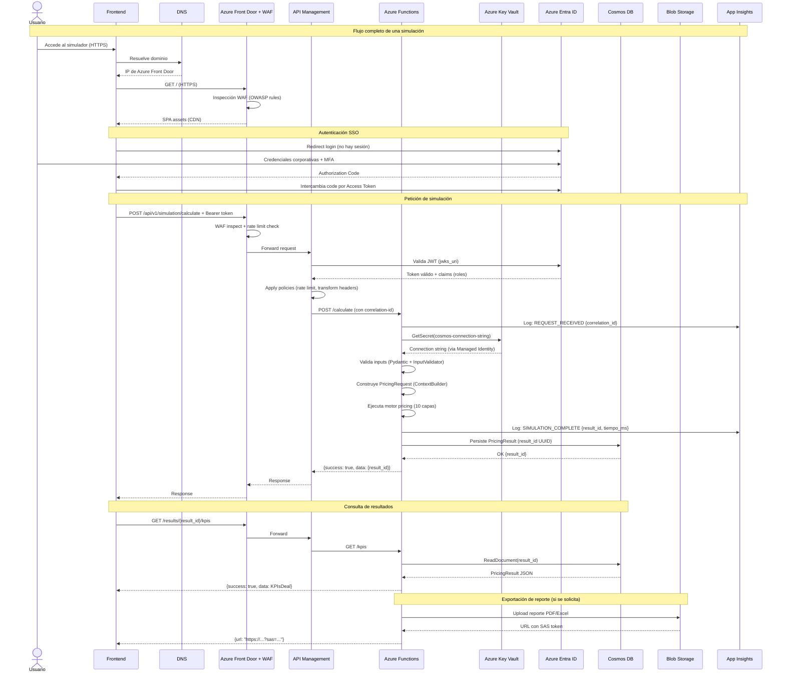

# Documento Técnico Integral — NEXA Pricing Simulator
## NexaBPO | Simulador Empresarial de Precios y Cotización

---

| Campo | Detalle |
|---|---|
| **Proyecto** | NEXA Pricing Simulator |
| **Cliente** | NexaBPO |
| **Versión Documento** | 1.0.0 |
| **Fecha** | 2026-05-21 |
| **Estado** | Borrador para Revisión Técnica |
| **Clasificación** | Confidencial — Uso interno |
| **Autor** | Equipo de Arquitectura |
| **Revisores pendientes** | Arquitecto NEXA, Responsable Infraestructura, Responsable Seguridad |

> ⚠️ **Convención de supuestos**: Los ítems marcados con `[SUPUESTO]` son inferencias técnicas basadas en la arquitectura, documentación de seguridad y codebase disponible. Deben ser confirmados en reunión técnica con los responsables de NEXA antes de ser tomados como definitivos.

---

## Tabla de Contenidos

1. [Introducción](#1-introducción)
2. [Visión General del Sistema](#2-visión-general-del-sistema)
3. [Arquitectura de la Solución](#3-arquitectura-de-la-solución)
4. [Componentes del Sistema](#4-componentes-del-sistema)
5. [Parametrización](#5-parametrización)
6. [Modelo de Datos](#6-modelo-de-datos)
7. [Seguridad](#7-seguridad)
8. [Integraciones](#8-integraciones)
9. [Procesos del Simulador](#9-procesos-del-simulador)
10. [Estrategia Técnica](#10-estrategia-técnica)
11. [Flujo de Petición End-to-End](#11-flujo-de-petición-end-to-end)
12. [Riesgos Técnicos](#12-riesgos-técnicos)
13. [Recomendaciones Técnicas](#13-recomendaciones-técnicas)
14. [Anexos](#14-anexos)

---

## 1. Introducción

### 1.1 Objetivo del Proyecto

El proyecto NEXA Pricing Simulator tiene como objetivo construir un simulador empresarial que permita al área comercial y técnica de NexaBPO calcular, validar y proyectar el precio de venta de contratos de operaciones BPO (Business Process Outsourcing) y Contact Center.

El simulador reemplaza y potencia el proceso actual basado en hojas de cálculo Excel (Excel V2-4), proporcionando una plataforma web centralizada, auditable, colaborativa y con trazabilidad completa desde los datos de entrada hasta el resultado financiero.

### 1.2 Alcance

El alcance técnico comprende:

- **Backend**: Motor de cálculo (pricing engine) en Python, expuesto como API REST, desplegado como Azure Functions.
- **Frontend**: Aplicación web SPA (Single Page Application) que consume la API REST.
- **Infraestructura**: Plataforma Azure Cloud con los servicios definidos en el diagrama de arquitectura.
- **Seguridad**: Autenticación via SSO con Azure AD / Entra ID / ADFS; sin gestión propia de usuarios/contraseñas.
- **CI/CD**: Azure DevOps con pipelines de construcción, prueba y despliegue.
- **Datos**: Cosmos DB como base de datos principal; Azure Blob Storage para archivos y artefactos.
- **Observabilidad**: Azure Monitor + Application Insights.

**Fuera del alcance:**
- Administración de usuarios y contraseñas dentro del simulador.
- Integración con sistemas ERP o CRM en esta fase.
- Cálculos actuariales o modelado de riesgo fuera del motor de pricing definido.

### 1.3 Contexto del Negocio

NexaBPO opera en el sector de contact center y outsourcing de procesos de negocio. Su área comercial cotiza contratos que involucran múltiples variables: perfiles de agentes, canales de comunicación (WhatsApp, correo, WebChat, etc.), tecnología, márgenes, factores de riesgo, nómina cargada, costos financieros (ICA, GMF, pólizas) y parametrización regulatoria (SMMLV, indexación).

El proceso actual de cotización es manual y dependiente de un archivo Excel complejo (V2-4), con 28 hojas y 16 hojas ocultas con lógica de cálculo. Esto genera:

- Alta dependencia de personas clave para operar el Excel.
- Dificultad de auditoría y trazabilidad de cambios en parametrización.
- Falta de versionado y control de cambios en cotizaciones históricas.
- Riesgo de errores por desincronización entre versiones del Excel.

### 1.4 Objetivos Técnicos

| Objetivo | Descripción |
|---|---|
| **Reproducibilidad** | Toda simulación con los mismos inputs debe producir exactamente el mismo resultado |
| **Trazabilidad** | Cada campo del resultado debe ser rastreable a su calculadora, fórmula y fuente de datos |
| **Parametrización dinámica** | Cambios de tarifas, SMMLV, tasas o políticas no deben requerir cambios de código |
| **Seguridad enterprise** | Cumplir lineamientos de seguridad de NEXA; SSO corporativo; sin credenciales hardcodeadas |
| **Escalabilidad** | Arquitectura serverless que escale horizontalmente según demanda |
| **Auditabilidad** | Log completo de simulaciones, cambios de parametrización y accesos |
| **Mantenibilidad** | Código estructurado por capas con separación clara de responsabilidades |

---

## 2. Visión General del Sistema

### 2.1 Descripción del Simulador

NEXA Pricing Simulator es una plataforma web empresarial que implementa un motor de cálculo de 10 capas para determinar el precio óptimo de un contrato BPO. El motor transforma un conjunto de inputs del deal (perfiles de agentes, canales, tecnología, márgenes, parámetros financieros) en un resultado financiero completo que incluye:

- **PyG mensual** (Estado de Resultados mes a mes durante el contrato)
- **KPIs del deal** (tarifa mensual, facturación proyectada, margen, utilidad neta)
- **Costo por Servir (CTS)** por cadena operativa
- **Visión de Tarifas** por canal de comunicación
- **Evaluación de Riesgo** del contrato
- **Waterfall de costos** para visualización gerencial

### 2.2 Problema que Resuelve

```
ANTES (Excel manual)                DESPUÉS (NEXA Simulator)
─────────────────────               ─────────────────────────
• Excel V2-4 con 28 hojas           • Plataforma web centralizada
• Dependencia de personas clave     • Acceso por roles y SSO corporativo
• Sin trazabilidad de cambios       • Historial completo de simulaciones
• Sin versionado de parámetros      • Parámetros versionados en storage
• Errores manuales frecuentes       • Motor validado contra Excel V2-4
• Sin auditoría                     • Logs completos en Azure Monitor
• Sin colaboración                  • Multi-usuario simultáneo
```

### 2.3 Flujo Macro de Operación

```
[Comercial] ingresa datos del deal
    │
    ▼
[Frontend] valida inputs y envía a API
    │
    ▼
[API REST / Azure Functions]
    ├── Valida seguridad (Azure AD token)
    ├── Construye PricingRequest
    └── Ejecuta motor de 10 capas
           │
           ▼
[Motor de Pricing] calcula:
    ├── Nómina cargada (Capa 2)
    ├── No-payroll / infraestructura (Capa 3)
    ├── Cadena B / plataforma digital (Capas 4-5)
    ├── Cadena C / integración IA (Capa 6)
    ├── Costos totales agregados (Capa 7)
    ├── Costos financieros ICA+GMF+Pólizas (Capa 8)
    ├── Estado de Resultados P&G (Capa 9)
    └── KPIs del deal (Capa 10)
           │
           ▼
[Cosmos DB] persiste resultado con result_id único
    │
    ▼
[Frontend] presenta PyG, KPIs, CTS, Tarifas, Riesgo
```

### 2.4 Actores Involucrados

| Actor | Rol | Interacción |
|---|---|---|
| **Comercial** | Usuario principal | Ingresa datos del deal, ejecuta simulaciones, revisa resultados |
| **Director de Cuenta** | Revisión y aprobación | Visualiza resultados, aprueba cotizaciones de alto riesgo |
| **Área Técnica/Operaciones** | Configuración | Actualiza parametrización (nóminas, tarifas, tasas) |
| **Administrador de Sistema** | Gestión técnica | Gestiona versiones activas de parametrización |
| **Auditor** | Control y cumplimiento | Accede a logs y trazabilidad de simulaciones |

---

## 3. Arquitectura de la Solución

### 3.1 Arquitectura Lógica

La solución sigue una **arquitectura de 4 capas** con Clean Architecture en el backend:

```
┌──────────────────────────────────────────────────────────────────────┐
│  CAPA DE PRESENTACIÓN (Frontend SPA)                                 │
│  • Interfaz web (React / Angular) — HTTPS                            │
│  • Formularios de simulación, dashboards, reportes                   │
└──────────────────────────┬───────────────────────────────────────────┘
                           │ REST / JSON (HTTPS)
┌──────────────────────────▼───────────────────────────────────────────┐
│  CAPA DE API / APLICACIÓN                                            │
│  • Azure API Management (gateway, throttling, versioning)            │
│  • Azure Functions (Python + FastAPI — lógica de negocio serverless) │
│  • Autenticación JWT (Azure Entra ID)                                │
└────────────────┬──────────────────────────┬──────────────────────────┘
                 │                          │
┌────────────────▼──────────┐  ┌───────────▼──────────────────────────┐
│  CAPA DE DOMINIO          │  │  CAPA DE INFRAESTRUCTURA             │
│  • Motor de pricing       │  │  • Cosmos DB (persistencia)          │
│  • Calculadoras (10 capas)│  │  • Azure Blob Storage (archivos)     │
│  • Modelos de dominio     │  │  • Azure Key Vault (secretos)        │
│  • Repositorios           │  │  • Azure Monitor + App Insights      │
└───────────────────────────┘  └──────────────────────────────────────┘
```

### 3.2 Arquitectura Física (Azure Cloud)

```
Internet
    │ HTTPS
    ▼
┌─────────┐    ┌──────────────────────────────────────────────────────────────┐
│   DNS   │───►│                    AZURE CLOUD                               │
└─────────┘    │                                                              │
               │  ┌──────────────────────────────────────────────┐           │
               │  │  Azure Front Door + WAF                       │           │
               │  │  • Punto de entrada global                    │           │
               │  │  • Balanceo y routing                         │◄──────────│
               │  │  • Reglas OWASP, rate limiting                │           │
               │  └───────────────────┬──────────────────────────┘           │
               │                      │                                       │
               │  ┌───────────────────▼──────────────────────────┐           │
               │  │  Azure API Management                         │  ┌──────┐ │
               │  │  • Gateway centralizado                       │  │Azure │ │
               │  │  • Versionamiento de APIs                     │  │Key   │ │
               │  │  • Rate limiting / throttling                 │  │Vault │ │
               │  │  • Políticas de seguridad JWT                 │  └──────┘ │
               │  └───────────────────┬──────────────────────────┘     ▲     │
               │                      │                                 │     │
               │  ┌───────────────────▼──────────────────────────┐     │     │
               │  │  Azure Functions (Python + FastAPI)           │─────┘     │
               │  │  • Motor de pricing (10 capas)                │           │
               │  │  • Cálculo serverless                         │           │
               │  │  • Managed Identity                           │           │
               │  └─────┬─────────────────────┬───────────────────┘           │
               │        │                     │                               │
               │  ┌─────▼──────┐    ┌─────────▼──────┐                       │
               │  │ Cosmos DB  │    │  Azure Blob    │                       │
               │  │ (NoSQL)    │    │  Storage       │                       │
               │  │ Simulacion │    │  Reportes/Logs │                       │
               │  │ Parametriz.│    │  Artefactos    │                       │
               │  └────────────┘    └────────────────┘                       │
               │                                                              │
               │  ┌─────────────────────────────────────┐                    │
               │  │  Azure Monitor + Application Insights│                    │
               │  │  Trazabilidad, métricas, alertas     │                    │
               │  └─────────────────────────────────────┘                    │
               └──────────────────────────────────────────────────────────────┘
```

### 3.3 Arquitectura Modular del Backend

El backend sigue **Clean Architecture** con las siguientes capas internas:

```
backend_nexa/
├── app.py                    ← Punto de entrada FastAPI
├── engine.py                 ← Motor orquestador (Composition Root)
│
├── domain/                   ← Dominio puro (sin I/O)
│   ├── models.py             ← Entidades y value objects
│   ├── user_inputs.py        ← Modelos de entrada del usuario
│   └── services/             ← Servicios de dominio (NominaCargadaService)
│
├── calculators/              ← Capas del pipeline (lógica pura)
│   ├── nomina.py             ← Capa 2: Nómina cargada
│   ├── no_payroll.py         ← Capa 3: Infraestructura y TI
│   ├── cadena_b.py           ← Capa 4-5: Plataforma digital
│   ├── cadena_c.py           ← Capa 6: Integración IA
│   ├── costos_totales.py     ← Capa 7: Costos agregados
│   ├── costos_financieros.py ← Capa 8: ICA, GMF, pólizas
│   ├── pyg.py                ← Capa 9: Estado de Resultados
│   ├── kpis.py               ← Capa 10: KPIs del deal
│   ├── cost_to_serve.py      ← CTS por cadena
│   ├── vision_tarifas.py     ← Tarifas por canal
│   ├── vision_pyg.py         ← P&G estructurado para frontend
│   └── riesgo.py             ← Evaluación de riesgo
│
├── adapters/                 ← Puente entrada/salida
│   ├── context_builder.py    ← UserInput + Provider → PricingRequest
│   ├── pricing_serializer.py ← PricingResult → Dict JSON
│   ├── json_loader.py        ← Carga JSON de test cases
│   └── input_validator.py    ← Validación triple capa
│
├── repositories/             ← Acceso a datos de parametrización
│   ├── parametrization_provider.py  ← Facade de parametrización
│   └── i_parametrization_provider.py ← Interfaz (Protocol)
│
├── storage/                  ← Single source of truth de parametrización
│   ├── parametrization/
│   │   ├── hr/               ← Nómina, salarios, ARL, prestaciones
│   │   ├── gn/               ← Rampup, márgenes mínimos
│   │   ├── op/               ← ICA, GMF, pólizas, indexación
│   │   └── business_rules/   ← Riesgo config, reglas de negocio
│   └── simulation_results/   ← Resultados persistidos
│
├── api/v1/                   ← Endpoints REST organizados por dominio
│   ├── parametrization/      ← HR, GN, OP upload + versionado
│   └── simulation/           ← Calculate + Results endpoints
│
└── shared/                   ← Utilitarios transversales
    ├── responses.py          ← ApiResponse estándar
    └── exceptions.py         ← DomainError, NotFoundError, etc.
```

### 3.4 Patrones Arquitectónicos Utilizados

| Patrón | Aplicación en NEXA |
|---|---|
| **Clean Architecture** | Separación en capas: dominio, calculadoras, adapters, API |
| **Facade** | `NexaPricingEngine` como punto de entrada único al motor |
| **Composition Root** | `_construir_calculadores()` en engine.py — wiring de dependencias |
| **Repository** | `ParametrizationProvider` abstrae la fuente de datos |
| **Strategy** | Calculadoras intercambiables via `IParametrizationProvider` |
| **Dependency Injection** | Calculadoras reciben dependencias por constructor, sin I/O propio |
| **Versioned Storage** | `versions.json` + `{version_id}.json` por dominio de parametrización |
| **Fail-Fast Validation** | Triple-layer validation: Pydantic → InputValidator → ContextBuilder |
| **Serverless** | Azure Functions para compute elástico |
| **API Gateway** | Azure API Management como punto de control |

### 3.5 APIs y Contratos

#### Endpoint de Simulación

```
POST /api/v1/simulation/calculate
Content-Type: application/json
Authorization: Bearer {azure_ad_token}

{
  "panel_de_control": { ... },
  "condiciones_cadena_a": { ... },
  "condiciones_cadena_b": { ... },
  "condiciones_cadena_c": { ... }
}

Response 200:
{
  "success": true,
  "data": { "result_id": "uuid" }
}
```

#### Endpoints de Consulta de Resultados

```
GET /api/v1/simulation/{result_id}/results          → PricingResult completo
GET /api/v1/simulation/{result_id}/results/kpis     → KPIsDeal
GET /api/v1/simulation/{result_id}/results/pyg      → List[PyGMensual]
GET /api/v1/simulation/{result_id}/results/cost-to-serve  → ResultadoCostToServe
GET /api/v1/simulation/{result_id}/results/vision-tarifas → ResultadoVisionTarifas
```

#### Formato de Respuesta Estándar

```json
{
  "success": true | false,
  "data": { ... },
  "error": {
    "code": "NOT_FOUND | VALIDATION_ERROR | DOMAIN_ERROR",
    "message": "Descripción del error"
  }
}
```

---

## 4. Componentes del Sistema

### 4.1 Azure Front Door + WAF

| Atributo | Detalle |
|---|---|
| **Responsabilidad** | Punto de entrada global; balanceo, routing, protección perimetral |
| **Entradas** | Tráfico HTTPS desde Internet |
| **Salidas** | Peticiones filtradas y enrutadas hacia APIM |
| **Dependencias** | DNS corporativo, certificados SSL/TLS |
| **Seguridad** | WAF con reglas OWASP Core Rule Set 3.x; IP restrictions; rate limiting |
| **Escalabilidad** | Global; distribución geográfica automática |
| **Observabilidad** | Logs de acceso, métricas de latencia, alertas de seguridad |
| **Riesgos** | Misconfiguration de reglas WAF puede bloquear tráfico legítimo |
| **Validaciones pendientes** | Reglas de enrutamiento, health probes, configuración multiambiente |

### 4.2 Azure API Management (APIM)

| Atributo | Detalle |
|---|---|
| **Responsabilidad** | Gateway centralizado de APIs; control de acceso, versionamiento, throttling |
| **Entradas** | Peticiones HTTP filtradas por WAF |
| **Salidas** | Peticiones enrutadas hacia Azure Functions |
| **Seguridad** | Validación JWT (Azure AD token); HTTPS enforce; IP filtering |
| **Políticas configuradas** | Rate limiting (100 req/min/usuario [SUPUESTO]), transformación de headers, CORS |
| **Versionamiento** | `/api/v1/...` — versión mayor en URL |
| **Observabilidad** | Request logs, response times, error rates; integración con App Insights |
| **Riesgos** | Timeout en simulaciones largas (contratos 24+ meses); gestión de API keys |
| **Configuración requerida** | Catálogo de APIs publicado, policies documentadas, auth con Entra ID |

### 4.3 Azure Functions (Backend Serverless)

| Atributo | Detalle |
|---|---|
| **Responsabilidad** | Ejecutar el motor de pricing; procesar requests REST; orquestar persistencia |
| **Runtime** | Python 3.12 + FastAPI (ASGI adapter) |
| **Trigger** | HTTP trigger via APIM |
| **Escalamiento** | Horizontal automático (Consumption Plan [SUPUESTO] — confirmar Premium si se necesita VNet) |
| **Secretos** | Leídos desde Azure Key Vault via Managed Identity (sin credenciales en código) |
| **Dependencias** | Key Vault, Cosmos DB, Blob Storage |
| **Timeout máximo** | 10 minutos (Consumption) / configurable en Premium |
| **Observabilidad** | Application Insights: correlation ID, dependencias, excepciones, performance |
| **Riesgos** | Cold start en Consumption Plan; límite de 10 min puede ser insuficiente para contratos largos |

### 4.4 Azure Key Vault

| Atributo | Detalle |
|---|---|
| **Responsabilidad** | Almacenar y servir todos los secretos del sistema |
| **Secretos almacenados** | Connection strings Cosmos DB, tokens de API externas, llaves de cifrado |
| **Acceso** | Exclusivamente vía Managed Identity de Azure Functions (sin credenciales hardcodeadas) |
| **RBAC** | Rol `Key Vault Secrets User` para Azure Functions; `Key Vault Administrator` para ops |
| **Rotación** | Política de rotación automática [SUPUESTO — confirmar frecuencia con NEXA] |
| **Auditoría** | Logs de acceso habilitados; integración con Azure Monitor |
| **Riesgos** | Expiración de secretos sin rotación automática; pérdida de acceso si Managed Identity falla |

### 4.5 Azure Cosmos DB

| Atributo | Detalle |
|---|---|
| **Responsabilidad** | Persistencia de simulaciones, resultados y parametrización dinámica |
| **Modelo de datos** | NoSQL (API Core SQL) |
| **Colecciones principales** | `simulation_results`, `parametrization_versions`, `user_sessions` [SUPUESTO] |
| **Partición** | Por `result_id` (UUID) para simulaciones; por `domain + version_id` para parametrización |
| **Consistencia** | Session consistency [SUPUESTO — revisar según SLA] |
| **Throughput** | Autoscale (mín 400 RU/s) [SUPUESTO] |
| **Indexación** | Indexado por `result_id`, `calculated_at`, `usuario` |
| **Observabilidad** | Azure Monitor: RU consumption, latencia, errores |
| **Riesgos** | Costo por RU en simulaciones complejas; diseño de partición crítico |

### 4.6 Azure Blob Storage

| Atributo | Detalle |
|---|---|
| **Responsabilidad** | Almacenar archivos de parametrización (Excel), reportes exportados, logs de auditoría |
| **Contenedores** | `parametrization-uploads`, `simulation-reports`, `audit-logs` |
| **Acceso** | Privado; acceso solo vía SAS tokens temporales o Managed Identity |
| **Lifecycle** | Retención de reportes: 1 año; logs: 90 días [SUPUESTO — confirmar con política NEXA] |
| **Naming convention** | `{dominio}/{version_id}/{timestamp}_{filename}` |
| **Riesgos** | Acceso público accidental; falta de lifecycle policy genera costos |

### 4.7 Azure Monitor + Application Insights

| Atributo | Detalle |
|---|---|
| **Responsabilidad** | Observabilidad completa del sistema (métricas, logs, trazas, alertas) |
| **Correlation ID** | Cada request lleva `x-correlation-id` propagado end-to-end |
| **Dashboards** | Por ambiente: disponibilidad, latencia P95, errores, RU Cosmos DB |
| **Alertas** | Error rate > 5%, latencia P95 > 5s, Functions fallidas > 3 consecutivas |
| **Integración** | Teams/correo para notificaciones de alertas críticas [SUPUESTO] |
| **Riesgos** | Falta de alertas puede ocultar degradación gradual del servicio |

---

## 5. Parametrización

### 5.1 Estrategia de Configuración

La parametrización de NEXA sigue el principio de **Single Source of Truth**: todos los parámetros de negocio viven en `storage/parametrization/` con versionado explícito. Ningún calculador tiene valores hardcodeados.

```
Nivel 1: storage/parametrization/   ← Datos versionados (SSoT)
Nivel 2: ParametrizationProvider    ← Facade con error-fail-fast
Nivel 3: Calculadoras               ← Consumen via IParametrizationProvider
Nivel 4: Engine                     ← Inyecta provider en Composition Root
```

### 5.2 Dominios de Parametrización

| Dominio | Directorio | Contenido | Calculadora Principal |
|---|---|---|---|
| **HR** | `storage/parametrization/hr/` | Salarios, ARL, prestaciones, rotación, staff ratios | NominaCalculator, ContextBuilder |
| **GN** | `storage/parametrization/gn/` | Rampup operacional, márgenes mínimos | KPIsCalculator, PyGCalculator |
| **OP** | `storage/parametrization/op/` | ICA por ciudad, GMF, pólizas, tasa financiación, indexación | CostosFinancierosCalculator |
| **Business Rules** | `storage/parametrization/business_rules/` | Criterios de riesgo, políticas comerciales, SMMLV | RiesgoCalculator, Engine |

### 5.3 Flujo de Carga de Parametrización (Excel → Storage)

```
[Archivo Excel V2-4]
    │
    ▼
POST /api/v1/parametrization/{domain}/upload
    │
    ├── Validación del archivo (extensión, tamaño, hojas requeridas)
    ├── Extracción de datos (openpyxl)
    ├── Transformación al schema esperado
    ├── Validación de datos extraídos
    └── Persistencia en storage/ con nuevo version_id
           │
           ▼
POST /api/v1/parametrization/{domain}/activate/{version_id}
    │
    └── Actualiza active_version en versions.json
           │
           ▼
[Motor usa nueva versión en el siguiente request]
```

### 5.4 Estructura de Versionado

```json
// storage/parametrization/hr/versions.json
{
  "active_version": "2026-01",
  "versions": [
    {
      "id": "2026-01",
      "timestamp": "2026-01-15T08:00:00Z",
      "label": "Parametrización HR Enero 2026",
      "status": "active",
      "uploaded_by": "user@nexa.com",
      "source_file": "HR_Enero2026.xlsx"
    },
    {
      "id": "2025-12",
      "timestamp": "2025-12-01T08:00:00Z",
      "label": "Parametrización HR Diciembre 2025",
      "status": "archived",
      "uploaded_by": "user@nexa.com"
    }
  ]
}
```

### 5.5 Validaciones de Parametrización

| Validación | Nivel | Implementación |
|---|---|---|
| Extensión del archivo | Adapter | `input_validator.py` — solo `.xlsx` |
| Tamaño máximo | Adapter | 50 MB [SUPUESTO] |
| Hojas requeridas | Extractor | Verificación de nombres de hojas |
| Tipos de datos | Extractor | Conversión tipada con error explícito |
| Rangos válidos | Provider | Fail-fast: `ParametrizationError` si falta clave |
| Suma de pesos | Business Rules | Σ pesos por categoría = 1.0 |

### 5.6 Trazabilidad de Cambios de Parametrización

Cada cambio de parametrización genera:
1. Nuevo archivo de versión en `storage/`
2. Entrada en Cosmos DB con `uploaded_by`, `timestamp`, `source_file`
3. Log en Azure Monitor con `PARAMETRIZATION_CHANGE` event
4. Registro en Azure Blob Storage del archivo original

---

## 6. Modelo de Datos

### 6.1 Entidades Principales

#### PricingResult (resultado de simulación)

```
result_id         UUID                  Identificador único
calculated_at     ISO8601               Timestamp UTC de cálculo
ficha_deal        FichaDeal             Datos del contrato
kpis              KPIsDeal              Métricas clave del deal
pyg_por_mes       List[PyGMensual]      P&G mes a mes
waterfall         WaterfallPromedio     Promedios para gráfico waterfall
config_comercial  ConfiguracionComercial Configuración del modelo de cobro
reglas_negocio    List[ReglaNegocios]   Evaluación vs políticas
evaluacion_riesgo EvaluacionRiesgo      Score de riesgo del contrato
vision_pyg        VisionPyG             P&G estructurado para tabla frontend
cost_to_serve     ResultadoCostToServe  Costo por servir por cadena
vision_tarifas    ResultadoVisionTarifas Tarifas desglosadas por canal
panel             PanelDeControl        Copia de los inputs del deal
```

#### PyGMensual (Estado de Resultados por mes)

```
mes               int         Número de mes (1..N)
rampup            float       Factor de rampa operacional [0..1]
ingreso_bruto_a   float       Ingreso Cadena A (costo_a × (1+margen) × rampup)
ingreso_bruto_b   float       Ingreso Cadena B
ingreso_bruto_c   float       Ingreso Cadena C
contingencia_op   float       Contingencia operativa (ingreso × op_cont)
contingencia_com  float       Contingencia comercial
markup_ingreso    float       Markup sobre ingreso bruto
descuento_ingreso float       Descuento sobre ingreso bruto
payroll_a         float       Nómina cargada Cadena A
no_payroll_a      float       Infraestructura y TI Cadena A
costo_b           float       Costo total Cadena B
costo_c           float       Costo total Cadena C
ica               float       ICA (gross-up sobre ingreso neto)
gmf               float       GMF (sobre costo bruto)
polizas           float       Pólizas de seguros (gross-up)
financiacion      float       Financiación (basada en costo mes anterior)
acum_*            float       Acumulados running (5 campos)
-- @property (derivados, no almacenados) --
ingreso_bruto     float       ingreso_bruto_a + b + c
ingreso_neto      float       ingreso_bruto + contingencias + markup - descuento
costo_a           float       payroll_a + no_payroll_a
costo_total       float       costo_a + costo_b + costo_c
contribucion      float       ingreso_neto - costo_total
pct_contribucion  float       contribucion / ingreso_neto
utilidad_neta     float       = contribucion
pct_utilidad_neta float       utilidad_neta / ingreso_neto
```

#### KPIsDeal (métricas del deal completo)

```
costo_mensual_promedio          float    Costo total / meses
ingreso_mensual                 float    Tarifa mensual calculada
facturacion_mensual_proyectada  float    ingreso_mensual / factor_periodo
ingreso_neto_total              float    Σ ingreso_neto
costo_total_contrato            float    Σ costo_total
contribucion_total              float    ingreso_neto_total - costo_total
pct_utilidad_neta_total         float    Utilidad / ingreso neto
valor_total_deal                float    = ingreso_neto_total
margen_minimo_requerido         float    Desde storage/parametrización
cumple_margen_minimo            bool     panel.margen >= margen_mínimo
```

### 6.2 Esquema en Cosmos DB

```json
// Colección: simulation_results
// Partición: /result_id
{
  "id": "uuid-v4",
  "result_id": "uuid-v4",           // PK
  "calculated_at": "2026-05-21T...",
  "usuario": "user@nexa.com",        // desde JWT
  "parametrization_versions": {      // snapshot de versiones usadas
    "hr": "2026-01",
    "gn": "2026-01",
    "op": "2026-01",
    "business_rules": "2026-01"
  },
  "ficha_deal": { ... },
  "kpis": { ... },
  "pyg_por_mes": [ ... ],
  "cost_to_serve": { ... },
  "vision_tarifas": { ... },
  "panel": { ... }
}
```

### 6.3 Convenciones de Nomenclatura

| Convención | Regla | Ejemplo |
|---|---|---|
| Campos Python | snake_case | `ingreso_mensual`, `costo_total` |
| Sufijos estándar | `_ch` = por canal, `_total` = sumatoria, `_mensual` = promedio mensual | `payroll_ch`, `costo_total` |
| IDs técnicos | UUID v4 | `result_id = "a2d8d5dd-..."` |
| Versiones | `YYYY-MM` | `"2026-01"` |
| Timestamps | ISO 8601 UTC | `"2026-05-21T14:30:00Z"` |
| Endpoints | kebab-case | `/cost-to-serve`, `/vision-tarifas` |
| Colecciones JSON | snake_case | `pyg_por_mes`, `reglas_negocio` |

### 6.4 Estrategia de Serialización

- Los objetos Python (`dataclass`) se serializan a `Dict[str, Any]` via `pricing_serializer.py`.
- Los campos `@property` (derivados, no almacenados en el dataclass) son capturados **explícitamente** antes de serializar para evitar pérdida de información.
- El resultado serializado es inmutable desde el momento de persistencia.

---

## 7. Seguridad

> Esta sección se basa en los lineamientos de seguridad de NEXA proporcionados y en las mejores prácticas de la arquitectura Azure. Los ítems `[CONFIRMAR]` deben validarse en reunión con el responsable de seguridad.

### 7.1 Autenticación — SSO con Azure AD / Entra ID

**Propuesta técnica** (requiere confirmación en reunión con equipo técnico NEXA):

```
[Usuario] → abre el simulador en el browser
    │
    ▼
[Frontend detecta que no hay sesión activa]
    │
    ▼
[Redirect a login corporativo Microsoft]
    │
    ▼
[Azure Entra ID / ADFS autentica con credenciales corporativas]
    │ (MFA según política NEXA)
    ▼
[Microsoft retorna Authorization Code]
    │
    ▼
[Frontend intercambia code por Access Token + Refresh Token]
    │
    ▼
[Frontend incluye Bearer token en cada llamada a APIM]
    │
    ▼
[APIM valida token contra Azure AD (jwks_uri)]
    │
    ▼
[Azure Functions recibe token validado; extrae claims]
```

**Configuración requerida:**
- Registro de la aplicación en Azure Entra ID (`App Registration`)
- Scopes definidos: `openid`, `profile`, `email`, `api://nexa-simulator/simulation.read`, `api://nexa-simulator/simulation.write` [SUPUESTO — definir scopes reales]
- Policy de acceso condicional: MFA requerido para acceso [CONFIRMAR]
- **Fuera del alcance**: Administración de usuarios y contraseñas dentro del simulador

### 7.2 Autorización — Roles

| Rol | Permisos | Fuente |
|---|---|---|
| `NEXA_COMMERCIAL` | Crear y ejecutar simulaciones; ver propios resultados | Azure AD Group |
| `NEXA_OPERATIONS` | Todo lo anterior + cargar parametrización | Azure AD Group |
| `NEXA_ADMIN` | Todo lo anterior + activar versiones, ver auditoría completa | Azure AD Group |
| `NEXA_AUDITOR` | Solo lectura de simulaciones y logs | Azure AD Group |

Los roles se mapean desde claims del JWT token (grupos de Azure AD). El backend valida el rol en cada endpoint.

### 7.3 Gestión de Secretos

| Secreto | Almacenado en | Rotación | Acceso |
|---|---|---|---|
| Connection string Cosmos DB | Azure Key Vault | 90 días [CONFIRMAR] | Managed Identity |
| Connection string Blob Storage | Azure Key Vault | 90 días [CONFIRMAR] | Managed Identity |
| API keys de servicios externos | Azure Key Vault | Según proveedor | Managed Identity |
| Certificados SSL/TLS | Azure Key Vault | Antes de expirar | Front Door |

**Principio**: Ningún secreto en código fuente, variables de entorno locales ni archivos de configuración en repositorio.

### 7.4 Seguridad de APIs

| Control | Implementación |
|---|---|
| **HTTPS obligatorio** | Front Door enforce HTTPS; HTTP → redirect 301 |
| **Autenticación** | JWT Bearer token validado en APIM |
| **Rate limiting** | 100 req/min por usuario [SUPUESTO — confirmar] |
| **Input validation** | Triple-layer: Pydantic → InputValidator → ContextBuilder |
| **CORS** | Solo orígenes permitidos explícitos (dominios frontend) |
| **SQL Injection** | N/A — NoSQL (Cosmos DB); uso de SDK con parameterized queries |
| **XSS** | WAF OWASP rules + sanitización en frontend |
| **CSRF** | SameSite cookies + CSRF tokens si se usan cookies [CONFIRMAR] |
| **Payload size limit** | Límite de 10 MB en APIM [SUPUESTO] |

### 7.5 Seguridad de Archivos de Parametrización

| Control | Implementación |
|---|---|
| **Tipo de archivo** | Solo `.xlsx`; validación de magic bytes |
| **Tamaño máximo** | 50 MB [SUPUESTO] |
| **Escaneo antivirus** | [CONFIRMAR — Azure Defender for Storage puede habilitar esto] |
| **Acceso a Blob** | Privado; SAS tokens temporales (15 min) para descarga |
| **Cifrado en reposo** | Azure Storage Service Encryption (AES-256, habilitado por defecto) |
| **Cifrado en tránsito** | HTTPS/TLS 1.2+ obligatorio |

### 7.6 Auditoría

Cada operación crítica genera un evento de auditoría:

| Evento | Datos registrados |
|---|---|
| `SIMULATION_CREATED` | result_id, usuario, timestamp, parametrization_versions |
| `SIMULATION_ACCESSED` | result_id, usuario, timestamp, IP |
| `PARAMETRIZATION_UPLOADED` | dominio, version_id, usuario, timestamp, source_file |
| `PARAMETRIZATION_ACTIVATED` | dominio, version_id, previous_version, usuario |
| `LOGIN_SUCCESS` | usuario, timestamp, IP, user_agent |
| `LOGIN_FAILURE` | timestamp, IP, razón de fallo |
| `UNAUTHORIZED_ACCESS` | endpoint, usuario, timestamp, IP |

Los logs se almacenan en Azure Monitor con retención de 90 días [CONFIRMAR].

### 7.7 Hardening

- Managed Identity para todas las conexiones entre servicios Azure (sin credenciales).
- Least privilege: cada servicio solo tiene los permisos mínimos necesarios.
- VNet Integration para Azure Functions [CONFIRMAR si se usa Premium Plan].
- Private Endpoints para Cosmos DB y Blob Storage [CONFIRMAR].
- Diagnóstic logs habilitados en todos los servicios Azure.
- Azure Security Center / Defender for Cloud habilitado [CONFIRMAR].

---

## 8. Integraciones

### 8.1 Microsoft Office 365

| Integración | Uso | Estado |
|---|---|---|
| **Azure AD / Entra ID** | Autenticación SSO | Requerido |
| **Microsoft Teams** | Notificaciones de alertas, soporte | Requerido |
| **SharePoint** | Documentación técnica y operativa del proyecto | Requerido |
| **OneDrive** | Colaboración en archivos del equipo | Requerido |
| **Excel (OneDrive)** | Fuente de archivos de parametrización | Indirecto |

### 8.2 Azure DevOps (CI/CD)

Ver sección completa en [10.2 CI/CD con Azure DevOps](#102-cicd-con-azure-devops).

### 8.3 Integraciones Futuras Identificadas

| Sistema | Tipo | Estado | Notas |
|---|---|---|---|
| **ERP / SAP** | API REST | Fuera de alcance v1 | Posible integración v2 |
| **CRM (Salesforce / Dynamics)** | API REST | Fuera de alcance v1 | Para envío automático de cotizaciones |
| **Sistema de RR.HH.** | API REST | Fuera de alcance v1 | Para sincronizar salarios automáticamente |
| **Kafka / Service Bus** | Mensajería | Fuera de alcance v1 | Para notificaciones de simulación completada |

### 8.4 Estrategia de Manejo de Errores en Integraciones

```python
# Patrón estándar de manejo de errores en el motor
try:
    result = external_service.call(params)
except ParametrizationError as e:
    # Error de datos faltantes — error 422 con detalle
    raise HTTPException(422, detail=str(e))
except NotFoundError as e:
    # Resultado no encontrado — error 404
    raise HTTPException(404, detail=e.message)
except Exception as e:
    # Error inesperado — log + error 500
    logger.error(f"[ERROR] {correlation_id}: {e}", exc_info=True)
    raise HTTPException(500, detail="Error interno del sistema")
```

---

## 9. Procesos del Simulador

### 9.1 Flujo de Cálculo — Motor de 10 Capas

```
PricingRequest
    │
    ├─► Capa 2: NominaCalculator
    │   Inputs:  ParametrosNomina, ParametrosCalculo, PerfilCadenaA[]
    │   Outputs: ResultadoNomina { salario_fijo, comisiones, cap_inicial,
    │                              cap_rotacion, examenes, seguridad, crucero }
    │
    ├─► Capa 3: NoPayrollCalculator
    │   Inputs:  ParametrosNoPayroll, PerfilCadenaA[]
    │   Outputs: ResultadoNoPayroll { opex_ti, capex, costos_fijos }
    │
    ├─► Capa 4-5: CadenaBCalculator
    │   Inputs:  ParametrosCadenaB
    │   Outputs: ResultadoCadenaB { opex_fijo, inversiones, sm, costo_variable,
    │                               escalamiento, hitl }
    │
    ├─► Capa 6: CadenaCCalculator
    │   Inputs:  ParametrosCadenaC, IParametrizationProvider
    │   Outputs: ResultadoCadenaC { tarifa_proveedor, opex_fijo_integ, opex_var_integ,
    │                               inversiones, equipo_integ, escalamiento, hitl }
    │
    ├─► Capa 7: CostosTotalesCalculator
    │   Inputs:  ResultadoNomina, ResultadoNoPayroll, ResultadoCadenaB, ResultadoCadenaC
    │   Outputs: CostosTotalesMes { payroll_a, no_payroll_a, costo_b, costo_c }
    │
    ├─► Capa 8: CostosFinancierosCalculator  ⚠️ Depende del mes anterior
    │   Inputs:  CostosTotalesMes, mes, costo_mes_anterior, PanelDeControl, Provider
    │   Outputs: CostosFinancierosMes { financiacion, polizas, ica, gmf }
    │   Fórmula: financiacion → polizas → ICA → GMF (gross-up chain)
    │
    ├─► Capa 9: PyGCalculator
    │   Inputs:  todas las capas anteriores (por mes, secuencial)
    │   Outputs: List[PyGMensual] (uno por mes del contrato)
    │   Nota:    Calculo es secuencial mes a mes (dependencia intermensual)
    │
    └─► Capa 10: KPIsCalculator
        Inputs:  List[PyGMensual], PanelDeControl, Provider
        Outputs: KPIsDeal { ingreso_mensual, facturacion, pct_utilidad, ... }
        │
        ├─► CostToServeCalculator → ResultadoCostToServe (CTS por cadena)
        ├─► VisionTarifasCalculator → ResultadoVisionTarifas (tarifas por canal)
        ├─► VisionPyGBuilder → VisionPyG (tabla frontend)
        ├─► _calcular_waterfall → WaterfallPromedio (gráfico gerencial)
        ├─► _calcular_reglas_negocio → List[ReglaNegocios]
        └─► RiesgoCalculator → EvaluacionRiesgo (score 10 criterios)
```

### 9.2 Reglas de Negocio Clave

| Regla | Descripción | Fuente |
|---|---|---|
| **Factor rampup** | Ajusta ingresos los primeros meses del contrato por operación parcial | storage/gn (HR-Campana) |
| **Gross-up financiero** | Orden: financiación → pólizas → ICA → GMF (cada uno sobre base acumulada) | CostosFinancierosCalculator |
| **Margen mínimo** | `panel.margen >= margen_minimo(linea_negocio)` | storage/gn (HR-Rentabilidad) |
| **Selección canal principal** | `max(canales, key=facturacion)` — no hardcoded `canales[0]` | pricing_serializer (F8.1) |
| **Dependencia intermensual** | `financiacion(mes N) = costo_total(mes N-1) × tasa × factor_periodo` | PyGCalculator |
| **Factor margenes** | `(1-margen)×(1-op_cont)×(1-com_cont)×(1+markup)×(1-descuento)` | calculators/utils.py |
| **Evaluación de riesgo** | `score = score_cliente × 0.4 + score_operativo × 0.6` | RiesgoCalculator |
| **Aprobación requerida** | `valor_total_deal > 1000 SMMLV` | storage/business_rules |

### 9.3 Estados de una Simulación

```
[DRAFT] → inputs ingresados, no calculado
    │
    ▼
[CALCULATING] → motor ejecutándose
    │
    ├── Error → [FAILED] → mensaje de error retornado
    │
    └── Éxito → [COMPLETED] → result_id persistido en Cosmos DB
                    │
                    ▼
              [ACCESSED] → usuario consulta por result_id
```

### 9.4 Validaciones del Motor

| Validación | Capa | Error si falla |
|---|---|---|
| Schema de entrada | Pydantic (request_dto.py) | HTTP 422 |
| Campos obligatorios | InputValidator | HTTP 422 |
| Consistencia de datos | ContextBuilder | HTTP 422 |
| Parametrización activa | ParametrizationProvider | HTTP 500 (ParametrizationError) |
| Canales activos requeridos | pricing_serializer (F8.2) | HTTP 500 (ValueError) |
| Margen mínimo | KPIsCalculator | Campo `cumple_margen_minimo: false` (no falla) |

---

## 10. Estrategia Técnica

### 10.1 Ambientes

| Ambiente | Propósito | URL | Acceso |
|---|---|---|---|
| **Development (DEV)** | Desarrollo activo del equipo | dev.nexa-simulator.com [SUPUESTO] | Equipo de desarrollo |
| **Testing (QA)** | Pruebas funcionales y automáticas | qa.nexa-simulator.com [SUPUESTO] | Equipo de QA + Dev |
| **UAT** | Validación con usuarios finales | uat.nexa-simulator.com [SUPUESTO] | Usuarios NEXA + Equipo |
| **Production (PROD)** | Operación real | simulator.nexa.com [SUPUESTO] | Todos los usuarios autorizados |

Cada ambiente tiene su propia instancia de:
- Azure Functions (separadas por resource group)
- Cosmos DB (cuenta separada o base de datos separada)
- Key Vault (vault separado)
- Application Insights (workspace separado)

### 10.2 CI/CD con Azure DevOps

#### Estrategia de Ramas

```
main          ← Solo producción; protegida con aprobación obligatoria
develop       ← Integración continua; base de desarrollo
feature/*     ← Trabajo en funcionalidades
bugfix/*      ← Correcciones de bugs
release/*     ← Preparación de versión
hotfix/*      ← Parches urgentes de producción
```

#### Pipeline de Build (`azure-pipelines-build.yml`)

```yaml
# Pipeline de construcción — se ejecuta en cada push a develop y PRs a main
trigger:
  branches:
    include:
      - develop
      - feature/*
      - bugfix/*

pool:
  vmImage: 'ubuntu-latest'

stages:
  - stage: Validate
    jobs:
      - job: Lint
        steps:
          - task: UsePythonVersion@0
            inputs:
              versionSpec: '3.12'
          - script: pip install flake8 black isort
          - script: flake8 backend_nexa/ --max-line-length=120
          - script: black --check backend_nexa/
          - script: isort --check-only backend_nexa/

      - job: SecurityScan
        steps:
          - task: UsePythonVersion@0
            inputs:
              versionSpec: '3.12'
          - script: pip install bandit safety
          - script: bandit -r backend_nexa/ -ll
          - script: safety check -r requirements.txt

  - stage: Test
    dependsOn: Validate
    jobs:
      - job: UnitTests
        steps:
          - task: UsePythonVersion@0
            inputs:
              versionSpec: '3.12'
          - script: pip install -r requirements.txt
          - script: |
              pytest tests/unit/ -v \
                --junitxml=test-results.xml \
                --cov=backend_nexa \
                --cov-report=xml \
                --cov-fail-under=80
          - task: PublishTestResults@2
            inputs:
              testResultsFiles: 'test-results.xml'
          - task: PublishCodeCoverageResults@1
            inputs:
              codeCoverageTool: 'Cobertura'
              summaryFileLocation: 'coverage.xml'

      - job: IntegrationTests
        dependsOn: UnitTests
        steps:
          - script: pytest tests/integration/ -v --junitxml=int-test-results.xml

  - stage: Build
    dependsOn: Test
    jobs:
      - job: BuildArtifact
        steps:
          - script: pip install -r requirements.txt -t .python_packages/lib/site-packages
          - task: ArchiveFiles@2
            inputs:
              rootFolderOrFile: '$(Build.SourcesDirectory)'
              archiveType: 'zip'
              archiveFile: '$(Build.ArtifactStagingDirectory)/nexa-functions.zip'
          - task: PublishBuildArtifacts@1
            inputs:
              artifactName: 'nexa-functions'
```

#### Pipeline de Release (`azure-pipelines-release.yml`)

```yaml
# Pipeline de despliegue — activado por aprobación manual en PROD
stages:
  - stage: DeployDev
    condition: eq(variables['Build.SourceBranch'], 'refs/heads/develop')
    jobs:
      - deployment: DeployToDev
        environment: 'nexa-dev'
        strategy:
          runOnce:
            deploy:
              steps:
                - task: AzureFunctionApp@2
                  inputs:
                    azureSubscription: 'nexa-service-connection-dev'
                    appType: 'functionAppLinux'
                    appName: 'nexa-functions-dev'
                    package: '$(Pipeline.Workspace)/nexa-functions/*.zip'
                    runtimeStack: 'PYTHON|3.12'

  - stage: DeployQA
    dependsOn: DeployDev
    condition: succeeded()
    jobs:
      - deployment: DeployToQA
        environment: 'nexa-qa'
        # Requiere aprobación manual del QA Lead

  - stage: DeployUAT
    dependsOn: DeployQA
    condition: and(succeeded(), eq(variables['Build.SourceBranch'], 'refs/heads/release/*'))
    jobs:
      - deployment: DeployToUAT
        environment: 'nexa-uat'
        # Requiere aprobación del Product Owner

  - stage: DeployProd
    dependsOn: DeployUAT
    condition: succeeded()
    jobs:
      - deployment: DeployToProd
        environment: 'nexa-prod'
        # Requiere aprobación del Arquitecto + Director Técnico NEXA
        strategy:
          runOnce:
            deploy:
              steps:
                - task: AzureFunctionApp@2
                  inputs:
                    azureSubscription: 'nexa-service-connection-prod'
                    appName: 'nexa-functions-prod'
                    package: '$(Pipeline.Workspace)/nexa-functions/*.zip'
                    # Deployment Slot swap para zero downtime
                    deployToSlotOrASE: true
                    resourceGroupName: 'rg-nexa-prod'
                    slotName: 'staging'
                - task: AzureAppServiceManage@0
                  displayName: 'Swap staging → production'
                  inputs:
                    action: 'Swap Slots'
                    webAppName: 'nexa-functions-prod'
                    sourceSlot: 'staging'
```

#### Gestión de Variables y Secretos en DevOps

```
Azure DevOps Variable Groups:
├── nexa-dev-vars          ← Variables no sensibles de DEV
├── nexa-qa-vars           ← Variables no sensibles de QA
├── nexa-prod-vars         ← Variables no sensibles de PROD
└── nexa-keyvault-link     ← Linked a Azure Key Vault (secretos reales)
    ├── cosmos-connection-string
    ├── blob-storage-connection-string
    └── azure-ad-client-secret
```

**Principio**: Los secretos nunca se definen en `azure-pipelines.yml`. Siempre se referencian desde Key Vault via Variable Group linkado.

#### Quality Gates

| Gate | Umbral | Bloquea deploy si falla |
|---|---|---|
| Cobertura de código | ≥ 80% | Sí |
| Pruebas unitarias | 100% passing | Sí |
| Análisis de seguridad (bandit) | 0 issues MEDIUM o HIGH | Sí |
| Análisis de dependencias (safety) | 0 vulnerabilidades conocidas | Sí |
| Lint / format | 0 errores | Sí |
| Aprobación manual | 2 approvers en PROD | Sí |

### 10.3 Monitoreo y Logging

#### Estrategia de Logging Estructurado

```python
# Patrón de logging en el motor
import logging
logger = logging.getLogger(__name__)

# Formato estructurado para Application Insights
logger.info(
    "[SIMULATION_COMPLETE]",
    extra={
        "correlation_id": correlation_id,
        "result_id": result_id,
        "usuario": usuario,
        "execution_time_ms": execution_time,
        "parametrization_versions": versions_used,
    }
)
```

#### Categorías de Log

| Categoría | Nivel | Destino | Retención |
|---|---|---|---|
| Request/Response | INFO | App Insights | 90 días |
| Errores de negocio | WARNING | App Insights | 90 días |
| Errores técnicos | ERROR | App Insights + Alert | 90 días |
| Excepciones no manejadas | CRITICAL | App Insights + Alert inmediato | 1 año |
| Auditoría de accesos | INFO | Azure Monitor + Blob | 1 año |
| Cambios de parametrización | INFO | Azure Monitor + Cosmos | Permanente |

#### Alertas Críticas

| Alerta | Condición | Acción |
|---|---|---|
| Alta tasa de errores | Error rate > 5% en 5 min | Notificación Teams + correo |
| Alta latencia | P95 > 5s en 10 min | Notificación Teams |
| Fallos consecutivos en Functions | 3 ejecuciones fallidas | Alerta crítica + escalamiento |
| Cosmos DB throttling | RU consumed > 80% | Alerta + revisión de capacidad |
| Certificados próximos a expirar | 30 días antes | Alerta al responsable de infraestructura |

### 10.4 Manejo de Errores

```
Error HTTP 400 → Datos de entrada malformados (JSON inválido)
Error HTTP 422 → Validación de negocio fallida (campos requeridos, rangos)
Error HTTP 401 → Token inválido o expirado
Error HTTP 403 → Sin permisos suficientes
Error HTTP 404 → Resultado de simulación no encontrado
Error HTTP 500 → Error interno del motor de cálculo
Error HTTP 503 → Servicio temporalmente no disponible

Todos los errores retornan:
{
  "success": false,
  "error": {
    "code": "VALIDATION_ERROR | NOT_FOUND | DOMAIN_ERROR | ...",
    "message": "Descripción clara del error para el usuario"
  }
}
```

---

## 11. Flujo de Petición End-to-End

### 11.1 Diagrama Secuencial



### 11.2 Tabla Resumida del Flujo

| Paso | Componente | Acción | Validaciones |
|---|---|---|---|
| 1 | Usuario | Accede al simulador | Certificado SSL/TLS, dominio oficial |
| 2 | DNS | Resuelve dominio a Azure Front Door | DNS configurado correctamente |
| 3 | Azure Front Door | Recibe tráfico, optimiza routing global | Health probes, configuración multiambiente |
| 4 | WAF | Inspecciona y filtra tráfico malicioso | Reglas OWASP, rate limiting, IP restrictions |
| 5 | Azure Entra ID | Autentica usuario corporativo (SSO + MFA) | Acceso condicional, MFA requerido |
| 6 | APIM | Valida JWT, aplica policies, enruta | Catálogo de APIs, policies, timeouts |
| 7 | Azure Functions | Ejecuta motor de pricing (10 capas) | Triggers HTTP, manejo de errores, retries |
| 8 | Azure Key Vault | Entrega secretos via Managed Identity | RBAC, rotación, auditoría |
| 9 | Cosmos DB | Persiste resultado de simulación | Partición, consistencia, throughput |
| 10 | Blob Storage | Almacena reportes y artefactos | Naming convention, lifecycle, acceso privado |
| 11 | App Insights | Registra trazabilidad end-to-end | Correlation ID, alertas, dashboards |
| 12 | Frontend | Presenta resultado al usuario | Tiempo de respuesta, errores controlados |

### 11.3 Consideraciones No Funcionales

| Atributo | Requerimiento | Estrategia |
|---|---|---|
| **Seguridad** | Zero trust; sin credenciales hardcodeadas | Managed Identity, Key Vault, SSO |
| **Escalabilidad** | Escala horizontal automática | Azure Functions (serverless) |
| **Disponibilidad** | SLA 99.9% [CONFIRMAR] | Azure Front Door multiregión, Functions retry |
| **Latencia** | P95 < 5s para simulaciones estándar | Serverless cold start mitigado en Premium Plan |
| **Trazabilidad** | Correlation ID end-to-end | x-correlation-id propagado en todos los servicios |
| **Costos** | Pago por uso | Consumption Plan para Functions [CONFIRMAR] |
| **Recuperación** | RTO 1h, RPO 15min [CONFIRMAR] | Cosmos DB backup automático, Functions stateless |

---

## 12. Riesgos Técnicos

| ID | Riesgo | Probabilidad | Impacto | Mitigación |
|---|---|---|---|---|
| **R01** | Cold start en Azure Functions (Consumption) puede causar latencias de 5-10s | Media | Alto | Migrar a Premium Plan o usar "Always On" / Warm-up triggers |
| **R02** | Timeout en contratos largos (36+ meses) excede límite de Functions | Baja | Alto | Aumentar timeout (Premium Plan); implementar async con polling |
| **R03** | Cambio en formato del Excel de parametrización rompe el parser | Media | Alto | Tests automáticos del parser; schema validation antes de activar versión |
| **R04** | Falta de confirmación del modelo de datos en Cosmos DB puede generar migraciones costosas | Media | Medio | Definir y congelar el schema en sprint 1 |
| **R05** | Acceso no autorizado si la configuración de APIM tiene brechas | Baja | Crítico | Revisión de seguridad de políticas APIM con NEXA Security |
| **R06** | Expiración de secretos sin rotación automática bloquea el servicio | Baja | Alto | Configurar rotación automática y alertas 30 días antes |
| **R07** | Divergencia entre resultados del motor Python y Excel V2-4 | Baja | Crítico | Tests de regresión automáticos contra baseline Excel en cada deploy |
| **R08** | Costo no controlado de Cosmos DB por mal diseño de partición | Media | Medio | Revisar throughput con arquitecto Azure antes de ir a producción |
| **R09** | Sin VNet Integration, Azure Functions es alcanzable desde Internet | Media | Alto | Evaluar Premium Plan con VNet Integration o Private Endpoints |
| **R10** | Datos de simulación histórica sin backup adecuado | Media | Alto | Habilitar backup automático de Cosmos DB (periodicidad a definir) |

---

## 13. Recomendaciones Técnicas

### 13.1 Arquitectura

1. **Azure Functions Premium Plan**: Migrar de Consumption a Premium Plan para eliminar cold starts, habilitar VNet Integration y tener instancias pre-warmed. El costo adicional es justificado por el SLA y la seguridad.

2. **Private Endpoints**: Configurar Private Endpoints para Cosmos DB y Blob Storage para que solo sean accesibles desde la VNet donde viven las Functions. Esto elimina exposición pública de la base de datos.

3. **Deployment Slots**: Usar slots de staging para zero-downtime deployments en producción (swap staging → production).

4. **Cosmos DB Partición**: Revisar estrategia de partición. Para simulaciones, `/result_id` es correcto para escritura pero ineficiente para queries por usuario. Considerar una segunda colección `simulation_index` con partición por `/usuario`.

### 13.2 Seguridad

5. **Microsoft Defender for Cloud**: Habilitar en todos los servicios Azure del proyecto para detección de amenazas y postura de seguridad.

6. **Revisión de Políticas APIM**: Hacer revisión formal con el responsable de seguridad de NEXA antes de go-live. Puntos críticos: validación JWT, CORS, rate limiting, response size limits.

7. **SonarCloud en CI/CD**: Integrar análisis estático de código en el pipeline de Azure DevOps. Mínimo: 0 issues bloqueantes en cada PR.

### 13.3 Operación

8. **Runbook de Operación**: Documentar procedimientos operativos antes de ir a producción: rotación de secretos, activación de nueva versión de parametrización, rollback de deploy, respuesta a alertas críticas.

9. **Dashboard de Negocio**: Crear un dashboard en Azure Monitor que muestre: simulaciones por día, errores de validación frecuentes (indica inputs mal configurados), latencia por tipo de simulación. Esto ayuda al equipo operativo a detectar problemas sin acceso técnico.

10. **Backup de Excel de Parametrización**: Guardar automáticamente en Blob Storage cada Excel que se sube, con retención de 1 año. Esto permite auditar qué valores estaban activos en cada simulación histórica.

### 13.4 Backend (Motor de Pricing)

11. **Snapshot de Parametrización en Resultado**: Cada `PricingResult` en Cosmos DB debe incluir las versiones de parametrización usadas (`hr: "2026-01"`, `op: "2026-01"`, etc.). Esto garantiza reproducibilidad perfecta de cualquier simulación histórica.

12. **Tests de Regresión contra Excel en CI/CD**: El pipeline debe ejecutar automáticamente los tests de comparación con los golden values del Excel V2-4 en cada build. Un deploy que rompa la reproducibilidad debe ser bloqueado.

13. **Paginación de Resultados**: Los endpoints que retornan `List[PyGMensual]` (hasta 36 meses) deben soportar paginación para contratos largos, aunque inicialmente el volumen sea manejable.

14. **Health Check Endpoint**: El endpoint `GET /health` debe verificar conectividad real con Cosmos DB y Key Vault, no solo retornar HTTP 200. Esto permite a Front Door detectar degradaciones reales.

### 13.5 Escalabilidad Futura

15. **Asincronía para Simulaciones Largas**: Para contratos de 36+ meses o simulaciones batch, considerar implementar un patrón async: `POST /calculate` retorna un `job_id` inmediatamente, y el cliente hace polling a `GET /jobs/{job_id}/status`. Esto evita timeouts.

16. **Multi-tenancy**: Si el simulador se expande a otras unidades de negocio o clientes, considerar partición por `tenant_id` desde el diseño inicial del schema en Cosmos DB.

17. **Cache de Parametrización**: El `ParametrizationProvider` carga los datos de storage en cada invocación. Para Functions con alta frecuencia, implementar cache en memoria con invalidación cuando cambie la versión activa.

---

## 14. Anexos

### Anexo A: Diagrama de Arquitectura Azure (Referencia)

*(Ver imagen proporcionada por el cliente — Pricing Simulator v1.01)*

Los 8 componentes identificados:
1. **Azure Front Door + WAF** — Protección perimetral y punto de entrada
2. **Azure API Management** — Gateway centralizado de APIs
3. **Azure Functions** — Motor de cálculo serverless
4. **Cosmos DB** — Base de datos NoSQL para simulaciones
5. **Azure Key Vault** — Gestión centralizada de secretos
6. **Azure Monitor** — Métricas de infraestructura
7. **Application Insights** — Trazabilidad y performance de aplicación
8. **Azure Blob Storage** — Almacenamiento de archivos y artefactos

### Anexo B: Glosario

| Término | Definición |
|---|---|
| **BPO** | Business Process Outsourcing — tercerización de procesos de negocio |
| **PyG** | Estado de Pérdidas y Ganancias (P&G) mensual del contrato |
| **KPIs del Deal** | Indicadores clave: tarifa mensual, margen, utilidad neta, CTS |
| **CTS** | Costo por Servir — costo unitario por FTE o transacción |
| **Cadena A** | Recursos humanos operativos (agentes, supervisores, formadores) |
| **Cadena B** | Plataforma digital / tecnología (WhatsApp, chatbot, CRM) |
| **Cadena C** | Integración de Inteligencia Artificial |
| **Rampup** | Factor de ajuste de ingresos durante el período de arranque operacional |
| **Gross-up** | Aplicación de ICA/GMF/pólizas sobre una base que incluye costos previos |
| **SMMLV** | Salario Mínimo Mensual Legal Vigente (Colombia) |
| **ICA** | Impuesto de Industria y Comercio |
| **GMF** | Gravamen a los Movimientos Financieros (4×1000) |
| **SSO** | Single Sign-On — autenticación única corporativa |
| **APIM** | Azure API Management |
| **WAF** | Web Application Firewall |
| **Managed Identity** | Identidad administrada de Azure — acceso sin credenciales explícitas |
| **PricingRequest** | Objeto de dominio con todos los inputs del motor de cálculo |
| **PricingResult** | Objeto de dominio con todos los resultados del motor de cálculo |
| **Composition Root** | Punto único donde se instancian y conectan todas las dependencias |

### Anexo C: Referencias

| Documento | Fuente | Estado |
|---|---|---|
| Lineamientos de Seguridad NEXA | Proporcionado por cliente | ✅ Incorporado |
| Solicitud de Requerimientos Técnicos e Infraestructura | Proporcionado por cliente | ✅ Incorporado |
| Diagrama de Arquitectura v1.01 | Proporcionado por cliente | ✅ Incorporado |
| README del Backend (NEXA Simulator) | Codebase | ✅ Incorporado |
| Documentación de Trazabilidad Fase 10 | Codebase | ✅ Incorporado |
| Excel V2-4 de referencia | NexaBPO (en poder del cliente) | ⚠️ No disponible para autor |

### Anexo D: Checklist de Confirmaciones Pendientes

Los siguientes puntos deben ser confirmados en reunión técnica con el equipo de NEXA:

| # | Ítem a Confirmar | Responsable NEXA |
|---|---|---|
| C01 | Plan de Azure Functions: Consumption vs Premium | Responsable Infraestructura |
| C02 | SLA requerido (99.9% u otro) para Production | Director Técnico |
| C03 | Uso de Private Endpoints para Cosmos DB y Blob | Responsable Infraestructura |
| C04 | Scopes exactos del App Registration en Entra ID | Responsable de Seguridad |
| C05 | Política de rotación de secretos (frecuencia) | Responsable de Seguridad |
| C06 | Retención de logs de auditoría (90 días u otro) | Responsable de Seguridad |
| C07 | ADFS o Entra ID puro (o ambos) para SSO | Responsable de Identidades |
| C08 | Rate limiting por usuario en APIM (valor exacto) | Responsable Infraestructura |
| C09 | Frecuencia de backup de Cosmos DB | Responsable Infraestructura |
| C10 | Herramienta de calidad de código (SonarQube/Cloud) | Responsable de Calidad |
| C11 | Ventanas de despliegue a producción | Responsable de Operaciones |
| C12 | Proceso formal para solicitar accesos | Responsable de Identidades |

### Anexo E: Estructura de Solicitud de Accesos (basada en Solicitud de Requerimientos)

Para habilitar el trabajo del equipo de desarrollo, se requiere confirmar y gestionar:

**Microsoft 365:**
- Cuentas corporativas para todos los integrantes del equipo
- Teams con canales: Desarrollo, Calidad, Operaciones
- SharePoint con sitio del proyecto y permisos de escritura

**Azure DevOps:**
- Acceso al repositorio con permisos de lectura/escritura
- Acceso a Boards para gestión de trabajo
- Acceso para crear/modificar pipelines de CI/CD
- Conexiones de servicio con infraestructura Azure (dev, qa, prod)
- Acceso a Azure Artifacts para gestión de dependencias

**Infraestructura Azure:**
- Credenciales para despliegues en DEV y QA
- Acceso a Key Vault de cada ambiente
- Acceso a dashboards de Azure Monitor y Application Insights

---

*Documento preparado por el Equipo de Arquitectura. Versión 1.0.0 — 2026-05-21.*  
*Clasificación: Confidencial — Uso interno NexaBPO.*

---

**Historial de Versiones**

| Versión | Fecha | Autor | Cambios |
|---|---|---|---|
| 1.0.0 | 2026-05-21 | Equipo de Arquitectura | Versión inicial — borrador para revisión técnica |
